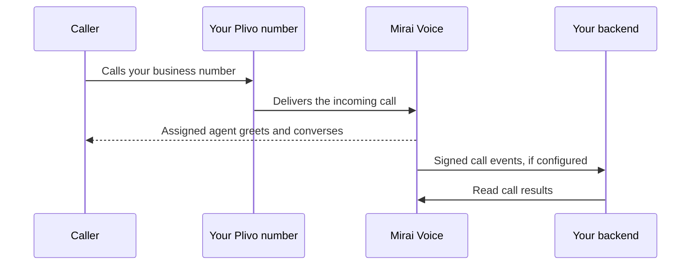

Let customers call your business number and speak with your voice agent. This
cookbook takes you from number setup to your first incoming conversation and
its call history, transcript, and recording.

## What you'll build

A phone number that answers incoming calls with your agent's greeting and
instructions. You can set it up in the console or from your backend.

This recipe covers **Indian +91 Plivo voice numbers**. You can bring an existing
number from your Plivo account or use a dedicated number already provided to
your workspace by Mirai. WhatsApp calling has a
[separate cookbook](/cookbooks/whatsapp-calling-for-partners).

You need:

- An enabled workspace with enough wallet balance for at least one minute at
  its applicable calling rate.
- A published agent in that workspace. A draft or archived agent cannot answer
  incoming calls.
- A dedicated, voice-enabled number you control. If you bring your own Plivo
  number, have its account's Auth ID and Auth Token available.
- For API setup: your workspace API key, its assigned API host, cURL and `jq`,
  or Python 3.10+ with `httpx`, or Node.js 18+.

<Note>
Importing a number does not activate incoming calls. Activation configures its
voice routing. Test a real incoming call before you advertise the number.
Mirai's shared outgoing test line is not your dedicated inbound number.
</Note>

## How it works



You assign the agent once. Each incoming call uses that assignment; you do not
send `POST /v2/calls` to receive a call. That endpoint starts an outgoing call.

## Set up in the console

1. Open the [console](https://console.voice.miraiminds.co) and select your
   workspace. Trial workspaces use the
   [sandbox console](https://sandbox.voice.miraiminds.co).
2. Create your agent in **Agent Studio**. Set its greeting, instructions,
   language, voice, and maximum call duration, then publish it.
3. Open **Phone numbers**. If your workspace already has a dedicated number,
   skip to the assignment step.
4. Select **Connect Plivo**, enter your Plivo Auth ID and Auth Token, and save.
   Select **Import a number**, then **Import** beside the number you own.
5. Under **Incoming calls go to**, select your published agent and click
   **Save**.
6. Click **Activate incoming calls**. Review the routing change, confirm that
   you want incoming calls to reach Mirai, and activate.
7. Call the number from another phone and complete the [test below](#test-it).

If you need a new number, open **Add a number**. Availability, business
verification, rental charges, and renewal terms appear in that flow. Complete
any required verification and rental confirmation before assigning the number.
Contact [support](mailto:help@miraiminds.co) if that option is unavailable.

<Warning>
Activation can replace the number's existing voice application. Check where
calls currently go before confirming. Numbers with messaging configured are
refused to protect their SMS/MMS routing; use a dedicated voice number.
</Warning>

## Set up through the API

### 1. Choose your API host

Use the host shown with your workspace's API credentials:

| Workspace | API base URL |
| :--- | :--- |
| Activated production workspace | `https://prod.voice.miraiminds.co` |
| Sandbox workspace | `https://sandbox.voice.miraiminds.co` |

Set `VOICE_BASE_URL` and `VOICE_API_KEY` in your backend environment. For BYO
Plivo, also set `PLIVO_AUTH_ID`, `PLIVO_AUTH_TOKEN`, and `PLIVO_NUMBER` to the
owned number in E.164 format, including `+91`. Keep secrets on your backend.
Changing the host does not activate a sandbox workspace for production.

Run the shell examples in Bash with `set -euo pipefail` so a failed request
stops the sequence:

```bash
set -euo pipefail
: "${VOICE_BASE_URL:?Set your assigned API host}"
: "${VOICE_API_KEY:?Set your workspace API key}"

curl --fail-with-body "$VOICE_BASE_URL/v2/wallet" \
  -H "Authorization: Bearer $VOICE_API_KEY"

curl --fail-with-body "$VOICE_BASE_URL/v2/phone-numbers" \
  -H "Authorization: Bearer $VOICE_API_KEY"
```

The number list has `data`, `has_more`, and `next_cursor`. Follow `next_cursor`
with `?cursor=…` if needed. If your number is already listed, retain its `id`,
set `NUMBER_ID`, and skip step 3. To inspect number onboarding availability,
use `GET /v2/telephony/options`.

### 2. Create a published agent

Save this as `agent.json`, then adapt its greeting and instructions for your
business. It has no required caller inputs, so a new caller can reach it
without a customer record.

```json
{
  "name": "Inbound support",
  "system_prompt": "You are Mira, an AI voice agent for our support team. Ask how you can help, listen carefully, and keep replies brief. Ask for clarification when needed. Do not invent account information or promise actions you cannot perform. If the caller is finished, say goodbye and end the call.",
  "first_message": "Hello, this is Mira, an AI voice agent for the support team. How can I help you?",
  "voice": { "voice_id": "neha" },
  "language": "en",
  "max_duration_secs": 300,
  "draft": false,
  "end_call": {
    "enabled": true,
    "message": "Thank you for calling. Goodbye.",
    "confirm": false
  }
}
```

<Tabs>
  <Tab title="cURL">
    ```bash
    AGENT=$(curl --fail-with-body -sS "$VOICE_BASE_URL/v2/agents" \
      -H "Authorization: Bearer $VOICE_API_KEY" \
      -H 'Content-Type: application/json' --data-binary @agent.json)
    AGENT_ID=$(jq -er '.id' <<< "$AGENT")
    jq '{id, revision, draft, archived}' <<< "$AGENT"
    ```
  </Tab>
  <Tab title="Python">
    ```python
    import json
    import os
    from pathlib import Path
    import httpx

    response = httpx.post(
        f"{os.environ['VOICE_BASE_URL']}/v2/agents",
        headers={"Authorization": f"Bearer {os.environ['VOICE_API_KEY']}"},
        json=json.loads(Path("agent.json").read_text()),
        timeout=30,
    )
    response.raise_for_status()
    agent = response.json()
    print(agent["id"])  # Use this as AGENT_ID in the following steps.
    ```
  </Tab>
  <Tab title="Node.js">
    ```javascript
    import { readFile } from "node:fs/promises";

    const response = await fetch(`${process.env.VOICE_BASE_URL}/v2/agents`, {
      method: "POST",
      redirect: "error",
      signal: AbortSignal.timeout(30000),
      headers: {
        Authorization: `Bearer ${process.env.VOICE_API_KEY}`,
        "Content-Type": "application/json",
      },
      body: await readFile("agent.json", "utf8"),
    });
    if (!response.ok) throw new Error(`Create agent failed: ${response.status}`);
    const agent = await response.json();
    console.log(agent.id); // Use this as AGENT_ID in the following steps.
    ```
  </Tab>
</Tabs>

Creation returns `201` with the agent object. Confirm `draft: false` and
`archived: false`. You can also use an existing published agent from
`GET /v2/agents` in the same workspace.

**Caller inputs:** incoming calls supply `caller_number` and `called_number`.
Any other required input must have a usable default in your agent's
`input_schema`; otherwise admission fails. Ask unknown callers for their name
or order number during the conversation. Do not treat caller ID as proof of
identity. See [agents](/v2/agents) and [tools](/v2/tools) for API lookups.

### 3. Connect Plivo and import your number

Skip this step for a number already in your workspace. If the Plivo integration
already exists, get its ID from `GET /v2/telephony/connections` instead of
creating it again.

```bash
INTEGRATION=$(jq -n '{provider:"plivo", name:"Support line",
  auth_id:env.PLIVO_AUTH_ID, auth_token:env.PLIVO_AUTH_TOKEN}' |
  curl --fail-with-body -sS "$VOICE_BASE_URL/v2/telephony/connections" \
    -H "Authorization: Bearer $VOICE_API_KEY" \
    -H 'Content-Type: application/json' --data-binary @-)
CONNECTION_ID=$(jq -er '.id' <<< "$INTEGRATION")

# Confirm the number appears in this integration's inventory.
curl --fail-with-body "$VOICE_BASE_URL/v2/telephony/connections/$CONNECTION_ID/numbers" \
  -H "Authorization: Bearer $VOICE_API_KEY"

NUMBER=$(jq -n --arg connection "$CONNECTION_ID" \
  '{connection_id:$connection, number:env.PLIVO_NUMBER}' |
  curl --fail-with-body -sS "$VOICE_BASE_URL/v2/phone-numbers" \
    -H "Authorization: Bearer $VOICE_API_KEY" \
    -H 'Content-Type: application/json' --data-binary @-)
NUMBER_ID=$(jq -er '.id' <<< "$NUMBER")
```

Both create requests return `201`. The integration should have
`state: "verified"`; the imported number initially has `state: "imported"`.
Import verifies ownership and leaves existing Plivo routing unchanged. Save
the returned IDs; if a response is lost, list existing resources before retrying.

### 4. Assign your agent and activate incoming calls

Read the current number before updating it. Every write uses its latest
`version`; do not hard-code version numbers.

```bash
NUMBER=$(curl --fail-with-body -sS "$VOICE_BASE_URL/v2/phone-numbers/$NUMBER_ID" \
  -H "Authorization: Bearer $VOICE_API_KEY")

NUMBER=$(jq --arg agent "$AGENT_ID" \
  '{version, agent_id:$agent}' <<< "$NUMBER" |
  curl --fail-with-body -sS -X PATCH "$VOICE_BASE_URL/v2/phone-numbers/$NUMBER_ID" \
    -H "Authorization: Bearer $VOICE_API_KEY" \
    -H 'Content-Type: application/json' --data-binary @-)

if [ "$(jq -r '.state' <<< "$NUMBER")" != ready ]; then
  NUMBER=$(jq '{version, replace_existing_application:false}' <<< "$NUMBER" |
    curl --fail-with-body -sS "$VOICE_BASE_URL/v2/phone-numbers/$NUMBER_ID/activate" \
      -H "Authorization: Bearer $VOICE_API_KEY" \
      -H 'Content-Type: application/json' --data-binary @-)
fi

jq '{id, number, agent_id, state, connection_state, version}' <<< "$NUMBER"
```

The assignment and activation requests return `200`. Before testing, check:

```json
{
  "state": "ready",
  "connection_state": "verified"
}
```

These are the relevant readiness fields, not the complete number response.
Also confirm `agent_id` matches your published agent.

If another voice application is attached, the safe example above refuses to
replace it. Review the existing routing in Plivo. Only after you decide to move
those incoming calls to Mirai, fetch the number's latest version and repeat
activation with `replace_existing_application: true`. After any activation
timeout or failure, GET the number again and inspect `state` and `setup_error`
before retrying.

### 5. Receive events and read results

Optionally set a public HTTPS `webhook_url` on the number with PATCH:

```bash
NUMBER=$(curl --fail-with-body -sS "$VOICE_BASE_URL/v2/phone-numbers/$NUMBER_ID" \
  -H "Authorization: Bearer $VOICE_API_KEY")
jq --arg url 'https://your-backend.example/voice/events' \
  '{version, webhook_url:$url}' <<< "$NUMBER" |
  curl --fail-with-body -X PATCH "$VOICE_BASE_URL/v2/phone-numbers/$NUMBER_ID" \
    -H "Authorization: Bearer $VOICE_API_KEY" \
    -H 'Content-Type: application/json' --data-binary @-
```

Replace the example URL with your actual receiver before running this request.
Verify events using the webhook secret associated with the workspace key that
created the Plivo integration. The integration retains that signing secret;
coordinate key or provider credential rotation with support. See
[webhook verification](/v2/webhooks#signature-verification) for the signing format,
raw request-body handling, retries, and event deduplication.

Find incoming calls in the console's call history or `GET /v2/calls`. Match
`direction: "inbound"`, `phone_number_id`, and `agent_id`; retain the call `id`.
For an incoming call, `from` is the caller and `to` is your business number.

| Request | Result |
| :--- | :--- |
| `GET /v2/calls/{id}` | Status, direction, agent revision, duration, cost, and result availability |
| `GET /v2/calls/{id}/transcript` | The conversation transcript when available |
| `GET /v2/calls/{id}/recording` | Redirect to available recording audio |
| `GET /v2/calls/{id}/analysis` | Post-call analysis state and results, when configured |
| `POST /v2/calls/{id}/abort` | End an active call |

Authenticate each request with your workspace API key. Results can take time
to arrive after hangup; check availability on the call before fetching audio
or transcript. See the [calls reference](/v2/calls).

## Test it

1. Call the configured number from another phone. You should hear your agent's
   greeting without starting a call through the API.
2. Say a short phrase, ask the agent to repeat it, and confirm you can both
   hear each other. Then complete a realistic support question.
3. Hang up. Find the incoming call in history and check its number, agent,
   duration, transcript, available recording, and settled cost.
4. If you configured events, verify receipt and signature handling in your
   backend. Replay a saved event to confirm it does not create duplicate work.
5. Repeat the call before publishing the number to customers.

**Ready** confirms setup, not audio quality or unlimited capacity. Arrange the
concurrent-call capacity your business needs and test within that limit.

### Troubleshooting

| Symptom | What to check |
| :--- | :--- |
| Call ends immediately or sounds busy | Agent is published and not archived; correct assignment; funded wallet; required input defaults; available capacity |
| Number is imported but never answers | Complete activation and confirm `ready` plus `connection_state: verified` |
| Number is ready but the wrong service answers | Check its current voice application in Plivo; another change may have replaced the routing |
| `409 conflict` | Fetch the latest version. Also check whether the account or number is already connected |
| `409 messaging_conflict` | Use a dedicated voice number without conflicting SMS/MMS configuration |
| `409 not_ready` | Verify the Plivo integration and check number activation and any rental status |
| `400 invalid_credentials` | Check the Plivo Auth ID/Auth Token and their account access |
| `503 telephony_unavailable` | Read the number's `setup_error`; check provider access and contact support if setup remains unavailable |
| `403 production_workspace_required` | Complete production activation for the key's workspace |
| Connected but silent, delayed, or one-way audio | Report the call ID, time and timezone, number, and observed behavior to support |
| No webhook or signature mismatch | Check the number's webhook URL, the integration's original signing secret, and verification of raw bytes |

## Change or pause incoming calls

To switch agents, PATCH the number with its latest `version` and the new
`agent_id`. New calls use the new assignment; accepted calls retain their agent
snapshot. Publishing or editing an agent affects later calls. Archiving it or
leaving its latest configuration as a draft stops it answering new calls.

To stop new incoming calls for one number, PATCH `agent_id: ""` with the
current version. To disable an entire Plivo integration, PATCH
`/v2/telephony/connections/{id}` with its current `version` and
`state: "disabled"`. Disabling also blocks new outgoing calls through it.
`POST /v2/telephony/connections/{id}/verify` verifies credentials and re-enables
the integration.

Unassigning or disabling does not release the number, cancel its rental, or
restore its previous Plivo application. Manage rentals separately and coordinate
restoring previous voice routing if you move away from Mirai.

## Billing and privacy

Mirai call usage follows your workspace's [pricing](/general/tiers). For BYO
Plivo, Plivo bills your provider account separately. Managed number rental and
renewal charges are separate from call usage; review the displayed terms.

Tell callers they are speaking with an AI voice agent and provide appropriate
recording notices. Keep API keys, Plivo tokens, webhook secrets, transcripts,
and recording links private. Apply access controls and retention rules for your
business, including GDPR, HIPAA, or TCPA requirements where applicable. This
recipe does not establish regulatory compliance.

## Production checklist

- The workspace is enabled and funded, and the number belongs to it.
- The correct published agent is assigned, with defaults for required inputs.
- The number is ready, its integration is verified, and real incoming calls
  have passed the audio and result checks.
- Webhook verification, caller notices, result access, and retention are set up.
- Your expected concurrent-call volume and number renewal arrangements are confirmed.
