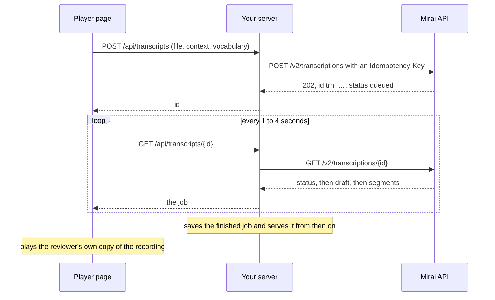

In this cookbook you build a web page where someone uploads a recorded call and
gets back a transcript they can listen along to. Your server sends the recording
to Mira Transcribe and reads the job for the page. The page shows a draft while
the job finishes, then the transcript with speakers, in step with the audio. The
same pattern fits call quality review, sales coaching, recorded interviews and
subtitles for recorded calls.

## What you'll build

- A reviewer chooses a recording (WAV, MP3 or M4A, up to 45 MB), adds a line of
  context and a few names to spell right, and clicks **Transcribe**.
- A few seconds later the page shows a draft. When the job finishes, the
  transcript with speakers replaces it without a reload.
- Each speaker has a colour, keyed to the voice (`speaker_id`). The roles that
  come back are a first guess, so the reviewer can rename any speaker.
- Clicking a line plays the call from there. While the audio plays, the line
  being spoken is marked and kept in view.
- Double-clicking a line lets the reviewer fix a word. Edits survive a reload.
- The transcript, edits included, exports as plain text, SRT subtitles or JSON.
- Your server keeps the API key, and only returns a transcript to the person who
  uploaded it.

**You need:** a workspace API key (`sk_live_…`) and some credit in its wallet,
and a backend in Python 3.10+ or Node.js 18+. This recipe uses no webhooks.

<Note>
Keep the API key on your server. The page only ever talks to your own routes,
and job IDs are not secrets, so your server checks who owns a job before it
returns one.
</Note>

## How it works



The API keeps no audio, so the page plays the file the reviewer chose. For the
23-second [test call](#test-it), the page goes through these stages:

| Time after upload | Job status | What the page shows |
| :--- | :--- | :--- |
| Under a second | `queued`, then `decoding` | "Listening to the recording…" |
| About 3 seconds | `merging`, with `draft` | The draft: one grey lane, with English words written in Devanagari |
| About 6 seconds | `completed` | Four lines from two speakers, and the cost: ₹0.12 |

A longer recording usually takes about 10 seconds plus 15% of its length, so
about 30 seconds for a two-minute call. The draft arrives before that.

---

## Step 1: Send recordings from your server

Your server holds the key and has two routes for the page:

| Route | What it does |
| :--- | :--- |
| `POST /api/transcripts` | Checks who is signed in and sends the file to [`POST /v2/transcriptions`](/v2/transcriptions#create-a-transcription). The `Idempotency-Key` combines the user's ID with the key the page sent, so a retried upload returns the same job. Records who owns the job and returns its ID. |
| `GET /api/transcripts/{id}` | Checks that the job belongs to the user and reads [`GET /v2/transcriptions/{id}`](/v2/transcriptions#get-a-transcription). Saves the job once it is `completed` or `failed`, and serves that copy from then on. |

Refusals from the API, such as `402 insufficient_balance`, `413` and `429`, go
back to the page with their `Retry-After` header, so the page can say what
happened. The server also serves the page itself from `public/`.

`myapp` stands for your own code. `current_user` (Python) or `requireUser`
(Node.js) identifies the signed-in user and refuses everyone else with `401`.
`db.transcripts` stores one row per job: `create` adds the owner and file name
and ignores an ID it already has, `get` returns the row or nothing, and
`save_job` stores the finished job.

<Tabs>
  <Tab title="cURL">
    The two API calls the server makes:

    ```bash
    # Send a recording
    curl -X POST https://sandbox.voice.miraiminds.co/v2/transcriptions \
      -H "Authorization: Bearer $MIRAI_API_KEY" \
      -H "Idempotency-Key: user_42:4d6c1e2a-7a7f-4c1b-9a51-2f0e7d3b9c10" \
      -F file=@transcription-test-call.wav \
      -F context="A call to a university admissions desk about a course and its fees" \
      -F vocabulary="Mira University, BBA, Aadhaar"

    # Read the job, each time the page asks
    curl https://sandbox.voice.miraiminds.co/v2/transcriptions/trn_01M3XRSFXW77RHEQ85979AJXAF \
      -H "Authorization: Bearer $MIRAI_API_KEY"
    ```
  </Tab>
  <Tab title="Python">
    ```python title="server.py"
    # pip install fastapi uvicorn httpx python-multipart
    import os

    import httpx
    from fastapi import FastAPI, File, Form, Header, Request, UploadFile
    from fastapi.responses import JSONResponse
    from fastapi.staticfiles import StaticFiles

    # Stand-ins for your own code: sign-in and storage.
    from myapp import current_user, db

    API = "https://sandbox.voice.miraiminds.co"
    MAX_UPLOAD = 45 * 1024 * 1024  # the API's limit for an uploaded file

    app = FastAPI()
    mirai = httpx.AsyncClient(
        base_url=API,
        headers={"Authorization": f"Bearer {os.environ['MIRAI_API_KEY']}"},
        timeout=30,
    )


    def error(status: int, code: str, message: str, retry_after: str | None = None) -> JSONResponse:
        headers = {"Retry-After": retry_after} if retry_after else None
        return JSONResponse({"error": {"code": code, "message": message}}, status_code=status, headers=headers)


    def refused(r: httpx.Response) -> JSONResponse:
        """Pass a refusal from the API on to the page, with its Retry-After."""
        try:
            e = r.json()["error"]
        except (ValueError, KeyError, TypeError):
            e = {"code": "upstream_error", "message": f"Transcription answered {r.status_code}"}
        return error(r.status_code, e["code"], e["message"], r.headers.get("Retry-After"))


    @app.post("/api/transcripts")
    async def create_transcript(
        request: Request,
        file: UploadFile = File(...),
        context: str = Form(""),
        vocabulary: str = Form(""),
        idempotency_key: str = Header(..., max_length=200),
    ):
        user = await current_user(request)
        if file.size is not None and file.size > MAX_UPLOAD:
            return error(413, "request_too_large", "Recordings can be up to 45 MB.")
        r = await mirai.post(
            "/v2/transcriptions",
            # The same key for the same file: a retried upload returns the same job.
            headers={"Idempotency-Key": f"{user.id}:{idempotency_key}"},
            files={"file": (file.filename or "recording", file.file, file.content_type)},
            data={"context": context, "vocabulary": vocabulary},
            timeout=600,  # the API answers once it has the whole upload
        )
        if r.status_code != 202:
            return refused(r)
        job = r.json()
        await db.transcripts.create(id=job["id"], owner_id=user.id, file_name=job["file_name"])
        return JSONResponse({"id": job["id"], "status": job["status"]}, status_code=202)


    @app.get("/api/transcripts/{transcript_id}")
    async def read_transcript(transcript_id: str, request: Request):
        user = await current_user(request)
        row = await db.transcripts.get(transcript_id)
        if row is None or row.owner_id != user.id:
            return error(404, "not_found", "No such transcript.")
        if row.job is not None:  # finished earlier: serve your own copy
            return row.job
        r = await mirai.get(f"/v2/transcriptions/{transcript_id}")
        if r.status_code != 200:
            return refused(r)
        job = r.json()
        if job["status"] in ("completed", "failed"):
            await db.transcripts.save_job(transcript_id, job)
        return job


    app.mount("/", StaticFiles(directory="public", html=True), name="page")
    ```
  </Tab>
  <Tab title="Node.js">
    ```javascript title="server.js"
    // npm install express multer
    import express from "express";
    import multer from "multer";
    // Stand-ins for your own code: sign-in and storage.
    import { requireUser, db } from "./myapp.js";

    const API = "https://sandbox.voice.miraiminds.co";
    const auth = { Authorization: `Bearer ${process.env.MIRAI_API_KEY}` };
    const MAX_UPLOAD = 45 * 1024 * 1024; // the API's limit for an uploaded file
    const upload = multer({ storage: multer.memoryStorage(), limits: { fileSize: MAX_UPLOAD } });
    const app = express();

    const error = (res, status, code, message) => res.status(status).json({ error: { code, message } });

    // Pass a refusal from the API on to the page, with its Retry-After.
    async function refused(r, res) {
      const body = await r.json().catch(() => ({}));
      const retry = r.headers.get("retry-after");
      if (retry) res.set("Retry-After", retry);
      const e = body.error ?? { code: "upstream_error", message: `Transcription answered ${r.status}` };
      error(res, r.status, e.code, e.message);
    }

    app.post("/api/transcripts", requireUser, upload.single("file"), async (req, res) => {
      const key = req.get("Idempotency-Key");
      if (!req.file || !key || key.length > 200) {
        return error(res, 400, "invalid_request", "Send a recording and an Idempotency-Key.");
      }
      const form = new FormData();
      form.append("file", new Blob([req.file.buffer], { type: req.file.mimetype }), req.file.originalname);
      form.append("context", req.body.context ?? "");
      form.append("vocabulary", req.body.vocabulary ?? "");
      const r = await fetch(`${API}/v2/transcriptions`, {
        method: "POST",
        // The same key for the same file: a retried upload returns the same job.
        headers: { ...auth, "Idempotency-Key": `${req.user.id}:${key}` },
        body: form,
      });
      if (r.status !== 202) return refused(r, res);
      const job = await r.json();
      await db.transcripts.create({ id: job.id, ownerId: req.user.id, fileName: job.file_name });
      res.status(202).json({ id: job.id, status: job.status });
    });

    app.get("/api/transcripts/:id", requireUser, async (req, res) => {
      const row = await db.transcripts.get(req.params.id);
      if (!row || row.ownerId !== req.user.id) return error(res, 404, "not_found", "No such transcript.");
      if (row.job) return res.json(row.job); // finished earlier: serve your own copy
      const r = await fetch(`${API}/v2/transcriptions/${encodeURIComponent(req.params.id)}`, { headers: auth });
      if (r.status !== 200) return refused(r, res);
      const job = await r.json();
      if (job.status === "completed" || job.status === "failed") await db.transcripts.saveJob(job.id, job);
      res.json(job);
    });

    app.use(express.static("public"));

    // multer refuses a file over the limit before it reaches the route.
    app.use((err, req, res, next) => {
      if (err.code === "LIMIT_FILE_SIZE") return error(res, 413, "request_too_large", "Recordings can be up to 45 MB.");
      next(err);
    });

    app.listen(3000, () => console.log("http://localhost:3000"));
    ```
  </Tab>
</Tabs>

<Tip>
Recordings over 45 MB go by link. Upload them to your own storage first, then
send JSON with a pre-signed `url` in place of the file, up to 200 MB. See
[Send a link](/v2/transcriptions#send-a-link).
</Tip>

## Step 2: Poll from the page

The page asks your server for the job until it is `completed` or `failed`. It
asks quickly at first, since a short recording is often done in seconds, then
every 4 seconds. On a `429` or `5xx` answer it waits for `Retry-After` and
asks again, since the job itself is unaffected. It gives up only after about a
minute without a usable answer.

```javascript title="public/poll.js"
// Read a transcript through your server until it is finished. Quick at first,
// when a short recording is often done, then every 4 seconds.
const DELAYS_MS = [1000, 1000, 1500, 2000, 3000];
const LATER_MS = 4000;
const MAX_MISSES = 15; // about a minute without an answer

const sleep = (ms) => new Promise((resolve) => setTimeout(resolve, ms));

export async function waitForTranscript(id, onUpdate) {
  let misses = 0;
  for (let n = 0; ; n++) {
    await sleep(DELAYS_MS[n] ?? LATER_MS);
    let res;
    try {
      res = await fetch(`/api/transcripts/${encodeURIComponent(id)}`, { cache: "no-store" });
    } catch {
      if (++misses >= MAX_MISSES) throw new Error("Lost touch with the server.");
      continue;
    }
    if (res.status === 429 || res.status >= 500) {
      // Busy, or briefly unavailable: wait as long as the answer asks, then try again.
      if (++misses >= MAX_MISSES) throw new Error(`The transcript is unavailable (${res.status}).`);
      await sleep(Number(res.headers.get("Retry-After") || 5) * 1000);
      continue;
    }
    const job = await res.json();
    if (!res.ok) throw new Error(job.error?.message ?? `Request failed (${res.status}).`);
    misses = 0;
    onUpdate(job);
    if (job.status === "completed" || job.status === "failed") return job;
  }
}
```

A job does not need anyone watching it. It is charged when it completes whether
or not it is read, and your server saves it the next time someone opens it.

## Step 3: Turn a job into a transcript

The page keeps the transcript as a small document: speakers, and lines that
point to a speaker by ID. Renaming a speaker is then one change that every line
and every export picks up. This module has no page code in it, so you can test
it on its own.

```javascript title="public/transcript.js"
// A transcript as data: speakers, lines and the reader's edits. No DOM here.
const COLOURS = ["#15803d", "#1d4ed8", "#b45309", "#7e22ce", "#be185d", "#0e7490"];

// A job from GET /v2/transcriptions/{id}, finished or still merging, as
// { id, draft, duration, speakers: [{ id, label, colour }], lines: [{ speaker, start, end, text }] }.
export function fromJob(job) {
  const draft = job.status !== "completed";
  const raw = (draft ? job.draft : job.segments) ?? [];
  const roles = new Map((job.diarization?.speakers ?? []).map((s) => [s.id, s.role]));
  const speakers = [];
  const byKey = new Map();
  const perRole = new Map();

  // Lines are grouped by speaker_id, the voice. The role is only a first label.
  function speakerFor(seg) {
    const key = draft ? "speech" : seg.speaker_id || `role-${seg.speaker || "unknown"}`;
    if (!byKey.has(key)) {
      const role = draft ? "" : seg.speaker || roles.get(seg.speaker_id) || "";
      const n = (perRole.get(role) ?? 0) + 1;
      perRole.set(role, n);
      const label = draft ? "Speech" : role ? (n > 1 ? `${role} ${n}` : role) : `Speaker ${speakers.length + 1}`;
      const speaker = { id: key, label, colour: COLOURS[speakers.length % COLOURS.length] };
      speakers.push(speaker);
      byKey.set(key, speaker);
    }
    return byKey.get(key).id;
  }

  const lines = raw
    .filter((seg) => seg.text?.trim())
    .map((seg) => ({ speaker: speakerFor(seg), start: seg.start, end: Math.max(seg.start, seg.end), text: seg.text.trim() }))
    .sort((a, b) => a.start - b.start);
  return { id: job.id, draft, duration: job.duration_s ?? lines.at(-1)?.end ?? 0, speakers, lines };
}

// The line being spoken at `t` seconds, or -1 between lines. When two speakers
// overlap, the line that started last wins.
export function lineAt(doc, t) {
  let lo = 0, hi = doc.lines.length - 1, found = -1;
  while (lo <= hi) {
    const mid = (lo + hi) >> 1;
    if (doc.lines[mid].start <= t) { found = mid; lo = mid + 1; } else { hi = mid - 1; }
  }
  for (let i = found; i >= 0 && i > found - 4; i--) if (t < doc.lines[i].end) return i;
  return -1;
}

// Edits return a new document, so keeping the old one is all undo needs.
export const renameSpeaker = (doc, id, label) => ({
  ...doc,
  speakers: doc.speakers.map((s) => (s.id === id ? { ...s, label } : s)),
});

export const editLine = (doc, index, text) => ({
  ...doc,
  lines: doc.lines.map((line, i) => (i === index ? { ...line, text, edited: true } : line)),
});

export const speakerOf = (doc, line) => doc.speakers.find((s) => s.id === line.speaker);

// 65.4 -> "1:05"
export function clock(t) {
  const s = Math.floor(t);
  const h = Math.floor(s / 3600), m = Math.floor(s / 60) % 60, sec = String(s % 60).padStart(2, "0");
  return h ? `${h}:${String(m).padStart(2, "0")}:${sec}` : `${m}:${sec}`;
}

// 65.4 -> "00:01:05,400"
function srtTime(t) {
  const ms = Math.round(t * 1000);
  const pad = (n, width = 2) => String(n).padStart(width, "0");
  return `${pad(Math.floor(ms / 3600000))}:${pad(Math.floor(ms / 60000) % 60)}:${pad(Math.floor(ms / 1000) % 60)},${pad(ms % 1000, 3)}`;
}

export function toTxt(doc) {
  return doc.lines.map((line) => `${speakerOf(doc, line).label}: ${line.text}`).join("\n") + "\n";
}

export function toSrt(doc) {
  return doc.lines
    .map((line, n) => `${n + 1}\n${srtTime(line.start)} --> ${srtTime(line.end)}\n` +
      `${speakerOf(doc, line).label}: ${line.text.replace(/-->/g, "→")}\n`)
    .join("\n");
}

export function toJson(doc) {
  const out = {
    id: doc.id,
    duration_s: doc.duration,
    speakers: doc.speakers.map(({ id, label }) => ({ id, label })),
    segments: doc.lines.map((line) => ({
      speaker_id: line.speaker,
      speaker: speakerOf(doc, line).label,
      start: line.start,
      end: line.end,
      text: line.text,
    })),
  };
  return JSON.stringify(out, null, 2) + "\n";
}
```

Lines are grouped by `speaker_id`, which identifies a voice. The role in
`speaker` (`Agent`, `Customer` or `Other`) only supplies the first label,
numbered when two voices share a role. A draft has no speakers yet, so all of
it goes in one lane called **Speech**. Colours follow the order in which voices
first speak, so the first voice is always green.

## Step 4: Build the player page

```html title="public/index.html"
<!doctype html>
<html lang="en">
<meta charset="utf-8" />
<meta name="viewport" content="width=device-width, initial-scale=1" />
<title>Call transcripts</title>
<style>
  body { font: 15px/1.5 system-ui, sans-serif; max-width: 860px; margin: 2rem auto; padding: 0 1rem; }
  form { display: grid; gap: 0.5rem; margin-bottom: 1rem; }
  #status { color: #57534e; }
  audio { width: 100%; position: sticky; top: 0; background: #fff; }
  #speakers { display: flex; flex-wrap: wrap; gap: 0.5rem; margin: 1rem 0; }
  #speakers input { border: 1px solid #d6d3d1; border-left: 4px solid var(--c); padding: 0.25rem 0.5rem; }
  #lines { list-style: none; padding: 0; }
  #lines li { display: grid; grid-template-columns: 3.5rem 7rem 1fr; gap: 0.5rem; padding: 0.35rem 0.5rem;
              border-left: 4px solid var(--c); cursor: pointer; }
  #lines li.active { background: #f0fdf4; }
  #lines time { color: #78716c; font-variant-numeric: tabular-nums; }
  #lines b { color: var(--c); }
  .draft #lines { color: #78716c; }
  [contenteditable="true"] { outline: 2px solid #15803d; cursor: text; }
</style>

<form id="upload">
  <input type="file" id="file" accept="audio/*,.wav,.mp3,.m4a" required />
  <input id="context" maxlength="2000" placeholder="What the call is about (optional)" />
  <input id="vocabulary" placeholder="Names and terms to spell right, separated by commas (optional)" />
  <button>Transcribe</button>
</form>
<p id="status" role="status" aria-live="polite"></p>

<section id="player" hidden>
  <audio id="audio" controls></audio>
  <label id="attach" hidden>Choose the recording to listen along <input type="file" accept="audio/*" /></label>
  <div id="speakers"></div>
  <ol id="lines"></ol>
  <p>
    Export:
    <button data-export="txt">Text</button>
    <button data-export="srt">Subtitles (SRT)</button>
    <button data-export="json">JSON</button>
  </p>
</section>

<script type="module">
  import { waitForTranscript } from "./poll.js";
  import { fromJob, lineAt, renameSpeaker, editLine, speakerOf, clock, toTxt, toSrt, toJson } from "./transcript.js";

  const $ = (id) => document.getElementById(id);
  const audio = $("audio");
  let doc = null;     // what the player shows
  let active = -1;    // the line being spoken
  let heldUntil = 0;  // the reader scrolled: stop following for a few seconds
  let key = null;     // one Idempotency-Key per chosen file

  const say = (text) => ($("status").textContent = text);
  const save = () => { try { localStorage.setItem(`transcript:${doc.id}`, JSON.stringify(doc)); } catch {} };
  const load = (id) => { try { return JSON.parse(localStorage.getItem(`transcript:${id}`)); } catch { return null; } };

  // Upload through your server. Pressing Transcribe twice for the same file
  // sends the same key, so it makes one job.
  $("file").addEventListener("change", () => (key = crypto.randomUUID()));
  $("upload").addEventListener("submit", async (event) => {
    event.preventDefault();
    const file = $("file").files[0];
    const form = new FormData();
    form.append("file", file);
    form.append("context", $("context").value);
    form.append("vocabulary", $("vocabulary").value);
    say("Uploading…");
    const res = await fetch("/api/transcripts", { method: "POST", headers: { "Idempotency-Key": key }, body: form });
    const body = await res.json().catch(() => ({}));
    if (!res.ok) return say(body.error?.message ?? `Upload refused (${res.status}).`);
    audio.src = URL.createObjectURL(file); // the API keeps no audio, so play the reader's own file
    $("attach").hidden = true;
    open(body.id);
  });

  async function open(id) {
    history.replaceState(null, "", `#${id}`);
    $("player").hidden = false;
    say("Waiting for a free slot…");
    try {
      const job = await waitForTranscript(id, show);
      if (job.status === "failed") say(`Not transcribed: ${job.error.message}`);
    } catch (err) {
      say(err.message);
    }
  }

  // Each answer: a status line, the draft while the job merges, then the finished transcript.
  function show(job) {
    if (job.status === "completed") {
      doc = load(job.id) ?? fromJob(job);
      const cost = job.cost.status === "charged" ? `₹${job.cost.amount_inr.toFixed(2)}` : "free";
      say(job.degraded ? `Single-pass transcript without speaker roles (${cost}).` : `Finished (${cost}).`);
    } else if (job.status === "merging" && job.draft?.length) {
      doc = fromJob(job);
      say("Draft. The finished transcript, with speakers, replaces it here when it is ready.");
    } else {
      if (!doc) say(job.status === "queued" ? "Waiting for a free slot…" : "Listening to the recording…");
      return;
    }
    render();
  }

  function render() {
    $("player").classList.toggle("draft", doc.draft);
    document.querySelectorAll("[data-export]").forEach((b) => (b.disabled = doc.draft));
    $("speakers").replaceChildren(...doc.speakers.map((speaker) => {
      const input = document.createElement("input");
      input.value = speaker.label;
      input.disabled = doc.draft;
      input.ariaLabel = "Speaker name";
      input.style.setProperty("--c", speaker.colour);
      input.addEventListener("change", () => {
        doc = renameSpeaker(doc, speaker.id, input.value.trim() || speaker.label);
        save();
        render();
      });
      return input;
    }));
    $("lines").replaceChildren(...doc.lines.map((line, i) => {
      const speaker = speakerOf(doc, line);
      const li = document.createElement("li");
      li.style.setProperty("--c", speaker.colour);
      const time = document.createElement("time");
      time.textContent = clock(line.start);
      const who = document.createElement("b");
      who.textContent = speaker.label;
      const text = document.createElement("span");
      text.textContent = line.text; // transcript text is data: never insert it as HTML
      li.append(time, who, text);
      li.addEventListener("click", () => {
        if (text.isContentEditable || !audio.src) return;
        audio.currentTime = line.start;
        audio.play();
      });
      text.addEventListener("dblclick", () => edit(text, i));
      return li;
    }));
    active = -1;
    follow();
  }

  // Highlight the line being spoken and keep it in view.
  function follow() {
    if (!doc) return;
    const i = lineAt(doc, audio.currentTime);
    if (i === active) return;
    $("lines").children[active]?.classList.remove("active");
    $("lines").children[i]?.classList.add("active");
    active = i;
    if (i >= 0 && Date.now() > heldUntil) $("lines").children[i].scrollIntoView({ block: "nearest", behavior: "smooth" });
  }
  audio.addEventListener("timeupdate", follow);
  audio.addEventListener("seeked", follow);
  for (const type of ["wheel", "touchmove"]) {
    addEventListener(type, () => (heldUntil = Date.now() + 6000), { passive: true });
  }

  // Fix a line: double-click it, Enter keeps the change, Escape drops it.
  function edit(el, i) {
    if (doc.draft) return;
    const done = (keep) => {
      el.removeEventListener("keydown", onKey);
      el.removeEventListener("blur", onBlur);
      el.contentEditable = "false";
      const text = el.textContent.replace(/\s+/g, " ").trim();
      if (keep && text && text !== doc.lines[i].text) {
        doc = editLine(doc, i, text);
        save();
      }
      el.textContent = doc.lines[i].text;
    };
    const onKey = (e) => {
      if (e.key === "Enter") { e.preventDefault(); done(true); }
      if (e.key === "Escape") done(false);
    };
    const onBlur = () => done(true);
    el.addEventListener("keydown", onKey);
    el.addEventListener("blur", onBlur);
    el.contentEditable = "true";
    el.focus();
  }

  // Export what the reader sees, edits included.
  const EXPORTS = { txt: [toTxt, "text/plain"], srt: [toSrt, "application/x-subrip"], json: [toJson, "application/json"] };
  document.querySelectorAll("[data-export]").forEach((button) => button.addEventListener("click", () => {
    const [make, type] = EXPORTS[button.dataset.export];
    const a = document.createElement("a");
    a.href = URL.createObjectURL(new Blob([make(doc)], { type: `${type};charset=utf-8` }));
    a.download = `${doc.id}.${button.dataset.export}`;
    a.click();
    setTimeout(() => URL.revokeObjectURL(a.href), 1000);
  }));

  // Opened from a link (#trn_…): the transcript comes from your server, the audio from the reader.
  $("attach").querySelector("input").addEventListener("change", (event) => {
    audio.src = URL.createObjectURL(event.target.files[0]);
    $("attach").hidden = true;
  });
  const linked = location.hash.slice(1);
  if (/^trn_[0-9A-Z]{26}$/.test(linked)) {
    $("attach").hidden = false;
    open(linked);
  }
</script>
</html>
```

### Draft, then the finished transcript

While the job is `merging`, `show` draws the draft greyed out and read-only,
with export turned off. When the job completes, the finished transcript
replaces it in place. The status line shows what the job cost, or that it was
free. A [degraded](/v2/transcribe-recorded-calls#degraded-jobs) job is marked
as a single-pass transcript without roles.

### Play from a line and follow the audio

Clicking a line sets `audio.currentTime` to the line's `start` and plays. On
every `timeupdate`, `lineAt` finds the line being spoken; the page marks it and
scrolls it into view. If the reviewer scrolls, following pauses for six
seconds, so the list doesn't pull them back while they read ahead.

### Rename speakers and fix words

Each speaker's name is an input. Changing it renames every line of that
speaker. Double-clicking a line's text makes it editable: **Enter** keeps the
change and **Escape** drops it. Edits are saved in the browser under the job
ID, and the transcript text is always set with `textContent`, never as HTML.

### Export

The three buttons turn the current document, edits included, into a file:
`Speaker: text` lines, SRT cues with the speaker's name in front of each line,
or JSON with `speaker_id`, `speaker`, `start`, `end` and `text` per line.

### Open a transcript later

The page's address ends with the job ID (`#trn_…`). Opening that address loads
the transcript from your server and asks for the recording, because the API
does not keep it. If you keep recordings in your own storage, set `audio.src`
to a link your server signs instead.

### Run it

Put the files side by side:

```text
server.py or server.js
myapp.py or myapp.js     (your sign-in and storage)
public/
  index.html
  poll.js
  transcript.js
```

<Tabs>
  <Tab title="Python">
    ```bash
    pip install fastapi uvicorn httpx python-multipart
    MIRAI_API_KEY=sk_live_YOUR_API_KEY uvicorn server:app --port 3000
    ```
  </Tab>
  <Tab title="Node.js">
    ```bash
    npm init -y && npm pkg set type=module
    npm install express multer
    MIRAI_API_KEY=sk_live_YOUR_API_KEY node server.js
    ```
  </Tab>
</Tabs>

Open `http://localhost:3000`.

---

## Test it

Download the [test call](/files/transcription-test-call.wav): 23 seconds, two
synthetic voices, Hindi and English. Use this context and vocabulary:

```text
Context:     A call to a university admissions desk about a course and its fees
Vocabulary:  Mira University, BBA, Aadhaar
```

Then try these:

1. Upload it. A draft appears after about 3 seconds. After about 6 seconds it
   is replaced by four lines that alternate between **Agent** and
   **Customer**, with "Mira University", "BBA" and "Aadhaar" in Latin script.
   The status reads "Finished (₹0.12)".
2. Click the third line. Playback jumps to 0:11 and the line is marked. Let it
   play: the mark moves to the fourth line at 0:20.
3. Rename **Agent** to a person's name; both of that speaker's lines change.
   Double-click the second line, add punctuation and press **Enter**. Reload the
   page: both edits are still there.
4. Export SRT. The first cue runs `00:00:00,000 --> 00:00:06,570`.
5. Click **Transcribe** again without choosing the file again. You get the same
   job ID back, and the wallet is charged once.
6. Open the page's address in a new tab. The transcript loads from your
   server; choose the file to listen along.

| Symptom | Likely cause | Fix |
| :--- | :--- | :--- |
| The upload says the wallet is empty | `402 insufficient_balance`: the balance is zero or below | Add credit in **Billing**, then upload again. |
| The upload is refused as too large | The file is over 45 MB | Send it by link (see the tip in step 1), or compress it to a mono MP3. |
| The upload is refused as busy | `429 at_capacity`: 20 unfinished jobs in your workspace | Queue uploads on your server and send the next one after `Retry-After`. |
| "Waiting for a free slot" lasts minutes | The service is busy and the job is queued | Leave it. It keeps its place, and a job not finished in 24 hours fails free. |
| No sound when clicking a line | The page was opened from a link, so it has no audio | Choose the file, or serve the recording from your own storage. |
| The mark lags a little behind the voice | `timeupdate` fires a few times a second | Call `follow` from `requestAnimationFrame` while the audio plays. |
| Agent and Customer are the wrong way round | Roles are a best guess | Rename the speakers. Lines stay grouped by `speaker_id`. |
| One person shows up as two speakers | Speaker separation split a voice, often on poor audio or crosstalk | Rename both to the same name, or add a merge to `transcript.js` that moves one speaker's lines to the other. |
| Edits are missing on another computer | Edits are saved in the browser | Save the edited document on your server (see the checklist). |
| `429 rate_limited` while polling | Many open pages share your key's request rate | Serve finished jobs from your storage, as the server does, and cache running jobs for a second or two. |
| The page shows "No such transcript." | The job belongs to another user, or the ID is wrong | Open transcripts only from your own list. |

---

## Privacy and compliance

Tell the people on a call that it is recorded, and that a transcript will be
made and reviewed, before you record. Get consent where the law asks for it.
Call recordings and transcripts are personal data under India's Digital
Personal Data Protection Act.

The API does not keep the audio: it deletes the upload once it has been
decoded. Your server passes the file through without keeping it, and the
player plays the reviewer's own copy.

Your server does keep every finished job, with everything that was said in the
call. Treat it like the recording: limit who can open it, decide how long to
keep it, and delete it on schedule. The API does not publish a retention period
for transcripts; see
[Privacy and your data](/v2/transcribe-recorded-calls#privacy-and-your-data).

Edits are saved in the reviewer's browser. On shared computers, save them on
your server instead and clear local storage when the reviewer signs out.

Words, speakers and roles can be wrong. Don't base a decision about a person on
a transcript that nobody has checked against the audio.

The API key stays in your server's environment, and both routes check who owns
a job before they touch it.

## Production checklist

- [ ] The API key is read from the server's environment, and no route returns
  it.
- [ ] Both routes check sign-in and job ownership.
- [ ] Every upload sends an `Idempotency-Key` that includes the user's ID.
- [ ] Your server and any proxy in front of it accept uploads up to 45 MB, and
  larger files go by link.
- [ ] `402`, `413` and `429` are shown to the reviewer in plain words, and
  `Retry-After` is honoured.
- [ ] Finished jobs are saved in your storage and served from there. A
  background task reads jobs that nobody opened, so every transcript reaches
  your storage.
- [ ] Edits are saved where your reviewers need them: on your server if more
  than one person reviews a call.
- [ ] You have a retention period for transcripts and enforce it.
- [ ] Callers are told about recording and transcription.
- [ ] You ran the test call above and got four lines for ₹0.12.

## Related

<CardGroup cols={2}>
  <Card title="Transcribe recorded calls" icon="file-audio" href="/v2/transcribe-recorded-calls">
    How transcription works, languages, vocabulary, pricing and privacy.
  </Card>
  <Card title="Transcriptions API" icon="file-lines" href="/v2/transcriptions">
    Every field, status, response and error code.
  </Card>
  <Card title="Wallet" icon="wallet" href="/v2/wallet">
    Balance, transactions and top-ups.
  </Card>
  <Card title="Limits" icon="gauge" href="/v2/limits">
    Request rate and other limits shared by every `/v2` call.
  </Card>
</CardGroup>
