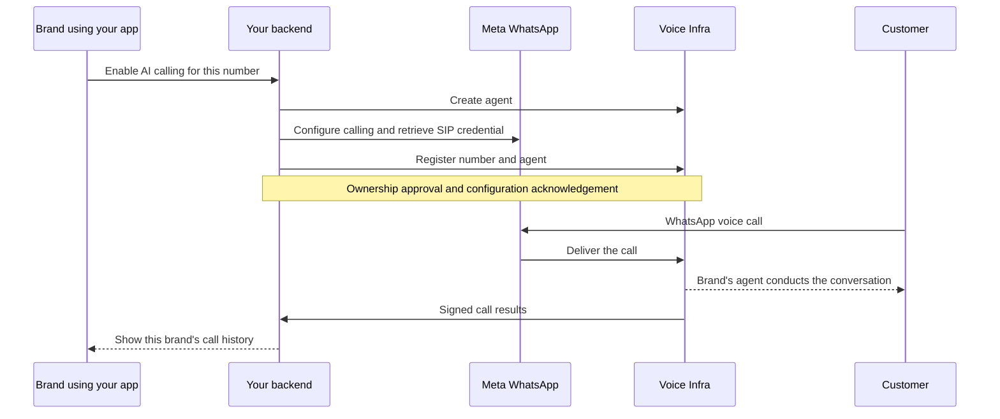

This cookbook is for platforms that already manage WhatsApp for many
businesses. You add voice calling to each brand's existing number through
your backend. Each brand keeps using your application and does not need a
separate Voice Infra login.

<Warning>
**Early access.** WhatsApp calling is a controlled pilot. The public
number-management APIs in this recipe are not deployed yet. Confirm their
availability with Voice Infra before running the registration steps.
General production rollout is not open yet. It still depends on reliable
two-way audio, production workspace activation and measured call capacity. The
examples below describe the integration contract. Your workspace and numbers
are not active just because this page is published.
</Warning>

## What you'll build

- An **AI Calling** section inside your application where a brand selects its
  WhatsApp number, configures its voice agent and tests calling.
- Incoming WhatsApp calls answered by that brand's agent.
- Customer-requested callbacks after Meta confirms calling permission.
- A brand-specific history of calls, transcripts and available results.
- One partner workspace and one combined Voice Infra bill for all your brands.

For a partner with 2,000 brands, keep a separate agent and number registration
for each brand. Registering 2,000 brands does not give you capacity for 2,000
simultaneous calls, so agree on concurrent-call capacity and test it
separately.

### Is this like BYO telco?

Yes. You bring the brand's existing WhatsApp number, configure its Meta calling
settings and register it with Voice Infra. The number stays with the brand's
Meta assets, and you do not buy a Plivo number or port the number.

Your backend can create the integration each number needs through our API, but
Voice Infra still approves ownership of each number. Once the partner workspace
is enabled, adding another approved number does not require a deployment for
that brand.

**You need:** an activated partner workspace, its backend API key and webhook
signing secret, an authorized Meta integration for each number, and a public
HTTPS webhook receiver. The examples use cURL and `jq`, Python 3.10+ with
`httpx`, or Node.js 18+.

## How it works



| Responsibility | Your platform | Voice Infra |
| :--- | :--- | :--- |
| Brand login, permissions and number ownership | Manage the brand's Meta assets and access | Approve number ownership for activation |
| Agent setup | Collect approved instructions, greeting, language and task | Store and run the agent |
| Calling permission | Send native Meta permission requests and process replies | Execute your permitted callback request |
| Voice transport | Configure the number's Meta settings | Handle SIP, encrypted media and the speech pipeline |
| Call results | Verify, store and show results to the correct brand | Publish signed events and result APIs |
| Billing | Allocate usage and invoice your brands | Bill the partner workspace centrally |

Keep your existing Meta messaging integration. Before changing SIP settings,
check whether the number already uses another calling provider, because
changing the destination changes where its voice calls go. Meta charges remain
under your existing Meta arrangement, separate from Voice Infra billing.

## Step 1: Activate the partner workspace

Complete **Go live** and the billing setup with Voice Infra once for your partner
workspace. Confirm your billing contact, commercial terms, funded balance and
call limit. There is no public partner-signup endpoint that turns a sandbox key
into production access.

We supply these values through a private channel:

| Value | Purpose |
| :--- | :--- |
| Assigned API origin | The environment your key can use |
| Workspace ID | Your shared partner workspace and Meta routing hint |
| API key | Authenticate your backend to Voice Infra |
| Webhook signing secret | Verify our call events and resolver requests |
| Approved call capacity | Bound the traffic you enable for brands |

```text
Sandbox:   https://sandbox.voice.miraiminds.co
Production: https://prod.voice.miraiminds.co
```

Load `VOICE_BASE_URL`, `VOICE_API_KEY` and `VOICE_WORKSPACE_ID` from your backend
configuration or secret manager. Confirm access:

```bash
set -euo pipefail

curl --fail-with-body "$VOICE_BASE_URL/v2/wallet" \
  -H "Authorization: Bearer $VOICE_API_KEY"

curl --fail-with-body "$VOICE_BASE_URL/v2/voices" \
  -H "Authorization: Bearer $VOICE_API_KEY"
```

The wallet response includes `balance_inr` and `currency`, and the voice
catalogue is under `data`. `403 production_workspace_required` means production
activation is incomplete. Changing only the base URL does not upgrade a sandbox
workspace. Before you register numbers, confirm that the public number APIs are
available.

<Note>
Keep the partner key on your backend. Brands must not receive this shared key
or unrestricted access to your partner workspace. Our API enforces workspace
ownership; your application enforces which brand can access each resource.
</Note>

### Store a mapping for every brand

Your database needs a durable mapping of:

```text
brand_id → workspace_id, business_number, phone_number_id,
           agent_id, number_id, number_version, enabled
```

Set `BRAND_ID` to that brand's permanent ID in your application before running
the creation examples. Run shell examples in Bash with `set -euo pipefail` so a
missing value or failed request stops the sequence.

Also retain secret-manager references for Meta access, your callback jobs, and
historical agent/number assignments. Select this mapping using the brand
identity you authenticated. A `brand_id` supplied in a request or in call
metadata is only a label and must not be used to authorize access.

## Step 2: Create the brand's agent

An [agent](/v2/agents) holds the brand's instructions, greeting, voice, language
and call duration. Use one agent per brand so that business information and
future changes stay separate.

### An acceptance test agent

Start each number with a test agent like this one, with voice `neha`, language
`en` and a 120-second limit. Its job is to confirm two-way audio, and it does
not claim to access orders or customer records. Use it before you enable a
brand's business workflow.

Save this complete definition as `agent.json`:

```json
{
  "name": "WhatsApp Calling Test",
  "system_prompt": "You are Mira, a voice agent running a short WhatsApp voice-call test. Clearly say this is a test. Start in English and switch to Hindi or Hinglish if the caller prefers. Ask whether they can hear you clearly, listen to a short reply, and repeat its main point to confirm two-way audio. Keep replies brief and natural. Do not claim to access orders, customer records, payments, or other business systems. If asked about this test, explain that it checks whether a WhatsApp call can connect to a voice agent and carry audio in both directions. When the caller wants to finish, thank them and end the call.",
  "first_message": "Hello! I am Mira, the voice agent for this WhatsApp calling test. Can you hear me clearly?",
  "voice": {"voice_id": "neha", "language": "en"},
  "language": "en",
  "max_duration_secs": 120
}
```

If you already have an agent in your workspace, read it with
`GET /v2/agents/{agent_id}` and reuse its ID instead of creating a duplicate.
You cannot use an ID from another workspace.

Check the selected voice in your workspace's [voice catalogue](/v2/voices).
Set the top-level `language` as well as any voice language. Replace the test
instructions with the brand's approved content before serving real customers.
Order lookup or booking requires a real [tool integration](/v2/tools) or supplied
context. Writing an instruction in the prompt does not create that integration.

<Tabs>
  <Tab title="cURL">
    ```bash
    : "${BRAND_ID:?Set the permanent brand ID from your application}"
    curl --fail-with-body -X POST "$VOICE_BASE_URL/v2/agents" \
      -H "Authorization: Bearer $VOICE_API_KEY" \
      -H 'Content-Type: application/json' \
      -H "Idempotency-Key: partner:$BRAND_ID:agent:v1" \
      --data-binary @agent.json --output agent.created.json

    AGENT_ID=$(jq -er '.id' agent.created.json)
    ```
  </Tab>
  <Tab title="Python">
    ```python
    import json
    import os
    from pathlib import Path
    import httpx

    response = httpx.post(
        f"{os.environ['VOICE_BASE_URL']}/v2/agents",
        headers={
            "Authorization": f"Bearer {os.environ['VOICE_API_KEY']}",
            "Idempotency-Key": f"partner:{os.environ['BRAND_ID']}:agent:v1",
        },
        json=json.loads(Path("agent.json").read_text()),
        timeout=30,
    )
    response.raise_for_status()
    agent_id = response.json()["id"]
    # Persist agent_id in this brand's database record.
    ```
  </Tab>
  <Tab title="Node.js">
    ```javascript
    import { readFile } from "node:fs/promises";

    for (const name of ["VOICE_BASE_URL", "VOICE_API_KEY", "BRAND_ID"]) {
      if (!process.env[name]) throw new Error(`Missing ${name}`);
    }
    const response = await fetch(`${process.env.VOICE_BASE_URL}/v2/agents`, {
      method: "POST",
      redirect: "error",
      signal: AbortSignal.timeout(30000),
      headers: {
        Authorization: `Bearer ${process.env.VOICE_API_KEY}`,
        "Content-Type": "application/json",
        "Idempotency-Key": `partner:${process.env.BRAND_ID}:agent:v1`,
      },
      body: await readFile("agent.json", "utf8"),
    });
    if (!response.ok) throw new Error(`Agent request failed: ${response.status}`);
    const { id: agentId } = await response.json();
    // Persist agentId in this brand's database record.
    ```
  </Tab>
</Tabs>

The response is the agent object, including its `id` (`agt_...`). If you are not
sure a request went through, retry it with the same creation key and body. Use
`PATCH /v2/agents/{agent_id}` for later edits.

## Step 3: Configure the brand's WhatsApp number

Your existing Meta integration does this step. With Meta, check that the
selected number is eligible for calling and that your app can access it. A
messaging integration on its own does not make a number eligible for calling.

Load `META_GRAPH_VERSION`, `META_ACCESS_TOKEN` and `PHONE_NUMBER_ID` from the
brand's authorized integration. `PHONE_NUMBER_ID` is Meta's phone-number ID,
not the WABA ID. `BUSINESS_NUMBER` is the brand's E.164 number, including `+`.

Generate `meta-settings.json` from the workspace and agent IDs you stored:

```bash
jq -n --arg ws "$VOICE_WORKSPACE_ID" --arg agent "$AGENT_ID" '{
  calling: {
    status: "ENABLED",
    srtp_key_exchange_protocol: "SDES",
    audio: {additional_codecs: ["PCMA", "PCMU"]},
    sip: {
      status: "ENABLED",
      servers: [{
        hostname: "sip.miraiminds.co",
        port: 5061,
        request_uri_user_params: {ws: $ws, agent: $agent}
      }]
    }
  }
}' > meta-settings.json

curl --fail-with-body -X POST \
  "https://graph.facebook.com/$META_GRAPH_VERSION/$PHONE_NUMBER_ID/settings" \
  -H "Authorization: Bearer $META_ACCESS_TOKEN" \
  -H 'Content-Type: application/json' \
  --data-binary @meta-settings.json
```

The `ws` hint is our workspace ID, and `agent` is our agent ID. Neither is your
platform's brand ID or a Meta WABA ID. SDES and the additional codecs must match
this integration. Check the response before continuing.

### Retrieve the SIP password

Meta generates the number's SIP password, so the brand does not choose one.
Retrieve it with your authorized Meta token:

```bash
umask 077
curl --fail-with-body \
  "https://graph.facebook.com/$META_GRAPH_VERSION/$PHONE_NUMBER_ID/settings?include_sip_credentials=true" \
  -H "Authorization: Bearer $META_ACCESS_TOKEN" \
  --output meta-settings.private.json
```

The password is `calling.sip.servers[].sip_user_password` for the entry whose
hostname is `sip.miraiminds.co`. The SIP username is the business number in E.164.
Store the password in your secret manager. The Meta token, SIP password and
Voice Infra API key are three different credentials.

Do not reset an already working SIP integration just to read its password. For
an existing registered number, verify its settings and reuse its registration.
Coordinate any move to a different workspace with Voice Infra.

## Step 4: Register and activate the number

Register the number with our API. The example below builds a private request
file without printing the SIP password. Set `VOICE_WEBHOOK_URL` to the public
HTTPS URL of the call-result receiver you build in step 7.

```bash
umask 077
jq -e --arg number "$BUSINESS_NUMBER" --arg phone_id "$PHONE_NUMBER_ID" \
  --arg agent "$AGENT_ID" --arg webhook "$VOICE_WEBHOOK_URL" '
  [.calling.sip.servers[] | select(.hostname == "sip.miraiminds.co")
    | .sip_user_password | select(type == "string" and length > 0)] as $passwords
  | if ($passwords | length) != 1 then error("Expected one SIP password")
    else {
      business_number: $number,
      phone_number_id: $phone_id,
      agent_id: $agent,
      sip_username: $number,
      sip_password: $passwords[0],
      webhook_url: $webhook
    } end
' meta-settings.private.json > number.private.json

curl --fail-with-body -X POST "$VOICE_BASE_URL/v2/whatsapp/numbers" \
  -H "Authorization: Bearer $VOICE_API_KEY" \
  -H 'Content-Type: application/json' \
  -H "Idempotency-Key: partner:$BRAND_ID:number:v1" \
  --data-binary @number.private.json --output number.created.json

NUMBER_ID=$(jq -er '.id' number.created.json)
```

The required request fields are `business_number`, `phone_number_id`, `agent_id`,
`sip_username` and `sip_password`. `webhook_url` and `resolver_url` are optional
public HTTPS endpoints. Leave them out until you have built them. The API works
out workspace ownership from your key, so do not send a workspace ID in the
body.

The response includes these fields (the values are examples):

```json
{
  "id": "wan_EXAMPLE",
  "business_number": "+919876543210",
  "phone_number_id": "123456789012345",
  "agent_id": "agt_EXAMPLE",
  "state": "pending",
  "version": 1,
  "sip_password_set": true,
  "sip": {
    "hostname": "sip.miraiminds.co",
    "port": 5061,
    "request_uri_user_params": {"ws": "ws_EXAMPLE", "agent": "agt_EXAMPLE"}
  }
}
```

Store the returned `id` and `version` in the brand mapping. The full response
also includes `meta_settings_example`. Compare it with the settings you applied.
Our API never returns the SIP password. Once the password is in your secret
manager and the integration is complete, delete the temporary files that hold
it.

### Approval and status

To get ownership approved, send Voice Infra your brand identifier, business
number, workspace ID and registration ID. You do not need to send the password.
If you are onboarding many brands, arrange batch approval. There is no
self-approval API for customers.

Poll each number's status with bounded backoff:

```bash
curl --fail-with-body "$VOICE_BASE_URL/v2/whatsapp/numbers/$NUMBER_ID" \
  -H "Authorization: Bearer $VOICE_API_KEY"
```

| State | What you do |
| :--- | :--- |
| `pending` | Wait for approval and configuration acknowledgement |
| `active` | Run real call tests before enabling the brand |
| `failed` | Contact Voice Infra with the registration ID |
| `disabling` | New calls are blocked; existing calls may be finishing |
| `disabled` | Keep history; calling is off |

`active` means the configuration is in place. It does not prove that speech is
audible or that Meta routes calls correctly. There is no activation webhook in
this version. For inventory, use `GET /v2/whatsapp/numbers?limit=100` and follow
`next_cursor`. To reconcile activation, use individual GETs. Do not poll
thousands of numbers every second.

## Step 5: Receive incoming calls

Your application does not send a `POST /v2/calls` request for an incoming call:

1. The customer taps the voice-call button in the brand's WhatsApp chat.
2. Meta delivers the call to Voice Infra.
3. The registered agent answers and conducts the conversation.
4. Events go to the number registration's `webhook_url`, if one is set.

Read the caller's number from `identity.caller_number` in our call object. For
incoming WhatsApp calls, `to` identifies the business, so do not assume `from`
contains the caller. `identity.wacid` links the call to Meta's records.

### Optional caller context

Set `resolver_url` on the registration if you want your backend to supply
context before the agent answers. We send a signed request with this shape:

```json
{
  "event": "call.resolve",
  "call_id": "call_EXAMPLE",
  "direction": "inbound",
  "from": "+919876543211",
  "to": "+919876543210"
}
```

Verify `X-Mirai-Signature` over the raw bytes as described in step 7. Identify
the brand from the registered business number and return HTTP 200:

```json
{
  "allow": true,
  "variables": {
    "customer_name": "Asha",
    "support_context": "The customer requested help choosing a product."
  }
}
```

Reference the supplied variables in the agent's prompt, and share only context
your backend is authorized to disclose. The resolver has a one-second budget.
A valid `{"allow":false}` declines the call, while a timeout or error falls back
to the default agent. Treat the resolver as optional enrichment. Because it does
not fail closed, it cannot act as an authorization check or a per-brand spend
limit. Verify the caller before any sensitive action.

## Step 6: Request a permitted callback

Your **Call me** button records the customer's callback request. You also need
native Meta calling permission, which is separate. Use your existing Meta
messaging integration to request permission and process the authenticated
confirmation, following Meta's current messaging-window and template rules.

Do not dial merely because a generic button was clicked or a cached expiry says
permission is valid. Check the current Meta verdict for the actual brand and
recipient:

```bash
curl --fail-with-body \
  "https://graph.facebook.com/$META_GRAPH_VERSION/$PHONE_NUMBER_ID/call_permissions?user_wa_id=$CUSTOMER_WHATSAPP_DIGITS" \
  -H "Authorization: Bearer $META_ACCESS_TOKEN" \
  --output permission.json

jq -e '.actions | any(.action_name == "start_call" and .can_perform_action == true)' \
  permission.json
```

`CUSTOMER_WHATSAPP_DIGITS` is the country code and number without `+`. Continue
only when the last command succeeds. Meta can still refuse the call if a
permission or quota changes afterward. Use the current provider verdict rather
than hard-coded country lists or permission lifetimes.

### Store the callback job before dialing

Your backend must keep a durable job with a unique `(brand_id, callback_id)` pair.
Freeze the recipient, agent, business number, request body, original timestamp
and idempotency key. Create a job only for a customer request that is still
outstanding. Permission on its own does not authorize a new callback.

Save this call request as `callback.json`, substituting values from that job:

```json
{
  "agent_id": "agt_YOUR_BRANDS_AGENT",
  "route": "whatsapp",
  "from": "+919876543210",
  "to": "+919876543211",
  "max_duration_secs": 120,
  "webhook_url": "https://your-backend.example/voice/events",
  "variables": {"customer_name": "Asha"},
  "metadata": {"brand_id": "your-brand-id", "callback_id": "your-callback-job-id"}
}
```

Use a real receiver URL, the registered brand number and the approved recipient.
`variables` and `metadata` are optional. `agent_id`, `to`, `route: "whatsapp"`
and the registered `from` select this call. Include `webhook_url` to receive
outbound results. Inbound results go to the registration's webhook.

<Tabs>
  <Tab title="cURL">
    ```bash
    # Run only after the current permission check and durable job claim succeed.
    : "${STORED_CALLBACK_KEY:?Load the original callback job idempotency key}"
    curl --fail-with-body -X POST "$VOICE_BASE_URL/v2/calls" \
      -H "Authorization: Bearer $VOICE_API_KEY" \
      -H 'Content-Type: application/json' \
      -H "Idempotency-Key: $STORED_CALLBACK_KEY" \
      --data-binary @callback.json --output callback.accepted.json
    ```
  </Tab>
  <Tab title="Python">
    ```python
    import json
    import os
    from pathlib import Path
    import httpx

    # Run only after permission validation and a durable job claim.
    response = httpx.post(
        f"{os.environ['VOICE_BASE_URL']}/v2/calls",
        headers={
            "Authorization": f"Bearer {os.environ['VOICE_API_KEY']}",
            "Idempotency-Key": os.environ["STORED_CALLBACK_KEY"],
        },
        json=json.loads(Path("callback.json").read_text()),
        timeout=30,
    )
    response.raise_for_status()
    call_id = response.json()["id"]
    # Persist call_id on the existing callback job.
    ```
  </Tab>
  <Tab title="Node.js">
    ```javascript
    import { readFile } from "node:fs/promises";

    // Run only after permission validation and a durable job claim.
    for (const name of ["VOICE_BASE_URL", "VOICE_API_KEY", "STORED_CALLBACK_KEY"]) {
      if (!process.env[name]) throw new Error(`Missing ${name}`);
    }
    const response = await fetch(`${process.env.VOICE_BASE_URL}/v2/calls`, {
      method: "POST",
      redirect: "error",
      signal: AbortSignal.timeout(30000),
      headers: {
        Authorization: `Bearer ${process.env.VOICE_API_KEY}`,
        "Content-Type": "application/json",
        "Idempotency-Key": process.env.STORED_CALLBACK_KEY,
      },
      body: await readFile("callback.json", "utf8"),
    });
    if (!response.ok) throw new Error(`Call request failed: ${response.status}`);
    const { id: callId } = await response.json();
    // Persist callId on the existing callback job.
    ```
  </Tab>
</Tabs>

The response is HTTP 202 with the call object, including `id` (`call_...`) and
`status`. An accepted request does not mean the customer answered. Voice Infra
handles the SIP signaling and audio, so you do not send SDP to Meta's `/calls`
endpoint for this integration.

### Retry without calling twice

- Process permission webhooks through your durable queue. Duplicate deliveries
  must select the same callback job.
- Retry uncertain API outcomes with the same body and idempotency key. Do not
  mint a new callback ID to get around a timeout.
- Keep completed jobs for longer than our 24-hour call-idempotency window, and
  stop automatic retries before the window expires so that an old webhook cannot
  start a new call.
- Persist the returned call ID and read its result. Do not automatically redial
  a completed or failed call, or move it to another channel.

## Step 7: Receive and display results

Voice Infra sends [signed webhooks](/v2/webhooks) to your HTTPS receiver. The
envelope contains an event ID, type, creation time and `data.call`:

```json
{
  "id": "evt_EXAMPLE",
  "type": "call.completed",
  "created_at": "2026-09-30T09:00:00Z",
  "data": {
    "call": {
      "id": "call_EXAMPLE",
      "agent_id": "agt_EXAMPLE",
      "route": "whatsapp",
      "direction": "outbound",
      "from": "+919876543210",
      "to": "+919876543211",
      "status": "completed"
    }
  }
}
```

Verify `X-Mirai-Signature` using the workspace signing secret and the exact raw
request bytes. This signature is separate from Meta's webhook signature and from
your API keys. The same Python verifier works on resolver request bytes:

```python
import hashlib
import hmac
import re
import time

def verify_signature(secret: str, header: str, raw_body: bytes) -> None:
    parts = {}
    for item in header.split(","):
        key, separator, value = item.strip().partition("=")
        if not separator or key in parts:
            raise ValueError("Malformed signature")
        parts[key] = value
    timestamp, digest = parts.get("t", ""), parts.get("v1", "")
    if not secret or not re.fullmatch(r"[0-9]{1,12}", timestamp):
        raise ValueError("Missing secret or timestamp")
    if not re.fullmatch(r"[a-f0-9]{64}", digest):
        raise ValueError("Malformed digest")
    if abs(time.time() - int(timestamp)) > 300:
        raise ValueError("Expired signature")
    expected = hmac.new(
        secret.encode(), timestamp.encode() + b"." + raw_body, hashlib.sha256
    ).hexdigest()
    if not hmac.compare_digest(expected, digest):
        raise ValueError("Invalid signature")
```

In your HTTP handler, verify before parsing JSON. Insert the authenticated event
into a durable inbox with a unique `(workspace_id, event_id)` key, then return
2xx. Process the inbox asynchronously. If storage fails, return a retryable
failure instead of acknowledging an event you have lost.

For outbound calls, the stored callback job tells you which brand owns the call.
For inbound calls, match the business number and agent against your stored brand
mapping. Keep historical mappings so that late events still match. Do not assign
a call to a brand from client-provided metadata alone.

Handle `call.started`, `call.completed`, `call.failed`, `call.aborted` and, where
applicable, `call.voicemail`. If post-call processing is configured, you may
also receive `call.processed`. Use `data.call.status` and `ended_reason` to tell
outcomes apart. There is no `call.no_answer` event. Do not let a late
`call.started` overwrite a terminal result.

| API | Purpose |
| :--- | :--- |
| `GET /v2/calls/{call_id}` | Read current status, duration, end reason and available cost |
| `GET /v2/calls?agent_id={agent_id}&limit=100` | List a brand agent's history; follow `next_cursor` |
| `GET /v2/calls/{call_id}/transcript` | Retrieve the transcript when available |
| `GET /v2/calls/{call_id}/recording` | Retrieve recording access when available |
| `GET /v2/calls/{call_id}/analysis` | Read analysis if enabled on the agent |
| `POST /v2/calls/{call_id}/abort` | Cancel an active or queued call |

Check brand ownership before every read or control operation. The transcript,
recording and analysis can become available some time after the call ends.

## Step 8: Operate one workspace across many brands

### Combined billing

One funded partner wallet covers the brands' calls. Use
`GET /v2/wallet` for balance and `GET /v2/wallet/transactions` for reconciliation.
Match settled call costs to brands through your stored brand mapping, and use
those records for your own resale billing. Voice Infra does not create separate
invoices or balances for brands inside this shared workspace.

Confirm the workspace's current [pricing](/general/tiers) and [wallet](/v2/wallet)
terms. Do not assume a pilot charge applies to everyone. Meta charges are
separate. Coordinate changes to keys and the workspace's pinned inbound calling
configuration with Voice Infra before changing production billing assumptions.

If the shared balance runs out, every brand can be affected, so monitor it
centrally. Per-brand dashboards and fair allocation are up to your application.
This shared-workspace recipe does not provide strict per-brand inbound spend
limits, and the optional resolver cannot serve as a reliable hard budget limit.

### Onboard in batches

Use a resumable queue and save IDs after each successful step. Back off on
429/503 responses. Arrange ownership approval in batches, then test and enable
brands gradually. A database test with 2,000 registrations does not show how
many simultaneous calls your customers can make.

Measure expected calls per second, concurrent calls and average call duration
with Voice Infra before you agree on traffic limits. Monitor connection success,
time to greeting, missing or one-way audio, dropped calls, provider errors,
callback backlog, webhook delivery and wallet settlement. Healthy HTTP endpoints
and a `completed` status do not prove both parties heard the conversation.

### Update or disconnect a brand

| Change | API and behavior |
| :--- | :--- |
| Agent instructions or voice | PATCH the agent with `if_revision` from the latest GET. New calls use the new revision, and existing calls keep their snapshot. |
| Webhook, resolver or assigned agent | PATCH `/v2/whatsapp/numbers/{number_id}` with the current `version` and the fields you are changing. On a conflict, read the number again. |
| Assigned agent's Meta routing hint | Coordinate applying the returned `meta_settings_example` and test the cutover before resuming traffic. |
| SIP password rotation | PATCH the new `sip_password` and current `version`, then wait for `active` again. |
| Disconnect the number | Stop admitting callback jobs, DELETE the registration and poll until `disabled`. Coordinate its Meta calling destination afterward. |

For example, to change where results go, send the version from your latest
read of the number:

```json
{"version": 1, "webhook_url": "https://your-backend.example/voice/events"}
```

DELETE blocks new calls immediately and lets existing calls finish. Keep the call
and billing history. DELETE is not a temporary pause, and there is no public API
to re-enable the registration, so coordinate restoration or workspace migration
with Voice Infra.

## Test it

Use the 120-second test agent from step 2 on one approved number. Record a call
ID for every test:

1. Call the number in WhatsApp. Listen for the greeting, say a short sentence,
   and confirm the agent repeats its meaning. Do this more than once to catch
   intermittent failures.
2. Make a genuine callback request through your app, accept native Meta calling
   permission, and confirm your job worker starts one call with audible speech.
3. Replay the permission webhook. Confirm it reuses the job and does not ring
   the customer again.
4. Test missing or revoked permission, a failed call, and a duplicate result
   webhook. Confirm your app records the correct outcome.
5. Check signed result delivery, any available transcript or recording, and
   settled usage.
6. Confirm another brand cannot read, change or cancel those calls through your
   application.

### Troubleshooting

| Symptom | What to check |
| :--- | :--- |
| Production `403` | Confirm the key's workspace has completed production activation |
| Number API collection returns `404` | Confirm that the public number-management APIs are available on your assigned origin |
| Meta settings error `100 / 33` | Check the phone-number ID and token access; do not use the WABA ID |
| Registration `409 integration_conflict` | Coordinate the workspace's pinned calling configuration with Voice Infra |
| Number stays `pending` | Confirm ownership approval and configuration acknowledgement |
| Active number but no working call | Check Meta settings and real call logs. Active only means the configuration is in place |
| Callback never rings | Read the call result and check the current permission, recipient and capacity |
| Connected but silent or choppy | Pause the rollout and report the call ID, time and timezone, direction and Meta `wacid` |
| Webhook signature mismatch | Check raw bytes, workspace signing secret and clock |
| Duplicate callbacks | Inspect durable job identity and retry keys; do not rotate the key to retry |

## Privacy and compliance

Tell callers they are speaking with a voice agent and explain recording or
transcript retention where applicable. Keep keys, SIP passwords and recording
links out of browsers, application logs and public documents. Apply brand-level
access checks to stored results and set retention rules that suit your use
case. Meta calling permission does not give you consent to record.

Work out which privacy and calling requirements apply to your operation,
including GDPR, HIPAA or TCPA where relevant. Following this recipe does not
make you compliant or authorize you to handle regulated data. Confirm the
applicable platform terms and your organization's requirements before enabling
those workflows.

## Production checklist

- Production workspace activation, central funding, commercial terms and the
  public APIs you need are confirmed.
- Every brand's number and agent mapping is correct, approved and active.
- Repeated incoming and permitted outgoing calls have audible two-way speech.
- Your actual Meta permission webhook, durable callback worker, result receiver
  and brand dashboard have been tested together.
- Duplicate and replayed events cannot start extra calls or corrupt final results.
- Concurrent and long calls pass within the measured limit, including provider
  failure, wallet exhaustion, alerting and recovery tests.
- Credential rotation, brand updates and disconnects work as documented.
- Brand isolation, retention, caller notices and settled usage are verified.

<Note>
Do not enable every brand just because the first number registered. Keep each
brand in setup until its real call acceptance tests pass, then expand in
measured batches. Even when every API request succeeds, you still need number
approval, partner production activation and reliable audio.
</Note>

## References

- [Agents](/v2/agents), [calls](/v2/calls), [webhooks](/v2/webhooks) and [wallet](/v2/wallet).
- [Meta SIP configuration](https://developers.facebook.com/documentation/business-messaging/whatsapp/calling/sip).
- [Meta call settings](https://developers.facebook.com/documentation/business-messaging/whatsapp/calling/call-settings).
- [Meta calling permissions](https://developers.facebook.com/documentation/business-messaging/whatsapp/calling/user-call-permissions).

Use the current Meta documentation and responses for eligibility, permission
messages and provider limits. Your existing Meta integration owns those steps.
