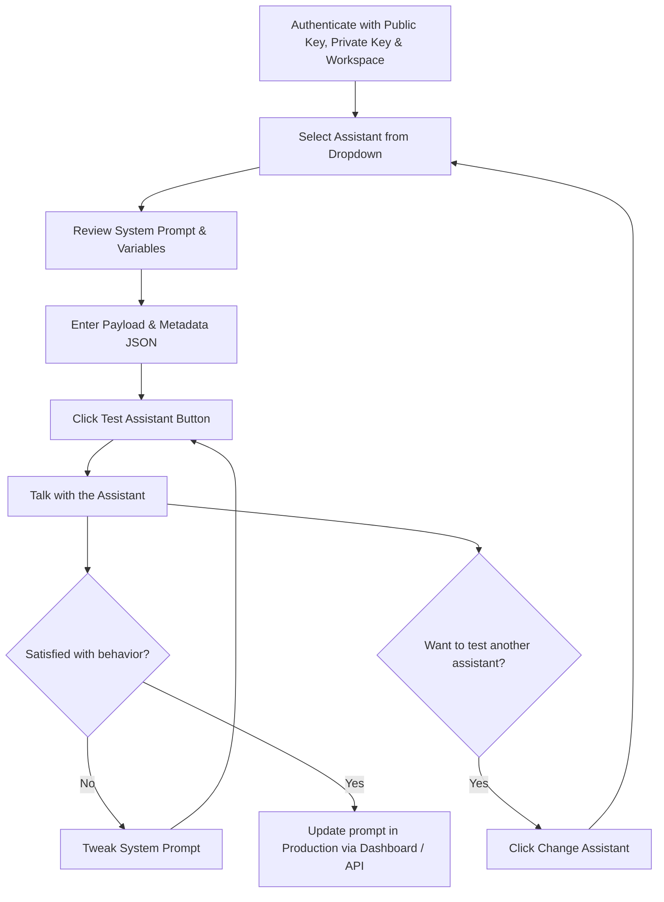

## Overview

The **Assistant Sandbox** is a testing environment where you can experiment with your voice assistant's system prompt, make real-time tweaks, and trigger web calls — all without modifying your production assistant. It's the fastest way to fine-tune how your assistant behaves during a call.

<Warning>
  **Credits are deducted for sandbox calls.** Sandbox calls are real calls and
  will consume credits from your wallet just like production calls.
</Warning>

## Getting Started

<Steps>
  <Step title="Authenticate">
    Enter your **Public Key**, **Private Key**, and **Workspace** credentials to access the sandbox, and click the **Validate** button.

    <Frame caption="Sandbox authentication — enter your Public Key, Private Key, and Workspace ID to validate access.">
      
    </Frame>

    | Field | Description |
    | :--- | :--- |
    | `Public Key` | Your public API key |
    | `Private Key` | Your private/secret API key |
    | `Workspace` | The workspace identifier you want to work with |

    Once authenticated, the sandbox loads your workspace data and retrieves all assistants configured under it.

  </Step>

  <Step title="Select an Assistant">
    After authentication, a **dropdown** appears listing all assistants created in your workspace. Select the assistant you want to test.

    <Frame caption="Assistant selection — choose from all assistants configured in your workspace.">
      
    </Frame>

  </Step>

  <Step title="Review the Prompt & Configure">
    Once you select an assistant, the screen splits into **two sections**:

    <Frame caption="Sandbox main interface — system prompt on the left, payload and metadata on the right.">
      
    </Frame>

    **Left Section — System Prompt & Variables**
    - The assistant's **system prompt** is displayed in an editable area, organized by sections like **Context**, **Objective**, and **Personality**
    - Below the prompt, you'll see **allowed variables** — these are system-generated variables based on the data you provide (e.g., customer name, order details, discount info)
    - You can only use these system-generated variables in your prompt

    **Right Section — Configuration**
    - **Payload** — A JSON text box where you paste the call payload data (e.g., customer info, cart details)
    - **Metadata** — A JSON text box where you paste any additional metadata for the call
    - **Change Assistant** — A button in the top-right to switch to a different assistant

  </Step>

<Step title="Make a Call">
  1. Populate the **Payload** and **Metadata** fields with your JSON data 2.
  Optionally, edit the **system prompt** to test different conversation
  behaviors 3. Click the **Test Assistant** button to trigger a web call 4.
  You'll be connected to the assistant and can speak with it in real-time
</Step>

  <Step title="Iterate & Refine">
    After each call, review how the assistant responded:
    - Modify the **system prompt** based on your findings
    - Adjust the **Payload** or **Metadata** as needed
    - Click **Test Assistant** again to test your changes instantly

    Repeat this cycle until the assistant behaves as expected.

  </Step>

  <Step title="Switch Assistants">
    To test a different assistant, click the **Change Assistant** button in the top-right corner. The assistant dropdown will reappear, letting you select another assistant from your workspace.
  </Step>
</Steps>

## Important Notes

<Note>
  **Prompt changes are not saved.** Any modifications you make to the system
  prompt in the sandbox are temporary. They are not stored or updated in the
  database. To apply changes permanently, update the assistant's prompt through
  the dashboard or API.
</Note>

<Note>
  **Use only system-generated variables.** The allowed variables shown in the
  sandbox are automatically generated based on the data you provide. Custom or
  arbitrary variables will not be resolved during the call.
</Note>

<Note>
  **No events or actions in sandbox.** Webhook events (such as `call.ended`,
  `call.completed`, `end-of-call`, `action`, etc.) and actions (such as
  `create-order`, `send-whatsapp`) are **not triggered** during sandbox calls.
  The sandbox is purely for testing prompt behavior and conversation flow.
</Note>

## Typical Workflow

## Best Practices

- **Start with your production prompt** — Select the assistant and test its current behavior before making changes.
- **Change one thing at a time** — Modify a single aspect of the prompt per call so you can clearly identify what impacts the assistant's behavior.
- **Test edge cases** — Vary your payload data (e.g., different product types, price ranges, customer profiles) to ensure the prompt handles diverse scenarios.
- **Note your changes** — Since sandbox edits aren't saved, copy your final working prompt and apply it to your assistant configuration manually.
- **Monitor your credits** — Each sandbox call deducts credits, so plan your testing sessions efficiently.
