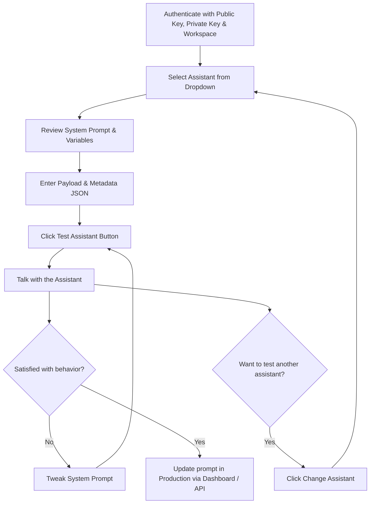

<Note>
**This documents the v1 product.** It is kept for integrations already running
on it. If you are building something new, start with the
[Quickstart](/v2/quickstart).
</Note>

## Overview

The **Assistant Sandbox** is a testing environment for your voice assistant's
system prompt. You can tweak the prompt as you go and trigger web calls to try
it, and none of this changes your production assistant. It's the fastest way to
fine-tune how your assistant behaves during a call.

<Warning>
  **Credits are deducted for sandbox calls.** Sandbox calls are real calls, and
  they use credits from your wallet the same way production calls do.
</Warning>

## Getting Started

<Steps>
  <Step title="Authenticate">
    To open the sandbox, enter your **Public Key**, **Private Key** and **Workspace** credentials, then click the **Validate** button.

    <Frame caption="Sandbox authentication — enter your Public Key, Private Key, and Workspace ID to validate access.">
      
    </Frame>

    | Field | Description |
    | :--- | :--- |
    | `Public Key` | Your public API key |
    | `Private Key` | Your private/secret API key |
    | `Workspace` | The workspace identifier you want to work with |

    Once you're authenticated, the sandbox loads your workspace data and every assistant configured in it.

  </Step>

  <Step title="Select an Assistant">
    A **dropdown** then lists every assistant in your workspace. Select the one you want to test.

    <Frame caption="Assistant selection — choose from all assistants configured in your workspace.">
      
    </Frame>

  </Step>

  <Step title="Review the Prompt & Configure">
    Once you select an assistant, the screen splits into two sections:

    <Frame caption="Sandbox main interface — system prompt on the left, payload and metadata on the right.">
      
    </Frame>

    **Left section: System Prompt & Variables**
    - The assistant's **system prompt** appears in an editable area, split into sections such as **Context**, **Objective** and **Personality**
    - Below the prompt is the list of **allowed variables**. The system generates these from the data you provide (e.g., customer name, order details, discount info)
    - You can only use these system-generated variables in your prompt

    **Right section: Configuration**
    - **Payload**: a JSON text box where you paste the call payload data (e.g., customer info, cart details)
    - **Metadata**: a JSON text box where you paste any additional metadata for the call
    - **Change Assistant**: a button in the top-right that switches to a different assistant

  </Step>

<Step title="Make a Call">
  1. Fill in the **Payload** and **Metadata** fields with your JSON data.
  2. Optionally, edit the **system prompt** to test different conversation
     behaviors.
  3. Click the **Test Assistant** button to trigger a web call.
  4. You're connected to the assistant and can speak with it in real time.
</Step>

  <Step title="Iterate & Refine">
    After each call, review how the assistant responded:
    - Modify the **system prompt** based on your findings
    - Adjust the **Payload** or **Metadata** as needed
    - Click **Test Assistant** again to test your changes right away

    Repeat this cycle until the assistant behaves as expected.

  </Step>

  <Step title="Switch Assistants">
    To test a different assistant, click the **Change Assistant** button in the top-right corner. The assistant dropdown reappears so you can select another assistant from your workspace.
  </Step>
</Steps>

## Important Notes

<Note>
  **Prompt changes are not saved.** Edits you make to the system prompt in the
  sandbox are temporary and are not stored in the database. To keep a change,
  update the assistant's prompt through the dashboard or API.
</Note>

<Note>
  **Use only system-generated variables.** The sandbox generates the allowed
  variables from the data you provide. Custom or arbitrary variables are not
  resolved during the call.
</Note>

<Note>
  **No events or actions in sandbox.** Sandbox calls do not trigger webhook
  events (such as `call.ended`, `call.completed`, `end-of-call`, `action`, etc.)
  or actions (such as `create-order`, `send-whatsapp`). The sandbox is only for
  testing prompt behavior and conversation flow.
</Note>

## Typical Workflow

```mermaid
flowchart TD
    A[Authenticate with Public Key, Private Key & Workspace] --> B[Select Assistant from Dropdown]
    B --> C[Review System Prompt & Variables]
    C --> D[Enter Payload & Metadata JSON]
    D --> E[Click Test Assistant Button]
    E --> F[Talk with the Assistant]
    F --> G{Satisfied with behavior?}
    G -- No --> H[Tweak System Prompt]
    H --> E
    G -- Yes --> I[Update prompt in Production via Dashboard / API]
    F --> J{Want to test another assistant?}
    J -- Yes --> K[Click Change Assistant]
    K --> B
```

## Best Practices

- **Start with your production prompt.** Select the assistant and test how it behaves now, before you make changes.
- **Change one thing at a time.** Edit one part of the prompt per call, so you can tell which edit changed the assistant's behavior.
- **Test edge cases.** Vary your payload data (e.g., different product types, price ranges, customer profiles) to check that the prompt handles a range of scenarios.
- **Note your changes.** Sandbox edits aren't saved, so copy your final working prompt and apply it to your assistant configuration by hand.
- **Monitor your credits.** Each sandbox call deducts credits, so plan your testing sessions with that in mind.
