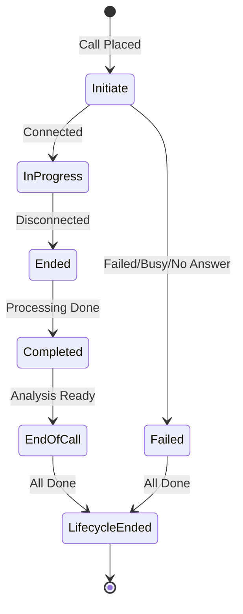

Voice Agents uses webhooks to notify your application about the state of every call in real-time. Whether a call connects, fails, or triggers a specific action (like creating an order), your configured **callback URL** receives an event payload.

## Call Lifecycle

Every call progresses through a specific lifecycle. At each stage, an event is fired.



### Lifecycle Events

These events track the normal progression of a successful call.

| Event | Description |
| :--- | :--- |
| `call.initiate` | The call has been queued and is being dialed. |
| `call.in-progress` | The recipient picked up; the AI conversation has started. |
| `call.ended` | The phone connection has dropped. |
| `call.completed` | Call data (recording, transcript, duration) has been processed. |
| `call.timeout` | The call exceeded the maximum allowed duration. |
| `end-of-call` | AI analysis is complete — summary, success evaluation, and structured data are available. |
| `call.lifecycle-ended` | All processing is finished. This is the **final event** for this call. |

### Failure & Retry Events

If a call cannot be established, one of these events will fire. The system may automatically retry based on your campaign settings.

| Event | Description |
| :--- | :--- |
| `call.failed` | The call could not be connected (general failure). |
| `call.busy` | The recipient's line was busy. |
| `call.no-answer` | The recipient did not pick up. |
| `call.validation-failed` | Pre-call validation failed (e.g., invalid number). |
| `call.skip` | The call was skipped (e.g., DND number). |

### Other Events

| Event | Description |
| :--- | :--- |
| `call.rescheduled` | A callback has been scheduled for a later time (lifecycle continues to the next attempt). |
| `call.aborted` | The call was manually cancelled via the abort API. |

<Note>
After all retry attempts are exhausted, `call.lifecycle-ended` is sent to signal that no further attempts will be made for this specific call task.
</Note>

## Webhook Payload Structure

Every webhook event shares a common envelope structure.

```json
{
  "metadata": {
    "customer_id": "12345",
    "order_ref": "ORD-001"
  },
  "event": {
    "type": "call.completed",
    "data": {
      "call": {
        "id": "c_550e8400-e29b",
        "status": "completed",
        "startedAt": "2023-10-27T10:00:00Z",
        "endedAt": "2023-10-27T10:02:30Z",
        "durationSeconds": 150,
        "recordingUrl": "https://api.voice-agents.com/recordings/...",
        "detailUrl": "https://api.voice-agents.com/calls/..."
      }
    }
  }
}
```

### Key Fields

- **`metadata`**: The custom JSON object you passed when initiating the call. This is passed back in **every** event, allowing you to link calls to your internal records (e.g., `userId`, `orderId`).
- **`event.type`**: The specific event name (e.g., `call.in-progress`, `end-of-call`).
- **`event.data`**: The payload specific to the event.

### Special Payloads

Some events contain additional data in `event.data`.

#### `end-of-call`
Contains the AI analysis, summary, and credit usage.

```json
{
  "analysis": {
    "success": true,
    "summary": "Customer confirmed the appointment for Tuesday.",
    "insights": {
        "sentiment": "positive",
        "intent": "booking_confirmed"
    }
  },
  "credits": {
    "used": 2.5,
    "available": 105.0
  }
}
```

#### `call.lifecycle-ended`
Contains a report of all attempts.

```json
{
  "report": {
    "reAttemptCount": 1,
    "rescheduledCount": 0,
    "finalStatus": "completed"
  }
}
```

## Actions

Actions are special events triggered by the AI during the conversation when a specific task needs to be performed on your end, such as creating an order or sending a message.

### `create_order`

Fires when the AI determines the customer wants to place an order and has provided all necessary details.

```json
{
  "event": {
    "type": "action",
    "data": {
      "action": "create_order",
      "payload": {
        "phone": "+15550109988",
        "lineItems": [{ "variantId": "123", "quantity": 1 }],
        "shippingAddress": {
          "firstName": "Jane",
          "lastName": "Doe",
          "address1": "123 Main St",
          "city": "New York",
          "zip": "10001",
          "country": "US"
        },
        "paymentMode": "cod",
        "cartTotal": 150.00
      }
    }
  }
}
```

### `send_whatsapp`

Fires when the AI cannot complete a task (like creating an order) due to missing info, and triggers a fallback message via WhatsApp.

| Reason | Meaning |
| :--- | :--- |
| `missing_address` | Customer's shipping address is incomplete. |
| `missing_first_name` | Customer's name could not be determined. |
| `invalid_cart_data` | Cart data is malformed or missing. |

```json
{
  "event": {
    "type": "action",
    "data": {
      "action": "send_whatsapp",
      "reason": "missing_address"
    }
  }
}
```

## Handling Webhooks

Here is an example of how to handle these events in a Node.js Express application.

```javascript
app.post('/webhooks/voice-agent', (req, res) => {
  const { event, metadata } = req.body;

  console.log(`Received event: ${event.type} for Customer: ${metadata.customer_id}`);

  switch (event.type) {
    case 'call.in-progress':
      // Call connected, maybe update UI status
      break;

    case 'action':
      if (event.data.action === 'create_order') {
        // Handle order creation logic
        createOrder(event.data.payload);
      } else if (event.data.action === 'send_whatsapp') {
        // Handle WhatsApp fallback logic
        sendWhatsAppFallback(event.data.reason);
      }
      break;

    case 'end-of-call':
      // Save call summary and analysis
      saveCallAnalysis(event.data.call.id, event.data.analysis);
      break;

    case 'call.rescheduled':
      // Update next attempt time in your DB
      console.log(`Call rescheduled for later`);
      break;

    case 'call.failed':
    case 'call.busy':
    case 'call.no-answer':
      // Log failure reason
      console.log(`Call failed: ${event.type}`);
      break;
      
    default:
      console.log('Unhandled event:', event.type);
  }

  // Always acknowledge the webhook
  res.status(200).send('OK');
});
```

## Security

To ensure that the webhooks you receive are genuinely from Voice Agents, you should verify the signature included in the headers.

See [Webhook Signature Verification](/developers/webhook-signature) for implementation details.
