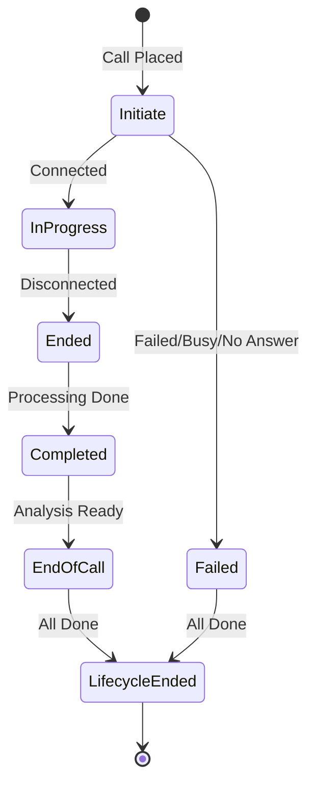

<Note>
**This documents the v1 product.** It is kept for integrations already running
on it. If you are building something new, start with the
[Quickstart](/v2/quickstart).
</Note>

Voice Agents sends webhooks to tell your application about the state of every
call in real time. When a call connects, fails or triggers an action such as
creating an order, your configured callback URL receives an event payload.

## Call Lifecycle

Every call moves through the lifecycle below, and each stage fires an event.


```mermaid
stateDiagram-v2
    [*] --> Initiate: Call Placed
    Initiate --> InProgress: Connected
    Initiate --> Failed: Failed/Busy/No Answer
    InProgress --> Ended: Disconnected
    Ended --> Completed: Processing Done
    Completed --> EndOfCall: Analysis Ready
    EndOfCall --> LifecycleEnded: All Done
    Failed --> LifecycleEnded: All Done
    LifecycleEnded --> [*]
```

### Lifecycle Events

These events follow a successful call from start to finish.

| Event | Description |
| :--- | :--- |
| `call.initiate` | The call has been queued and is being dialed. |
| `call.in-progress` | The recipient picked up; the AI conversation has started. |
| `call.ended` | The phone connection has dropped. |
| `call.completed` | Call data (recording, transcript, duration) has been processed. |
| `call.timeout` | The call exceeded the maximum allowed duration. |
| `end-of-call` | AI analysis is complete. The summary, success evaluation and structured data are available. |
| `call.lifecycle-ended` | All processing is finished. This is the final event for this call. |

### Failure & Retry Events

If a call can't be connected, one of these events fires. The system may retry
automatically, depending on your campaign settings.

| Event | Description |
| :--- | :--- |
| `call.failed` | The call could not be connected (general failure). |
| `call.busy` | The recipient's line was busy. |
| `call.no-answer` | The recipient did not pick up. |
| `call.validation-failed` | Pre-call validation failed (e.g., invalid number). |
| `call.skip` | The call was skipped (e.g., DND number). |

### Other Events

| Event | Description |
| :--- | :--- |
| `call.rescheduled` | A callback has been scheduled for a later time (lifecycle continues to the next attempt). |
| `call.aborted` | The call was manually cancelled via the abort API. |

<Note>
When all retry attempts are used up, we send `call.lifecycle-ended` to signal
that no more attempts will be made for this call task.
</Note>

## Webhook Payload Structure

Every webhook event uses the same envelope.

```json
{
  "metadata": {
    "customer_id": "12345",
    "order_ref": "ORD-001"
  },
  "event": {
    "type": "call.completed",
    "data": {
      "call": {
        "id": "c_550e8400-e29b",
        "status": "completed",
        "startedAt": "2023-10-27T10:00:00Z",
        "endedAt": "2023-10-27T10:02:30Z",
        "durationSeconds": 150,
        "recordingUrl": "https://api.voice-agents.com/recordings/...",
        "detailUrl": "https://api.voice-agents.com/calls/..."
      }
    }
  }
}
```

### Key Fields

- **`metadata`**: The custom JSON object you passed when initiating the call. It
  comes back in every event, so you can link calls to your internal records
  (e.g., `userId`, `orderId`).
- **`event.type`**: The event name (e.g., `call.in-progress`, `end-of-call`).
- **`event.data`**: The payload specific to the event.

### Special Payloads

Some events contain additional data in `event.data`.

#### `end-of-call`
Contains the AI analysis, summary, and credit usage.

```json
{
  "analysis": {
    "success": true,
    "summary": "Customer confirmed the appointment for Tuesday.",
    "insights": {
        "sentiment": "positive",
        "intent": "booking_confirmed"
    }
  },
  "credits": {
    "used": 2.5,
    "available": 105.0
  }
}
```

#### `call.lifecycle-ended`
Contains a report of all attempts.

```json
{
  "report": {
    "reAttemptCount": 1,
    "rescheduledCount": 0,
    "finalStatus": "completed"
  }
}
```

## Actions

Actions are events the AI sends during the conversation when your system needs
to do something, such as create an order or send a message.

### `create_order`

Fires when the AI decides that the customer wants to place an order and has given
all the details it needs.

```json
{
  "event": {
    "type": "action",
    "data": {
      "action": "create_order",
      "payload": {
        "phone": "+15550109988",
        "lineItems": [{ "variantId": "123", "quantity": 1 }],
        "shippingAddress": {
          "firstName": "Jane",
          "lastName": "Doe",
          "address1": "123 Main St",
          "city": "New York",
          "zip": "10001",
          "country": "US"
        },
        "paymentMode": "cod",
        "cartTotal": 150.00
      }
    }
  }
}
```

### `send_whatsapp`

Fires when the AI can't complete a task, such as creating an order, because
information is missing. It triggers a fallback message on WhatsApp.

| Reason | Meaning |
| :--- | :--- |
| `missing_address` | Customer's shipping address is incomplete. |
| `missing_first_name` | Customer's name could not be determined. |
| `invalid_cart_data` | Cart data is malformed or missing. |

```json
{
  "event": {
    "type": "action",
    "data": {
      "action": "send_whatsapp",
      "reason": "missing_address"
    }
  }
}
```

## Handling Webhooks

This example handles these events in a Node.js Express application.

```javascript
app.post('/webhooks/voice-agent', (req, res) => {
  const { event, metadata } = req.body;

  console.log(`Received event: ${event.type} for Customer: ${metadata.customer_id}`);

  switch (event.type) {
    case 'call.in-progress':
      // Call connected, maybe update UI status
      break;

    case 'action':
      if (event.data.action === 'create_order') {
        // Handle order creation logic
        createOrder(event.data.payload);
      } else if (event.data.action === 'send_whatsapp') {
        // Handle WhatsApp fallback logic
        sendWhatsAppFallback(event.data.reason);
      }
      break;

    case 'end-of-call':
      // Save call summary and analysis
      saveCallAnalysis(event.data.call.id, event.data.analysis);
      break;

    case 'call.rescheduled':
      // Update next attempt time in your DB
      console.log(`Call rescheduled for later`);
      break;

    case 'call.failed':
    case 'call.busy':
    case 'call.no-answer':
      // Log failure reason
      console.log(`Call failed: ${event.type}`);
      break;
      
    default:
      console.log('Unhandled event:', event.type);
  }

  // Always acknowledge the webhook
  res.status(200).send('OK');
});
```

## Security

To confirm that a webhook really came from Voice Agents, verify the signature in
its headers.

See [Webhook Signature Verification](/developers/webhook-signature) for implementation details.

## The same thing in v2

v2 keeps most of this design. It still sends one event per state change, and
each event comes in an envelope you acknowledge with `200` and carries a
signature you verify. The event names are different. Retries and actions did
not carry over to v2, and the analysis is not built yet.

| v1 event | v2 | Notes |
| :--- | :--- | :--- |
| `call.initiate` | `call.queued` | Opt-in in v2; ask to have it enabled. |
| `call.in-progress` | `call.started` | Media is live. |
| `call.ended` + `call.completed` | `call.completed` | One terminal event, not two. |
| `call.timeout` | `call.failed` | Read `data.call.status`, which is `timeout`. |
| `call.failed` / `call.busy` / `call.no-answer` | `call.failed` | One event; the status distinguishes them. |
| `call.aborted` | `call.aborted` | Same meaning. |
| — | `call.voicemail` | New in v2, and it is billed. |
| `call.validation-failed` | — | v2 rejects a bad number at create time, with `400`. |
| `call.rescheduled`, `call.skip`, `call.lifecycle-ended` | — | **v2 does not retry.** Each call object has one outcome, so retry from your own dialler. |
| `end-of-call` (summary, sentiment) | — | Post-call analysis is on the [roadmap](/general/roadmap). |
| `action` (`create_order`, `send_whatsapp`) | — | Not in v2. |

**`metadata` works differently.** v1 echoes your object back on every event. v2
returns the `call_id` in the `202` response to
[`POST /v2/calls`](/v2/calls#create-a-call). Store it against your own record
before the first event can arrive, and use it to match events to that record.
The `variables` you pass when you create the call go into the prompt and do not
come back on the event.

For the full reference, see [v2 Webhooks](/v2/webhooks).
