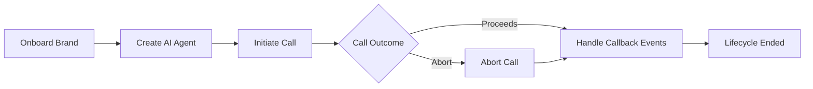
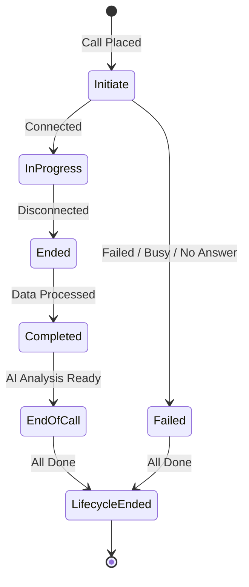

This guide walks through the complete lifecycle of a customer on the Voice Agents platform — from initial onboarding to receiving real-time call events via your callback URL.

## Lifecycle Overview



---

## Step 1 — Onboard a Brand

Register your brand (Shopify store) to create a workspace with billing configuration. All subsequent API operations are scoped to this workspace.

<div style={{backgroundColor: '#e6f4ea', color: '#1e7e34', padding: '10px', borderRadius: '4px', fontFamily: 'monospace', fontWeight: 'bold', display: 'inline-block', marginBottom: '20px'}}>
POST /v2/workspace/onboard/shopify
</div>

### Authentication

| Header | Description |
| :--- | :--- |
| `x-public-key` | Your public API key |
| `x-private-key` | Your private API key |

### Body Parameters

| Parameter | Type | Required | Description |
| :--- | :--- | :--- | :--- |
| `name` | string | **Yes** | Your store/brand name |
| `currencyCode` | string | **Yes** | Store currency (e.g., `INR`, `USD`) |
| `timezone` | string | **Yes** | Store timezone (e.g., `Asia/Kolkata`) |
| `supportContacts.phoneNumber` | string | **Yes** | Support phone number in E.164 format |
| `supportContacts.email` | string | No | Support email address |
| `trustSignals.valuePropositionOneLiner` | string | **Yes** | One-line brand value proposition |
| `trustSignals.customersTillDate` | integer | No | Total customers served |
| `trustSignals.totalOrdersFulfilled` | integer | No | Total orders fulfilled |
| `trustSignals.storeRating` | number | No | Store rating (e.g., `4.8`) |
| `policyFramework.returnPolicy` | object | No | Return window, processing fee, refund timeline |
| `policyFramework.shippingPolicy` | object | No | Delivery timeline, free shipping threshold |
| `policyFramework.codPolicy` | object | No | COD availability and additional fee |

<CodeGroup>

```bash cURL
curl --location 'https://api.voice-agents.miraiminds.co/v2/workspace/onboard/shopify' \
--header 'x-public-key: pk_your_public_key' \
--header 'x-private-key: sk_your_private_key' \
--header 'Content-Type: application/json' \
--data '{
    "name": "Acme Store",
    "currencyCode": "INR",
    "timezone": "Asia/Kolkata",
    "supportContacts": {
        "phoneNumber": "+919876543210",
        "email": "support@acme.com"
    },
    "trustSignals": {
        "valuePropositionOneLiner": "Handcrafted products using sustainable materials",
        "customersTillDate": 15000,
        "totalOrdersFulfilled": 42000,
        "storeRating": 4.8
    },
    "policyFramework": {
        "returnPolicy": {
            "windowDays": 7,
            "processingFee": { "amount": 50 },
            "refundTimelineDays": 3
        },
        "shippingPolicy": {
            "deliveryTimeline": { "minDays": 3, "maxDays": 5 },
            "freeShippingMinOrderValue": 999
        },
        "codPolicy": {
            "enabled": true,
            "additionalFee": { "amount": 50 }
        }
    }
}'
```

```javascript Node.js
const response = await fetch(
  'https://api.voice-agents.miraiminds.co/v2/workspace/onboard/shopify',
  {
    method: 'POST',
    headers: {
      'x-public-key': 'pk_your_public_key',
      'x-private-key': 'sk_your_private_key',
      'Content-Type': 'application/json',
    },
    body: JSON.stringify({
      name: 'Acme Store',
      currencyCode: 'INR',
      timezone: 'Asia/Kolkata',
      supportContacts: {
        phoneNumber: '+919876543210',
        email: 'support@acme.com',
      },
      trustSignals: {
        valuePropositionOneLiner: 'Handcrafted products using sustainable materials',
        customersTillDate: 15000,
        totalOrdersFulfilled: 42000,
        storeRating: 4.8,
      },
      policyFramework: {
        returnPolicy: { windowDays: 7, processingFee: { amount: 50 }, refundTimelineDays: 3 },
        shippingPolicy: { deliveryTimeline: { minDays: 3, maxDays: 5 }, freeShippingMinOrderValue: 999 },
        codPolicy: { enabled: true, additionalFee: { amount: 50 } },
      },
    }),
  }
);
const { data } = await response.json();
console.log(data.workspace); // save your workspace ID
```

```python Python
import requests

response = requests.post(
    'https://api.voice-agents.miraiminds.co/v2/workspace/onboard/shopify',
    headers={
        'x-public-key': 'pk_your_public_key',
        'x-private-key': 'sk_your_private_key',
        'Content-Type': 'application/json',
    },
    json={
        'name': 'Acme Store',
        'currencyCode': 'INR',
        'timezone': 'Asia/Kolkata',
        'supportContacts': {
            'phoneNumber': '+919876543210',
            'email': 'support@acme.com',
        },
        'trustSignals': {
            'valuePropositionOneLiner': 'Handcrafted products using sustainable materials',
            'customersTillDate': 15000,
            'totalOrdersFulfilled': 42000,
            'storeRating': 4.8,
        },
        'policyFramework': {
            'returnPolicy': {'windowDays': 7, 'processingFee': {'amount': 50}, 'refundTimelineDays': 3},
            'shippingPolicy': {'deliveryTimeline': {'minDays': 3, 'maxDays': 5}, 'freeShippingMinOrderValue': 999},
            'codPolicy': {'enabled': True, 'additionalFee': {'amount': 50}},
        },
    }
)
workspace_id = response.json()['data']['workspace']
print(workspace_id)  # save your workspace ID
```

</CodeGroup>

**Success Response (`200 OK`)**

```json
{
  "success": true,
  "data": {
    "workspace": "68d63c242cd956c2bb41cd3a",
    "status": "active"
  }
}
```

<Warning>
  Save your `workspace` ID — it is required as a header in every subsequent API call.
</Warning>

---

## Step 2 — Create an AI Agent

Create a voice assistant configured with a persona, language, voice, call settings, and optionally a knowledge base.

<div style={{backgroundColor: '#e6f4ea', color: '#1e7e34', padding: '10px', borderRadius: '4px', fontFamily: 'monospace', fontWeight: 'bold', display: 'inline-block', marginBottom: '20px'}}>
POST /v1/admin/assistant/create
</div>

### Headers

| Header | Required | Description |
| :--- | :--- | :--- |
| `x-public-key` | **Yes** | Your public API key |
| `x-private-key` | **Yes** | Your private API key |
| `workspace` | **Yes** | Your workspace ID |

### Body Parameters

| Parameter | Type | Required | Description |
| :--- | :--- | :--- | :--- |
| `name` | string | **Yes** | Assistant display name (max 40 chars) |
| `variant.type` | string | **Yes** | Assistant type: `abandoned_cart` or `custom` |
| `variant.config.systemPrompt` | string | No | Custom system prompt (for `custom` variant) |
| `agent.identity.name` | string | **Yes** | Agent's spoken name (e.g., `Priya`) |
| `agent.identity.gender` | string | **Yes** | `male` or `female` |
| `agent.identity.voice` | string | **Yes** | Voice identifier (see [Voice Gallery](/api-reference/introduction)) |
| `icpContext.language` | string | **Yes** | Call language: `hinglish`, `english`, `hindi`, `tamil`, `telugu`, and more |
| `icpContext.targetAgeGroups` | array | No | `gen_z`, `millennials`, `gen_x`, `boomers` |
| `icpContext.locationTiers` | array | No | `metro_urban`, `tier1`, `tier2`, `tier3`, `rural` |
| `callSettings.slots` | array | No | Time windows when calls can be made (e.g., `10:00`–`17:30`) |
| `callSettings.maxCallDuration` | number | No | Maximum call duration in seconds |
| `callSettings.concurrentCallCount` | number | No | Max concurrent calls (up to 10) |
| `callSettings.retryProtocol` | object | No | Retry behavior for no-pick-up and low-engagement calls |
| `analysisPlan` | object | No | Success criteria and summary instructions for post-call AI analysis |
| `knowledgeBase.faq` | array | No | FAQ pairs (`question` + `answer`) |
| `knowledgeBase.documents` | array | No | External documents by URL (`pdf`, `txt`, `docx`, `markdown`) |

<CodeGroup>

```bash cURL
curl --location 'https://api.voice-agents.miraiminds.co/v1/admin/assistant/create' \
--header 'x-public-key: pk_your_public_key' \
--header 'x-private-key: sk_your_private_key' \
--header 'workspace: 68d63c242cd956c2bb41cd3a' \
--header 'Content-Type: application/json' \
--data '{
    "name": "Acme Abandoned Cart Agent",
    "variant": {
        "type": "abandoned_cart"
    },
    "agent": {
        "identity": {
            "name": "Priya",
            "gender": "female",
            "voice": "priya"
        }
    },
    "icpContext": {
        "language": "hinglish",
        "targetAgeGroups": ["millennials", "gen_z"],
        "locationTiers": ["metro_urban", "tier1"]
    },
    "callSettings": {
        "slots": [
            { "startTime": "10:00", "endTime": "13:00" },
            { "startTime": "15:00", "endTime": "19:00" }
        ],
        "maxCallDuration": 180,
        "concurrentCallCount": 5,
        "retryProtocol": {
            "maxAttemptsNoPickup": 2,
            "maxAttemptsLowEngagement": 1,
            "reAttemptPeriod": 300,
            "maxRescheduleCount": 1
        }
    },
    "analysisPlan": {
        "successCriteriaPlan": "Call is successful if the customer confirmed intent to complete the purchase or provided a reason for abandonment.",
        "summaryPlan": "Summarize customer sentiment and whether they intend to buy."
    },
    "knowledgeBase": {
        "faq": [
            {
                "question": "What is your return policy?",
                "answer": "We offer 7-day returns with a ₹50 processing fee."
            }
        ]
    }
}'
```

```javascript Node.js
const response = await fetch(
  'https://api.voice-agents.miraiminds.co/v1/admin/assistant/create',
  {
    method: 'POST',
    headers: {
      'x-public-key': 'pk_your_public_key',
      'x-private-key': 'sk_your_private_key',
      workspace: '68d63c242cd956c2bb41cd3a',
      'Content-Type': 'application/json',
    },
    body: JSON.stringify({
      name: 'Acme Abandoned Cart Agent',
      variant: { type: 'abandoned_cart' },
      agent: {
        identity: { name: 'Priya', gender: 'female', voice: 'priya' },
      },
      icpContext: {
        language: 'hinglish',
        targetAgeGroups: ['millennials', 'gen_z'],
        locationTiers: ['metro_urban', 'tier1'],
      },
      callSettings: {
        slots: [
          { startTime: '10:00', endTime: '13:00' },
          { startTime: '15:00', endTime: '19:00' },
        ],
        maxCallDuration: 180,
        concurrentCallCount: 5,
        retryProtocol: {
          maxAttemptsNoPickup: 2,
          maxAttemptsLowEngagement: 1,
          reAttemptPeriod: 300,
          maxRescheduleCount: 1,
        },
      },
      analysisPlan: {
        successCriteriaPlan:
          'Call is successful if the customer confirmed intent to complete the purchase.',
        summaryPlan: 'Summarize customer sentiment and whether they intend to buy.',
      },
      knowledgeBase: {
        faq: [{ question: 'What is your return policy?', answer: 'We offer 7-day returns.' }],
      },
    }),
  }
);
const { data } = await response.json();
console.log(data.assistantId); // save your assistant ID
```

```python Python
import requests

response = requests.post(
    'https://api.voice-agents.miraiminds.co/v1/admin/assistant/create',
    headers={
        'x-public-key': 'pk_your_public_key',
        'x-private-key': 'sk_your_private_key',
        'workspace': '68d63c242cd956c2bb41cd3a',
        'Content-Type': 'application/json',
    },
    json={
        'name': 'Acme Abandoned Cart Agent',
        'variant': {'type': 'abandoned_cart'},
        'agent': {
            'identity': {'name': 'Priya', 'gender': 'female', 'voice': 'priya'},
        },
        'icpContext': {
            'language': 'hinglish',
            'targetAgeGroups': ['millennials', 'gen_z'],
            'locationTiers': ['metro_urban', 'tier1'],
        },
        'callSettings': {
            'slots': [
                {'startTime': '10:00', 'endTime': '13:00'},
                {'startTime': '15:00', 'endTime': '19:00'},
            ],
            'maxCallDuration': 180,
            'concurrentCallCount': 5,
            'retryProtocol': {
                'maxAttemptsNoPickup': 2,
                'maxAttemptsLowEngagement': 1,
                'reAttemptPeriod': 300,
                'maxRescheduleCount': 1,
            },
        },
        'analysisPlan': {
            'successCriteriaPlan': 'Call is successful if the customer confirmed intent to purchase.',
            'summaryPlan': 'Summarize customer sentiment and purchase intent.',
        },
        'knowledgeBase': {
            'faq': [{'question': 'What is your return policy?', 'answer': 'We offer 7-day returns.'}],
        },
    }
)
assistant_id = response.json()['data']['assistantId']
print(assistant_id)  # save your assistant ID
```

</CodeGroup>

**Success Response (`200 OK`)**

```json
{
  "success": true,
  "data": {
    "assistantId": "6927ec5c9322ed9f9fb55c68"
  }
}
```

Save the `assistantId` — it is required when initiating calls.

<Note>
  `variant.type` is immutable after creation. Choose `abandoned_cart` for cart recovery flows or `custom` for fully flexible prompts.
</Note>

---

## Step 3 — Initiate a Call

Trigger an outbound call to a customer using the assistant you created.

<div style={{backgroundColor: '#e6f4ea', color: '#1e7e34', padding: '10px', borderRadius: '4px', fontFamily: 'monospace', fontWeight: 'bold', display: 'inline-block', marginBottom: '20px'}}>
POST /v2/call/initiate
</div>

### Headers

| Header | Required | Description |
| :--- | :--- | :--- |
| `x-public-key` | **Yes** | Your public API key |
| `x-private-key` | **Yes** | Your private API key |
| `workspace` | **Yes** | Your workspace ID |

### Body Parameters

| Parameter | Type | Required | Description |
| :--- | :--- | :--- | :--- |
| `phoneNumber` | string | **Yes** | Customer's phone number in E.164 format (e.g., `+919876543210`) |
| `assistant` | string | **Yes** | The `assistantId` from Step 2 |
| `callbackUrl` | string | **Yes** | HTTPS URL to receive webhook events for this call |
| `priority` | boolean | No | Set `true` to jump the call queue |
| `payload` | object | No | Call context data (customer info, cart items, pricing) passed to the AI during the call |
| `metadata` | object | No | Arbitrary key-value pairs echoed back in every webhook event |
| `metadata.discount` | object | No | Discount code to offer during the call (`code`, `value`, `codeType`, `applyAs`) |

#### `payload` Object

The `payload` provides the AI with context about the customer and their cart. All fields are optional but recommended for `abandoned_cart` assistants.

| Field | Type | Description |
| :--- | :--- | :--- |
| `customer.firstName` | string | Customer's first name |
| `customer.lastName` | string | Customer's last name |
| `customer.email` | string | Customer's email |
| `customer.phone` | string | Customer's phone |
| `lineItems` | array | Cart items — each with `title`, `quantity`, and `variant.id` + `variant.title` |
| `subtotalPriceSet.shopMoney.amount` | string | Cart subtotal |
| `totalPriceSet.shopMoney.amount` | string | Cart total |
| `abandonedCheckoutUrl` | string | Direct URL to the abandoned checkout |
| `shippingAddress` | object | Customer's shipping address |

<CodeGroup>

```bash cURL
curl --location 'https://api.voice-agents.miraiminds.co/v2/call/initiate' \
--header 'x-public-key: pk_your_public_key' \
--header 'x-private-key: sk_your_private_key' \
--header 'workspace: 68d63c242cd956c2bb41cd3a' \
--header 'Content-Type: application/json' \
--data '{
    "phoneNumber": "+919876543210",
    "assistant": "6927ec5c9322ed9f9fb55c68",
    "callbackUrl": "https://your-app.com/webhooks/voice-agent",
    "priority": false,
    "payload": {
        "id": "gid://shopify/AbandonedCheckout/66509168181329",
        "abandonedCheckoutUrl": "https://acme.com/checkout/recover?token=abc123",
        "customer": {
            "firstName": "Riya",
            "lastName": "Shah",
            "email": "riya@example.com",
            "phone": "+919876543210"
        },
        "lineItems": [
            {
                "title": "Handcrafted Tote Bag",
                "quantity": 1,
                "variant": {
                    "id": "gid://shopify/ProductVariant/44001234567",
                    "title": "Brown / Medium"
                }
            }
        ],
        "subtotalPriceSet": { "shopMoney": { "amount": "1895.0" } },
        "totalPriceSet": { "shopMoney": { "amount": "1945.0" } },
        "shippingAddress": {
            "city": "Mumbai",
            "province": "Maharashtra",
            "country": "India",
            "zip": "400001"
        }
    },
    "metadata": {
        "orderId": "ORD-9876",
        "customerId": "cust_001",
        "discount": {
            "code": "SAVE10",
            "description": "10% off your cart",
            "value": 10,
            "codeType": "percentage",
            "applyAs": "additional"
        }
    }
}'
```

```javascript Node.js
const response = await fetch(
  'https://api.voice-agents.miraiminds.co/v2/call/initiate',
  {
    method: 'POST',
    headers: {
      'x-public-key': 'pk_your_public_key',
      'x-private-key': 'sk_your_private_key',
      workspace: '68d63c242cd956c2bb41cd3a',
      'Content-Type': 'application/json',
    },
    body: JSON.stringify({
      phoneNumber: '+919876543210',
      assistant: '6927ec5c9322ed9f9fb55c68',
      callbackUrl: 'https://your-app.com/webhooks/voice-agent',
      priority: false,
      payload: {
        id: 'gid://shopify/AbandonedCheckout/66509168181329',
        abandonedCheckoutUrl: 'https://acme.com/checkout/recover?token=abc123',
        customer: {
          firstName: 'Riya',
          lastName: 'Shah',
          email: 'riya@example.com',
          phone: '+919876543210',
        },
        lineItems: [
          {
            title: 'Handcrafted Tote Bag',
            quantity: 1,
            variant: { id: 'gid://shopify/ProductVariant/44001234567', title: 'Brown / Medium' },
          },
        ],
        subtotalPriceSet: { shopMoney: { amount: '1895.0' } },
        totalPriceSet: { shopMoney: { amount: '1945.0' } },
        shippingAddress: { city: 'Mumbai', province: 'Maharashtra', country: 'India', zip: '400001' },
      },
      metadata: {
        orderId: 'ORD-9876',
        customerId: 'cust_001',
        discount: { code: 'SAVE10', description: '10% off your cart', value: 10, codeType: 'percentage', applyAs: 'additional' },
      },
    }),
  }
);
const { data } = await response.json();
console.log(data.callId); // save for abort/tracking
```

```python Python
import requests

response = requests.post(
    'https://api.voice-agents.miraiminds.co/v2/call/initiate',
    headers={
        'x-public-key': 'pk_your_public_key',
        'x-private-key': 'sk_your_private_key',
        'workspace': '68d63c242cd956c2bb41cd3a',
        'Content-Type': 'application/json',
    },
    json={
        'phoneNumber': '+919876543210',
        'assistant': '6927ec5c9322ed9f9fb55c68',
        'callbackUrl': 'https://your-app.com/webhooks/voice-agent',
        'priority': False,
        'payload': {
            'id': 'gid://shopify/AbandonedCheckout/66509168181329',
            'abandonedCheckoutUrl': 'https://acme.com/checkout/recover?token=abc123',
            'customer': {
                'firstName': 'Riya',
                'lastName': 'Shah',
                'email': 'riya@example.com',
                'phone': '+919876543210',
            },
            'lineItems': [
                {
                    'title': 'Handcrafted Tote Bag',
                    'quantity': 1,
                    'variant': {'id': 'gid://shopify/ProductVariant/44001234567', 'title': 'Brown / Medium'},
                }
            ],
            'subtotalPriceSet': {'shopMoney': {'amount': '1895.0'}},
            'totalPriceSet': {'shopMoney': {'amount': '1945.0'}},
            'shippingAddress': {'city': 'Mumbai', 'province': 'Maharashtra', 'country': 'India', 'zip': '400001'},
        },
        'metadata': {
            'orderId': 'ORD-9876',
            'customerId': 'cust_001',
            'discount': {'code': 'SAVE10', 'description': '10% off your cart', 'value': 10, 'codeType': 'percentage', 'applyAs': 'additional'},
        },
    }
)
call_id = response.json()['data']['callId']
print(call_id)  # save for abort/tracking
```

</CodeGroup>

**Success Response (`200 OK`)**

```json
{
  "success": true,
  "data": {
    "callId": "c_550e8400-e29b-41d4-a716-446655440000",
    "status": "queued"
  }
}
```

<Note>
  The call is placed asynchronously. The `callId` is returned immediately — real-time status updates are delivered to your `callbackUrl`.
</Note>

---

## Step 4 — Abort a Call

Cancel a queued or in-progress call using the `callId` returned during initiation.

<div style={{backgroundColor: '#fef2f2', color: '#b91c1c', padding: '10px', borderRadius: '4px', fontFamily: 'monospace', fontWeight: 'bold', display: 'inline-block', marginBottom: '20px'}}>
POST /v2/call/abort
</div>

### Body Parameters

| Parameter | Type | Required | Description |
| :--- | :--- | :--- | :--- |
| `callId` | string | **Yes** | The `callId` returned when the call was initiated |

<CodeGroup>

```bash cURL
curl --location 'https://api.voice-agents.miraiminds.co/v2/call/abort' \
--header 'x-public-key: pk_your_public_key' \
--header 'x-private-key: sk_your_private_key' \
--header 'workspace: 68d63c242cd956c2bb41cd3a' \
--header 'Content-Type: application/json' \
--data '{
    "callId": "c_550e8400-e29b-41d4-a716-446655440000"
}'
```

```javascript Node.js
const response = await fetch(
  'https://api.voice-agents.miraiminds.co/v2/call/abort',
  {
    method: 'POST',
    headers: {
      'x-public-key': 'pk_your_public_key',
      'x-private-key': 'sk_your_private_key',
      workspace: '68d63c242cd956c2bb41cd3a',
      'Content-Type': 'application/json',
    },
    body: JSON.stringify({
      callId: 'c_550e8400-e29b-41d4-a716-446655440000',
    }),
  }
);
const result = await response.json();
console.log(result.message); // "Call aborted successfully"
```

```python Python
import requests

response = requests.post(
    'https://api.voice-agents.miraiminds.co/v2/call/abort',
    headers={
        'x-public-key': 'pk_your_public_key',
        'x-private-key': 'sk_your_private_key',
        'workspace': '68d63c242cd956c2bb41cd3a',
        'Content-Type': 'application/json',
    },
    json={'callId': 'c_550e8400-e29b-41d4-a716-446655440000'}
)
print(response.json()['message'])
```

</CodeGroup>

**Success Response (`200 OK`)**

```json
{
  "success": true,
  "message": "Call aborted successfully",
  "data": {
    "callId": "c_550e8400-e29b-41d4-a716-446655440000",
    "status": "aborted"
  }
}
```

After a successful abort, your `callbackUrl` will receive a `call.aborted` event.

<Warning>
  Calls that have already reached `call.completed` or `call.lifecycle-ended` state cannot be aborted.
</Warning>

---

## Step 5 — Handle Callback URL & Lifecycle Events

The `callbackUrl` you provided when initiating the call receives real-time webhook events as the call progresses. Your custom `metadata` is echoed back in every event so you can correlate events to your internal records.

### Call Lifecycle



### Lifecycle Events Reference

| Event | Trigger |
| :--- | :--- |
| `call.initiate` | Call has been queued and is dialing |
| `call.in-progress` | Customer answered — AI conversation started |
| `call.ended` | Phone connection dropped |
| `call.completed` | Recording, transcript, and duration are ready |
| `call.timeout` | Call exceeded maximum allowed duration |
| `end-of-call` | AI analysis complete — summary and structured data available |
| `call.lifecycle-ended` | Final event — all processing finished |
| `call.failed` | Call could not connect |
| `call.busy` | Customer's line was busy |
| `call.no-answer` | Customer did not pick up |
| `call.aborted` | Call was cancelled via the abort API |
| `call.rescheduled` | Retry scheduled for a later time |

### Webhook Payload Structure

Every event uses the same envelope with your `metadata` echoed back:

```json
{
  "metadata": {
    "customerId": "cust_001",
    "orderId": "ORD-9876"
  },
  "event": {
    "type": "call.completed",
    "data": {
      "call": {
        "id": "c_550e8400-e29b-41d4-a716-446655440000",
        "status": "completed",
        "startedAt": "2025-11-27T10:00:00Z",
        "endedAt": "2025-11-27T10:02:30Z",
        "durationSeconds": 150,
        "recordingUrl": "https://api.voice-agents.miraiminds.co/recordings/...",
        "detailUrl": "https://api.voice-agents.miraiminds.co/calls/..."
      }
    }
  }
}
```

The `end-of-call` event additionally includes AI analysis and credit usage:

```json
{
  "event": {
    "type": "end-of-call",
    "data": {
      "analysis": {
        "success": true,
        "summary": "Customer confirmed intent to complete the purchase after receiving the discount code.",
        "insights": {
          "sentiment": "positive",
          "intent": "purchase_confirmed"
        }
      },
      "credits": {
        "used": 2.5,
        "available": 105.0
      }
    }
  }
}
```

### Handling Webhooks — Example

```javascript
app.post('/webhooks/voice-agent', (req, res) => {
  // Always respond immediately — do not wait for processing
  res.status(200).send('OK');

  const { event, metadata } = req.body;
  console.log(`[${event.type}] customer=${metadata.customerId}`);

  switch (event.type) {
    case 'call.initiate':
      updateCallStatus(metadata.customerId, 'dialing');
      break;

    case 'call.in-progress':
      updateCallStatus(metadata.customerId, 'in-progress');
      break;

    case 'call.aborted':
      updateCallStatus(metadata.customerId, 'aborted');
      break;

    case 'call.failed':
    case 'call.busy':
    case 'call.no-answer':
      logCallFailure(metadata.customerId, event.type);
      break;

    case 'call.completed':
      saveRecording(event.data.call.id, event.data.call.recordingUrl);
      break;

    case 'end-of-call':
      saveAnalysis(metadata.customerId, event.data.analysis);
      deductCredits(event.data.credits.used);
      break;

    case 'call.lifecycle-ended':
      closeCallRecord(metadata.customerId);
      break;

    default:
      console.log('Unhandled event:', event.type);
  }
});
```

### Callback URL Tips

- **HTTPS required** — plain HTTP endpoints are rejected.
- **Respond with `200 OK` immediately** — Voice Agents does not wait for your processing; slow responses may trigger retries.
- **Use `metadata` for correlation** — pass your internal IDs (e.g., `customerId`, `orderId`) when initiating the call; they are echoed in every event.
- **Verify signatures** — validate the webhook signature on every incoming request. See [Webhook Signature Verification](/developers/webhook-signature).

---

## API Summary

| Step | Method | Endpoint | Purpose |
| :--- | :--- | :--- | :--- |
| Onboard | `POST` | `/v2/workspace/onboard/shopify` | Register a brand and create a workspace |
| Create Agent | `POST` | `/v1/admin/assistant/create` | Create a voice assistant |
| Initiate Call | `POST` | `/v2/call/initiate` | Trigger an outbound call |
| Abort Call | `POST` | `/v2/call/abort` | Cancel a queued or active call |
| Receive Events | — | your `callbackUrl` | Handle real-time call lifecycle events |
