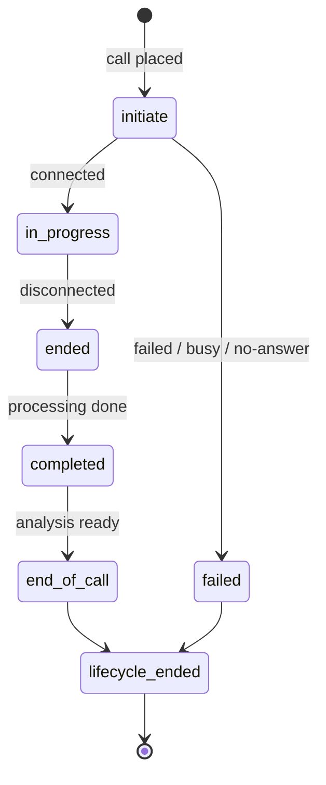

Pass `callbackUrl` when you [initiate a call](/v1/calls#initiate-a-call) and v1
POSTs events there as the call progresses.

<Note>
**v2 signs differently**

v1 uses `x-signature` (a bare hex HMAC over the raw body) plus `x-public-key`.
[v2](/v2/webhooks) uses `X-Mirai-Signature: t=…,v1=…` with a replay window. If
you run both, use **two separate routes** — the schemes are not interchangeable.
</Note>

## Envelope

```json
{
  "metadata": { "internalOrderId": "8842" },
  "event": {
    "type": "call.completed",
    "data": {
      "call": {
        "id": "68f0a1b2c3d4e5f600000900",
        "status": "completed",
        "startedAt": "2026-07-26T09:15:02.000Z",
        "endedAt": "2026-07-26T09:16:38.000Z",
        "durationSeconds": 96,
        "recordingUrl": "https://cdn.miraiminds.co/recordings/68f0….mp3",
        "detailUrl": "https://app.miraiminds.co/calls/68f0…"
      }
    }
  }
}
```

| Field | Description |
| :--- | :--- |
| `metadata` | Exactly the object you sent at initiate. Present on **every** event. |
| `event.type` | See below. |
| `event.data` | Event-specific. `CallEventData` for `call.*` and `end-of-call`; `ActionEventData` for `action`. |

## Lifecycle events



| Event | Fires when |
| :--- | :--- |
| `call.initiate` | Queued and being dialled. |
| `call.in-progress` | Answered; the conversation started. |
| `call.ended` | The phone connection dropped. |
| `call.completed` | Recording, transcript and duration processed. |
| `call.timeout` | Exceeded the maximum duration. |
| `end-of-call` | Analysis is complete — summary, success flag, insights, credits. |
| `call.lifecycle-ended` | **Final event.** No further attempts for this call task. |

### Failure and retry events

| Event | Fires when |
| :--- | :--- |
| `call.failed` | General connection failure. |
| `call.busy` | Line busy. |
| `call.no-answer` | Nobody picked up. |
| `call.validation-failed` | Pre-call validation failed. |
| `call.skip` | Skipped, e.g. a DND number. |
| `call.rescheduled` | A callback was scheduled; the lifecycle continues. |
| `call.aborted` | Cancelled through the [abort API](/v1/calls#abort-a-call). |

`retryProtocol` on the assistant decides how many attempts follow a failure.
`call.lifecycle-ended` is what tells you the chain is over — **that** is the
event to close your record on, not `call.failed`.

## `end-of-call`

Carries the [analysis plan](/v1/assistants#analysis-plan) output and credit
usage.

```json
{
  "metadata": { "internalOrderId": "8842" },
  "event": {
    "type": "end-of-call",
    "data": {
      "call": {
        "id": "68f0a1b2c3d4e5f600000900",
        "status": "completed",
        "durationSeconds": 96,
        "recordingUrl": "https://cdn.miraiminds.co/recordings/68f0….mp3"
      },
      "analysis": {
        "success": true,
        "summary": "Customer confirmed the order and chose cash on delivery.",
        "requiredActions": ["create-order", "send-whatsapp"],
        "insights": { "interested": true, "callback_requested": false }
      },
      "credits": { "used": 1.5, "available": 98.5 },
      "report": { "reAttemptCount": 0, "rescheduledCount": 0 }
    }
  }
}
```

| Field | Description |
| :--- | :--- |
| `analysis.success` | The boolean your `successCriteriaPlan` returned. |
| `analysis.summary` | Output of your `summaryPlan`. |
| `analysis.requiredActions` | Post-call actions the analysis asked for. |
| `analysis.insights` | Structured fields from your `callInsightPlan`. |
| `credits.used` / `.available` | Credits consumed by this call, and the balance after. |
| `report` | Attempt counters for this call task. |

## `action` events

Fired when the conversation produced a business action for you to execute.

```json
{
  "event": {
    "type": "action",
    "data": {
      "action": "create_order",
      "call": { "id": "68f0a1b2c3d4e5f600000900" },
      "reason": null,
      "payload": {
        "email": "jane@example.com",
        "phone": "+919876543210",
        "lineItems": [{ "title": "Sample Product", "quantity": 1 }],
        "shippingAddress": {
          "firstName": "Jane", "lastName": "Smith",
          "address1": "12 MG Road", "city": "Bengaluru",
          "province": "Karnataka", "zip": "560001", "country": "India",
          "phone": "+919876543210"
        },
        "cartTotal": 1895,
        "codCharge": 50,
        "discount": { "code": "SAVE10", "reason": "abandoned cart recovery" },
        "note": "Customer confirmed on call",
        "abandonedCheckoutId": "gid://shopify/AbandonedCheckout/66509168181329"
      }
    }
  }
}
```

| `action` | Meaning |
| :--- | :--- |
| `create_order` | Place the order described in `payload`. |
| `send_whatsapp` | Send a WhatsApp follow-up to `payload.number`. |
| `mark_prepaid` | The customer chose prepaid. |
| `update_address` | The customer gave a corrected address. |
| `confirmed_address` | The customer confirmed the address on file. |

`reason` is set when the action exists because something was missing:
`missing_address`, `missing_first_name`, `invalid_cart_data`.

## Signature verification

Every delivery carries two headers:

| Header | Value |
| :--- | :--- |
| `x-signature` | Hex HMAC-SHA256 of the **raw request body**, keyed with your organization's private key |
| `x-public-key` | Your organization's public key, so you know which secret to verify with |

There is no timestamp and no replay window in v1. Recompute the HMAC over the
raw bytes and compare in constant time.

<Tabs>
  <Tab title="Python">
    ```python
    import hashlib
    import hmac
    import os

    from flask import Flask, request

    app = Flask(__name__)
    PRIVATE_KEY = os.environ["MIRAI_PRIVATE_KEY"]  # sk_…, the same key you send as x-private-key


    def verify_v1(raw_body: bytes, signature: str, secret: str) -> bool:
        expected = hmac.new(secret.encode("utf-8"), raw_body, hashlib.sha256).hexdigest()
        return hmac.compare_digest(expected, signature or "")


    @app.post("/webhooks/call-events")
    def call_events():
        if not verify_v1(request.get_data(), request.headers.get("x-signature", ""), PRIVATE_KEY):
            return {"error": "invalid signature"}, 401

        body = request.get_json()
        event_type = body["event"]["type"]
        call = body["event"]["data"].get("call", {})
        handle(event_type, call, body.get("metadata", {}))
        return "", 200
    ```
  </Tab>
  <Tab title="Node.js">
    ```javascript
    import express from "express";
    import crypto from "node:crypto";

    const app = express();
    const PRIVATE_KEY = process.env.MIRAI_PRIVATE_KEY; // sk_…

    function verifyV1(rawBody, signature, secret) {
      const expected = crypto.createHmac("sha256", secret).update(rawBody).digest("hex");
      const a = Buffer.from(expected, "utf8");
      const b = Buffer.from(signature ?? "", "utf8");
      return a.length === b.length && crypto.timingSafeEqual(a, b);
    }

    // raw body — a re-serialised object will not match
    app.post(
      "/webhooks/call-events",
      express.raw({ type: "application/json" }),
      (req, res) => {
        if (!verifyV1(req.body, req.get("x-signature"), PRIVATE_KEY)) {
          return res.status(401).json({ error: "invalid signature" });
        }
        const body = JSON.parse(req.body.toString("utf8"));
        handle(body.event.type, body.event.data.call, body.metadata);
        res.sendStatus(200);
      }
    );

    app.listen(3000);
    ```
  </Tab>
</Tabs>

### Rules

1. **Use the raw body.** Sign the exact bytes received, before any JSON parsing.
   Re-serialising changes key order and spacing, and the digest with it.
2. **Constant-time compare.** `hmac.compare_digest` / `crypto.timingSafeEqual`.
3. **Keep the private key out of the browser.** It signs webhooks *and*
   authenticates API calls.
4. **Return `200` fast.** Enqueue the work; do not do it inline.
5. **Expect duplicates.** v1 events carry no event ID — dedupe on
   `event.type` + `call.id`, and make handlers idempotent.

### Troubleshooting

| Symptom | Cause |
| :--- | :--- |
| Signature never matches | Body was parsed before hashing, or a proxy re-encoded it |
| Headers missing | A reverse proxy or WAF stripped `x-signature` |
| Wrong key | `x-public-key` identifies which organization's secret to use — check it matches the one you have |
