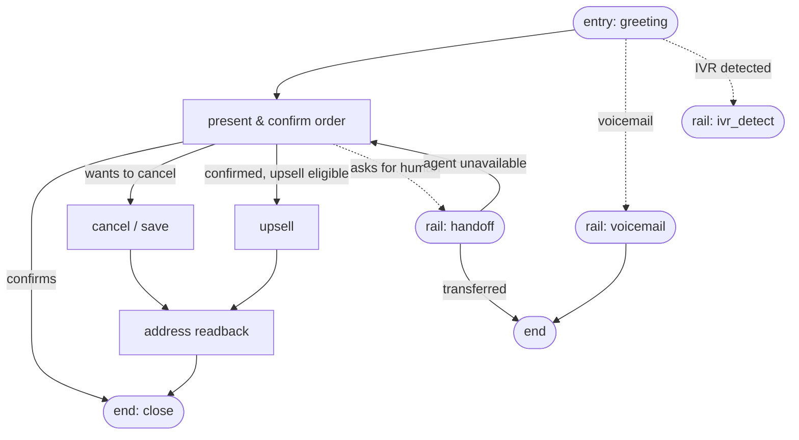

<Warning>
**Preview — not yet available**

Node graphs are the **`t5` (₹5/minute)** product. `t5` is published in the
contract so you can design against it, but it is **not live**: today
`POST /v2/calls` with `"tier": "t5"` returns
`501 tier_unavailable`. Everything on this page — the schema, the node
library, the authoring API — is a **proposal under active development**. Field
names and limits may change before launch. Do not build a production integration
against it yet. Target: **Q4 2026**, alongside the visual
[orchestration platform](/general/roadmap#orchestration-platform). See the
[roadmap](/general/roadmap) for status, and confirm timelines with your
account contact.
</Warning>

## The idea: a call is a graph, not a prompt

On `t1` today, a whole call is one system prompt. That works when the call has a
single job and ends when the customer says yes or no — an order confirmation, a
reminder, an "are you still interested?".

It stops working when the call has **structure**: an opening, a confirmation, an
address readback, an upsell, a handoff to a human, a graceful exit for a
voicemail. Cramming all of that into one prompt makes a small, fast model juggle
every rule at once — and it does none of them well.

A **node graph** breaks the call into small stages. Each node carries one short
role prompt and a set of allowed transitions. The model's only job at any moment
is to **pick the next node**, not to hold the entire conversation in its head.
That is what keeps a small model reliable — and it is the whole reason this tier
exists.

<CardGroup cols={2}>
  <Card title="t3 — our graphs" icon="puzzle-piece">
    On `t3`, calls run node graphs we author and maintain (e.g. order
    confirmation). You get the [structure](/general/tiers#feature-matrix)
    without authoring anything.
  </Card>
  <Card title="t5 — your graphs" icon="pen">
    On `t5`, **you** author the graph node by node and version it like code. This
    page is about that authoring surface.
  </Card>
</CardGroup>

Both tiers run the **same** runtime; the only difference is who wrote the graph.

## The proposed schema

A graph is a JSON document: an `entry` node, a map of `nodes`, and `globals`.
This shape is **proposed** and will be finalised when `t5` ships.

```jsonc
{
  "schemaVersion": "1.0",
  "entry": "greeting",
  "nodes": {
    "greeting": {
      "type": "conversation",              // conversation | rail | tool | end
      "prompt": "Greet the customer by name and confirm you are speaking to them.",
      "transitions": [
        { "to": "confirm_order", "when": "customer confirms their identity" },
        { "to": "voicemail",     "rail": true }
      ]
    },
    "confirm_order": {
      "type": "conversation",
      "prompt": "Read back the order and ask the customer to confirm or cancel.",
      "transitions": [
        { "to": "done",        "when": "customer confirms the order" },
        { "to": "cancel_save", "when": "customer wants to cancel" }
      ]
    },
    "cancel_save": {
      "type": "conversation",
      "prompt": "Acknowledge, offer one retention option, then close.",
      "transitions": [ { "to": "done", "when": "customer responds either way" } ]
    },
    "voicemail": { "type": "rail", "use": "voicemail" },   // library node
    "done":      { "type": "end",  "endMessage": "Thank you. Goodbye." }
  },
  "globals": { "language": "hi", "maxTurnsPerNode": 8 }
}
```

### Top-level fields

| Field | Type | Notes |
| :--- | :--- | :--- |
| `schemaVersion` | string | Schema the graph is written against. `"1.0"` for now. |
| `entry` | string | Name of the node the call starts in. Must exist in `nodes`. |
| `nodes` | object | Map of node name → node object. Names are your own slugs. |
| `globals.language` | string | Default language for every node, e.g. `hi`, `en`. |
| `globals.maxTurnsPerNode` | number | **Mandatory.** Hard turn budget per node before a rail fires. Stops a node trapping the caller. |

## Node types

Every node declares a `type`. Four are proposed.

| `type` | Purpose | Key fields |
| :--- | :--- | :--- |
| `conversation` | The workhorse. A short role prompt plus `transitions` the model chooses between. This is your **branch** point — list one transition per outcome. | `prompt` (≤ 400 tokens), `transitions[]` |
| `rail` | A **library node** you drop in by name — voicemail, handoff, IVR detect (below). It brings its own detector and exit contract; you do not re-implement it. | `use` (library name) |
| `tool` | Runs an action (e.g. a lookup) between turns, then transitions on the result. | `tool`, `transitions[]` |
| `end` | Terminates the call. Speaks a closing **message**, then hangs up cleanly. | `endMessage` |

A **transition** is `{ "to": "<node>", "when": "<plain-language condition>" }`.
A transition marked `"rail": true` is taken automatically when the referenced
rail's detector fires (e.g. a voicemail is detected) rather than by model choice.

## The node library (rails)

Rails are pre-built nodes with their own detector **and** their own exit
contract. You reference them by `use`; you do not build them. Three are proposed,
each grounded in the tier feature set.

| `use` | Fires when | Does | Exits to |
| :--- | :--- | :--- | :--- |
| `voicemail` | An answering-machine greeting is detected on answer | Speaks your `voicemailMessage` once, does not converse | ends the call with [`ended_reason: voicemail`](/v2/calls#ended-reasons) (billable — media was live) |
| `handoff` | The caller asks for a human, or comprehension fails N times in a row | Announces the transfer, then bridges the call to a human agent | `ended_reason: transferred` on success, or back to the previous node on failure — **a failed transfer never drops the caller** |
| `ivr_detect` | An IVR menu is detected in the first few seconds ("press 1 for…") | Navigates one level via DTMF, or bails | resumes the graph, or ends |

<Note>
**Rails cost latency, but off the hot path**

Detection for these rails runs **before or between** turns — never between "the
caller stops speaking" and "the bot's first word". A rail adds capability, not
turn latency. That constraint is a hard design rule for every tier.
</Note>

Every rail also has a "couldn't do it" exit that returns to a normal
conversational node with an apology line. **A rail is never a dead end.**

## A worked example

`order_confirmation_v1` — the graph `t3` ships with, drawn as nodes and rails.
Solid arrows are model-chosen transitions; dashed arrows are rails that can fire
from any node.



Read it as: open → confirm → (save on cancel / upsell on confirm) → address
readback → close, with voicemail, handoff and IVR-detect available as rails that
can pull the call out of the main line at any point and return it safely.

## Authoring rules (enforced at author time)

A graph is validated when you **submit** it, not when a call runs — so a broken
graph can never reach a live caller. The proposed checks:

| Rule | Why |
| :--- | :--- |
| Connected from `entry`; every node reachable | Dead nodes are almost always a wiring bug. |
| At least one `end` reachable from every node — **no trap states** | A caller must always be able to reach a clean ending. |
| `maxTurnsPerNode` present; no cycle without a turn-budget escape | A node that can loop forever will strand a caller. |
| Each `prompt` within the model's token budget (**≤ 400 tokens**, checked against the real tokenizer) | Short prompts are the entire premise of the tier. |
| Rail names in `use` resolve against the library | Catches a typo'd `"use": "voicmail"` before launch, not at 2am. |
| Transition conditions non-empty and non-duplicate within a node | An empty or duplicated `when` makes the branch ambiguous. |
| Total node count within a documented ceiling | Keeps graphs reviewable and calls predictable. |

Validation will return the **full list** of errors on a dry run, not just the
first — so you fix everything in one pass. Each error names the node and the
rule.

## Anti-patterns

These defeat the point of the tier. The validator catches some; the rest are on
you.

- **One giant node.** If a single node's prompt does the whole call, you have
  bought `t5` and built `t1`. Split by stage.
- **Re-implementing a rail by hand.** Writing your own "detect voicemail" logic
  inside a conversation node instead of using the `voicemail` rail — the rail has
  a real detector and the right billing/exit contract; a hand-rolled one does not.
- **Prompts that assume memory of earlier nodes.** Each node's prompt should
  stand alone. The model picks the next node; it does not carry the full history
  as context you can rely on.
- **A node with no reachable end.** The validator rejects trap states — design
  the exit before the entrance.

## When it ships

Node graphs go live with the `t5` tier — target **Q4 2026**, with the visual
[orchestration platform](/general/roadmap#orchestration-platform) entering
beta in the same window so non-engineers can author graphs too. Until then:

- Design against the schema above, but expect field names and limits to move.
- Do not ship a code path that sends `"tier": "t5"` — it returns
  [`501 tier_unavailable`](/general/tiers#coming-soon) today.
- The authoring API (create / update / validate a graph) will be documented here
  when it lands.

Watch the [roadmap](/general/roadmap) and [Billing & tiers](/general/tiers)
for the status flip, or ask your account contact.
