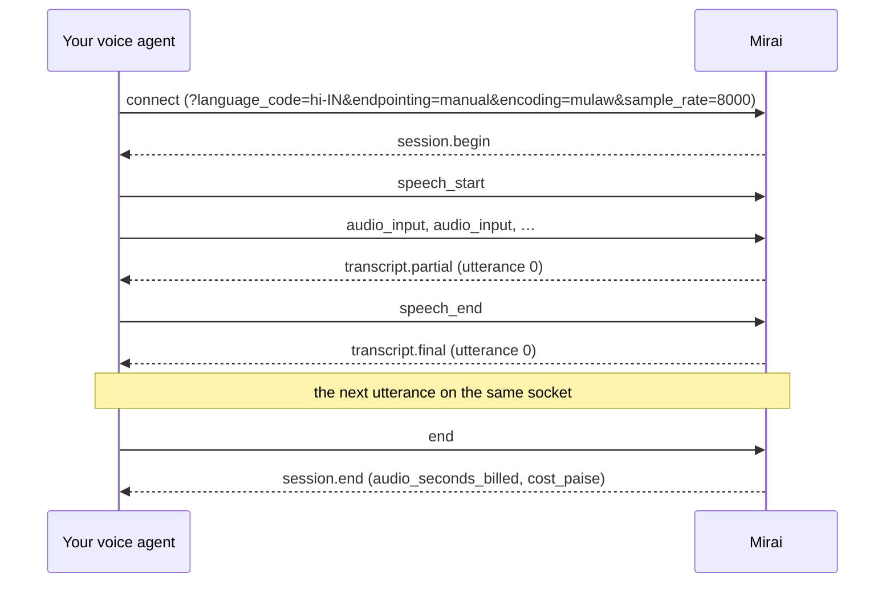

Mira STT v5 realtime turns a live audio stream into text while the person is
still talking. You open one WebSocket per call and send audio as it arrives.
Partial transcripts come back as the words are recognised, and each utterance
ends with one final transcript. It is the same recogniser our own voice
agents listen with.

For a recording that already exists, use [offline transcription](/v2/transcriptions)
instead: it labels speakers and adds timestamps.

<Tip>
On Pipecat, `MiraiSTTService` from our [Pipecat package](/v2/pipecat#transcribe-with-miraisttservice)
speaks this protocol for you, including endpointing, reconnects and the edge.
</Tip>

## Languages

Pass the language in `language_code`. Mira writes speech the way it was
spoken: Hindi in Devanagari with English words in Latin, never translated.

| `language_code` | Language |
| :--- | :--- |
| `hi-IN` (default) | Hindi, including Hinglish |
| `en-IN` | English (Indian) |
| `gu-IN` | Gujarati |
| `mr-IN` | Marathi |
| `pa-IN` | Punjabi |
| `bn-IN` | Bengali |
| `ta-IN` | Tamil |
| `te-IN` | Telugu |
| `kn-IN` | Kannada |
| `ml-IN` | Malayalam |

We publish accuracy for Hindi, English and Gujarati, measured on real customer
calls, on the **Evals** tab of the console's Speech to text page. Try the other
seven on your own audio before you rely on them. There is no automatic
language detection: name the language, and change it mid-call with
[`config.update`](#messages-you-send) if the caller switches.

## Connect

```text
wss://sandbox.voice.miraiminds.co/v1/audio/transcriptions/stream
```

Once your company has gone live, use `wss://prod.voice.miraiminds.co` with the
same path. `/v2/stt/stream` is the same endpoint, if you keep every URL under
`/v2`. Open one socket per call and keep it until the call ends.

### From your server

Send your API key in the `Authorization` header, as on every other request:

```text
Authorization: Bearer sk_live_…
```

We refuse an API key in the URL (`?api_key=` returns `401`), because URLs end
up in proxy and server logs.

If your code already speaks Sarvam's v3 realtime protocol, it can send the key
in an `api-subscription-key` header instead. The messages below are the same
ones, so you change the URL and the key and keep the rest.

### From a browser

A browser cannot set headers on a WebSocket, and your API key must never reach
a web page. Your backend mints a short-lived stream token with its key and
hands the page only the token.

<Tabs>
  <Tab title="cURL">
    ```bash
    curl -X POST https://sandbox.voice.miraiminds.co/v2/stt/stream/tokens \
      -H "Authorization: Bearer $MIRA_API_KEY"
    ```
  </Tab>
  <Tab title="Python">
    ```python
    import os

    import httpx

    r = httpx.post(
        "https://sandbox.voice.miraiminds.co/v2/stt/stream/tokens",
        headers={"Authorization": f"Bearer {os.environ['MIRA_API_KEY']}"},
    )
    r.raise_for_status()
    stream_url = "wss://sandbox.voice.miraiminds.co" + r.json()["url"]
    ```
  </Tab>
  <Tab title="Node.js">
    ```js
    const r = await fetch("https://sandbox.voice.miraiminds.co/v2/stt/stream/tokens", {
      method: "POST",
      headers: { Authorization: `Bearer ${process.env.MIRA_API_KEY}` },
    });
    if (!r.ok) throw new Error(`token mint failed: ${r.status}`);
    const streamUrl = "wss://sandbox.voice.miraiminds.co" + (await r.json()).url;
    ```
  </Tab>
</Tabs>

```json title="201 Created"
{
  "object": "stt_stream_token",
  "token": "te1.eyJzdmMiOiJzdHQifQ.Hq3x9Zt0bL7wKc2Vn5RdQe8yUf1aJm4sPo6iTg0hBkE",
  "tokens": ["te1.eyJzdmMiOiJzdHQifQ.Hq3x9Zt0bL7wKc2Vn5RdQe8yUf1aJm4sPo6iTg0hBkE"],
  "expires_at": "2026-10-12T05:31:00Z",
  "url": "/v1/audio/transcriptions/stream?token=te1.eyJzdmMiOiJzdHQifQ.Hq3x9Zt0bL7wKc2Vn5RdQe8yUf1aJm4sPo6iTg0hBkE",
  "edge_url": "wss://stt-edge.voice.miraiminds.co/v1/audio/transcriptions/stream"
}
```

`url` is a path. Connect to your API host followed by that path, and add your
[query parameters](#query-parameters) after it with `&`. A token:

- lasts 60 seconds and opens one socket;
- bills the workspace of the key that minted it, under that key's rate limit;
- stops working if that key is revoked.

To open several sockets at once, ask for up to 20 tokens in one request with
`count` (`?count=5`, or `{"count": 5}` as the body). They come back in
`tokens`, each good for one socket. The wallet is checked before anything is
minted, so an empty wallet gets `402 insufficient_balance` here rather than at
the socket. The mint shares your key's rate limit (`429 rate_limited`), and
answers `503 unavailable` on a server where streaming speech to text is not
switched on.

<Warning>
A socket opened with a token can transcribe on your wallet until it closes,
for up to an hour. Mint tokens only for users you have signed in, one per
connection, right before the page connects, and rate-limit the route that
mints them.
</Warning>

### Streaming from the edge

Speech is recognised on GPUs in a different datacenter from our API region.
When an edge server next to those GPUs is running, the token response names it
in `edge_url`, and audio sent there skips the hop between the two
datacenters. pipecat-mirai connects to the edge by itself and falls back to the
API URL if the edge does not answer within a few seconds. You don't change
anything.

From your own client, connect to `edge_url` with the same token and the same
query parameters, or with your API key in the `Authorization` header. When
`edge_url` is `null`, no edge is serving: connect to `url` on your API host. A
rejected key, an empty wallet or a rate limit gets the same answer on either.

### Query parameters

Everything about the session is set on the URL, checked before the upgrade:

| Parameter | Values | Default |
| :--- | :--- | :--- |
| `language_code` | One of the codes under [Languages](#languages). | `hi-IN` |
| `model` | `mira-stt`. `mira-stt:v5-realtime` and `saaras:v3-realtime` are accepted as aliases. | `mira-stt` |
| `encoding` | `linear16` (signed 16-bit little-endian PCM), `mulaw` or `alaw` (G.711). | `linear16` |
| `sample_rate` | `8000` or `16000`. | `16000` |
| `endpointing` | `manual` or `vad`. See [Manual or VAD endpointing](#manual-or-vad-endpointing). | `vad` |
| `stream_type` | `balanced` or `fast`. Both give the same partial cadence today; the parameter is there for Sarvam clients. | `balanced` |
| `mode` | `transcribe` or `codemix`. Both mean the same here, and are accepted so Sarvam clients work unchanged. | `transcribe` |
| `return_timestamps` | `true` or `false`. `true` adds `start_s` and `end_s` to each `transcript.final`: where the utterance sits in the audio you have sent, in seconds, padding included. | `false` |
| `silence_duration_ms` | `vad` only. How long a pause ends an utterance, 0 to 10,000. | `1000` |
| `threshold` | `vad` only. Speech probability that counts as speech, 0 to 1. | `0.3` |
| `prefix_padding_ms` | `vad` only. Audio kept from before speech starts, 0 to 2,000. | `300` |
| `min_speech_duration_ms` | `vad` only. Shorter sounds are ignored, 0 to 10,000. | `250` |

```text title="A phone call with your own VAD"
wss://sandbox.voice.miraiminds.co/v1/audio/transcriptions/stream?language_code=hi-IN&encoding=mulaw&sample_rate=8000&endpointing=manual
```

An unknown parameter, a value outside these, or a parameter given twice fails
the upgrade with `400 invalid_config`, and `message` names it. `token` is the
only other parameter we read.

### When the connection is refused

We check everything we can before the WebSocket upgrade. A refused connection
gets an ordinary HTTP response with the usual [error envelope](/v2/errors):

| Status | `code` | Why | What to do |
| :--- | :--- | :--- | :--- |
| 400 | `invalid_config` | A query parameter is unknown or out of range. | Fix the parameter `message` names. |
| 401 | `unauthorized` | No credentials, an unknown key, or an API key in the URL. | Send the key in the `Authorization` header, or use a stream token. |
| 401 | `invalid_token` | The stream token is unknown, expired or already used. | Mint a new token. Each one opens one socket. |
| 402 | `insufficient_balance` | Your wallet is empty. | [Top up](/v2/wallet#top-up). |
| 403 | `forbidden` | The key, or the key that minted the token, was revoked. | Use a current key. |
| 426 | `upgrade_required` | A plain HTTP request reached the endpoint. | Connect with a WebSocket client (`wss://`). |
| 429 | `at_capacity` | Your workspace already has 10 sessions open (`Retry-After: 5`), or the service is at its own ceiling. Carries `Retry-After`. | Close the sessions you are done with, then retry after that delay. |
| 429 | `rate_limited` | Your key's request rate. | Honour `Retry-After`. |
| 503 | `unavailable` | The server is restarting, the recogniser is briefly unreachable, or streaming speech to text is not switched on for this server. Carries `Retry-After` when retrying helps. | Reconnect after that delay. |
| 503 | `billing_unavailable` | We could not read your wallet, so we don't open the session. `Retry-After: 2`. | Retry shortly. Open sessions keep running. |

A successful upgrade carries `X-Session-Id: sttws_…`, the same id as
`session_id` in `session.begin`.

## How a session flows



1. Connect with your settings on the URL. The first message you receive is
   `session.begin`, with the settings in force and your limits.
2. Send audio in `audio_input` messages as it arrives, about 20 to 100 ms at a
   time.
3. With manual endpointing, send `speech_start` when the caller starts talking
   and `speech_end` when they stop. With VAD endpointing, we find those moments
   and tell you with `vad.speech_start` and `vad.speech_end`.
4. Partial transcripts arrive while the utterance is open. After it ends, you
   get exactly one `transcript.final` for it.
5. Keep the socket for the rest of the call. Send `end` when the call is over:
   we finish any open utterance, send its final, then `session.end` with what
   the session cost, and close the socket.

## Manual or VAD endpointing

Endpointing decides when an utterance ends, which is when its final
transcript is produced. **If you already have a VAD, use `manual`. If you
don't, use `vad`.**

### Manual

Your own voice activity detection (Pipecat's Silero VAD, a turn model, your
telephony provider's events) decides. Send `speech_start` when speech begins
and `speech_end` when it ends, and the final comes back straight after
`speech_end`. There is no silence wait on our side, which makes this the
fastest path for a voice agent.

Most VADs fire a little after the first syllable, so open the utterance with
about half a second of the audio from before `speech_start`: send
`speech_start`, then that buffered audio, then the live stream. Audio you send
outside an utterance is billed but not transcribed. `flush` does the same as
`speech_end`.

### VAD

We run a Silero VAD on your audio. You send audio continuously, and we send
`vad.speech_start` when speech begins and `vad.speech_end` once the caller has
been quiet for `silence_duration_ms` (1 second by default), then the final.
Use `vad.speech_start` to detect barge-in.

The final can only start after that silence, so with the defaults it arrives
at least a second after the caller stops. A lower `silence_duration_ms` gives
quicker turns and cuts more people off mid-thought.

You can switch between the two mid-session with `config.update`. The change
applies from the next utterance.

## Audio

| `encoding` | What to send | Bytes per second at 8 kHz / 16 kHz |
| :--- | :--- | :--- |
| `linear16` | Signed 16-bit little-endian mono PCM, no header. | 16,000 / 32,000 |
| `mulaw` | G.711 μ-law, 1 byte per sample. What most phone lines carry. | 8,000 / 16,000 |
| `alaw` | G.711 A-law, 1 byte per sample. | 8,000 / 16,000 |

Send telephone audio as it comes off the line: 8 kHz μ-law from Twilio or
Plivo, 8 kHz PCM from Exotel. Don't resample it to 16 kHz first; we do that on
our side, and upsampling adds nothing the model can use. Send 16 kHz when your
source is wideband, such as a browser microphone.

Audio goes in JSON text frames, base64-encoded, in whole samples (an even
number of bytes for `linear16`). One message can carry up to 128,000 bytes of
audio before encoding. Send audio at the pace it is captured. A file can be
sent faster than real time, but a live call should stream as it happens so
partials and finals stay in step with the speaker.

## Messages you send

Every message is a JSON text frame with an `event` field.

| `event` | Fields | What it does |
| :--- | :--- | :--- |
| `audio_input` | `audio` (base64) | Adds audio to the stream. |
| `speech_start` | none | `manual` only. Opens an utterance. |
| `speech_end` | none | `manual` only. Closes the open utterance; its final follows. |
| `flush` | none | `manual` only. The same as `speech_end`. |
| `config.update` | Any of `language_code`, `stream_type`, `endpointing`, `threshold`, `silence_duration_ms`, `min_speech_duration_ms` | Changes settings mid-session. Answered with `config.updated`. |
| `ping` | none | Answered with `pong`. Keeps a quiet socket open. |
| `end` | none | Finishes the open utterance, sends its final and `session.end`, then closes the socket. |

```json title="audio_input (shortened)"
{ "event": "audio_input", "audio": "AACaADABvQE9AqwCBgNJA3QDgwN4A1MDFAO+AlMC1gFLAbYA" }
```

```json title="Control messages, one per frame"
{ "event": "speech_start" }
{ "event": "speech_end" }
{ "event": "flush" }
{ "event": "ping" }
{ "event": "end" }
```

### `config.update`

```json
{ "event": "config.update", "language_code": "en-IN" }
```

Keys go at the top level, beside `event`. We check every key before applying
any of them, so a bad value changes nothing and you get an `invalid_config`
error. `threshold`, `silence_duration_ms` and `min_speech_duration_ms` apply at
once. `language_code`, `stream_type` and `endpointing` apply from the next
utterance, so an utterance in progress keeps the settings it started with.
`encoding`, `sample_rate` and `model` are fixed for the life of the socket:
open a new one to change them.

## Events you receive

| `event` | Fields | When |
| :--- | :--- | :--- |
| `session.begin` | `request_id`, `session_id`, `config`, `capabilities`, `limits` | First message after you connect. |
| `vad.speech_start` | `utterance_idx`, `confidence` | `vad` only. Speech began. |
| `vad.speech_end` | `utterance_idx`, `confidence` | `vad` only. The silence after speech reached `silence_duration_ms`. |
| `transcript.partial` | `utterance_idx`, `text` | While an utterance is open. `text` is the whole utterance so far. |
| `transcript.final` | `utterance_idx`, `text` | Once per utterance, after it ends. |
| `config.updated` | `applied`, `config` | After a valid `config.update`. |
| `pong` | none | After your `ping`. |
| `session.draining` | `reason`; from the recogniser also `audio_samples_received`, `sample_rate` | We are ending the session: a restart, the 1-hour limit or an empty wallet. See [Closing](#closing). |
| `session.end` | `request_id`, `total_duration_s`, `total_utterances`, `audio_duration_s`, `audio_seconds_billed`, `cost_paise`, optional `reason` | The session is over. The socket closes after it. |
| `error` | `code`, `message`, `is_fatal` | A message was refused or the session failed. See [Errors](#errors-on-an-open-socket). |

```json title="session.begin"
{
  "event": "session.begin",
  "request_id": "mira_5f0c2b6e9d1a4c7e8b3f6a2d9e0c1b4a",
  "session_id": "sttws_01K7C2M3Q4R7T9V2X5Y8A1B4C7",
  "config": {
    "language_code": "hi-IN",
    "model": "mira-stt:v5-realtime",
    "stream_type": "balanced",
    "mode": "transcribe",
    "prompt": null,
    "encoding": "mulaw",
    "sample_rate": 8000,
    "return_timestamps": false,
    "threshold": 0.3,
    "prefix_padding_ms": 300,
    "silence_duration_ms": 1000,
    "min_speech_duration_ms": 250,
    "turn_detection": "manual"
  },
  "capabilities": {
    "audio_language_identification": false,
    "final_orthography": "off",
    "provisional_finals": false,
    "provisional_policy": "off"
  },
  "limits": { "max_session_secs": 3600, "idle_timeout_secs": 120 }
}
```

`config` is the full configuration in force. `turn_detection` is your
`endpointing`, and `model` is the build that is listening. Quote `session_id`
when you ask us about a session; it is also on its row in your
[session log](#your-session-log).

```json title="vad.speech_start"
{ "event": "vad.speech_start", "utterance_idx": 0, "confidence": 0.91 }
```

```json title="vad.speech_end"
{ "event": "vad.speech_end", "utterance_idx": 0, "confidence": 0.12 }
```

```json title="transcript.partial"
{ "event": "transcript.partial", "utterance_idx": 0, "text": "नमस्ते मुझे कल शाम" }
```

```json title="transcript.final"
{ "event": "transcript.final", "utterance_idx": 0, "text": "नमस्ते मुझे कल शाम पाँच बजे का appointment book करना है" }
```

A partial can rewrite words it sent earlier. Replace what you show with each
new partial instead of appending to it, and replace the partials with the
final. `utterance_idx` counts from 0 for each session. An utterance with no
recognisable speech still gets its final, with `text` set to `""`.

```json title="config.updated"
{
  "event": "config.updated",
  "applied": ["language_code=en-IN"],
  "config": {
    "language_code": "en-IN",
    "model": "mira-stt:v5-realtime",
    "stream_type": "balanced",
    "mode": "transcribe",
    "prompt": null,
    "encoding": "mulaw",
    "sample_rate": 8000,
    "return_timestamps": false,
    "threshold": 0.3,
    "prefix_padding_ms": 300,
    "silence_duration_ms": 1000,
    "min_speech_duration_ms": 250,
    "turn_detection": "manual"
  }
}
```

During an utterance, `config` still shows the settings that utterance runs
with. A language change shows up from the next utterance.

```json title="pong"
{ "event": "pong" }
```

```json title="session.draining"
{ "event": "session.draining", "reason": "max_duration" }
```

`reason` is `max_duration` (the 1-hour limit), `server_shutdown` (our API
server is restarting), `insufficient_balance` (your wallet ran out) or
`server_draining` (the recogniser is restarting; that one also carries
`audio_samples_received` and `sample_rate`). In every case the open utterance
is finished and its final and `session.end` still arrive.

```json title="session.end"
{
  "event": "session.end",
  "request_id": "mira_5f0c2b6e9d1a4c7e8b3f6a2d9e0c1b4a",
  "total_duration_s": 48.212,
  "total_utterances": 7,
  "audio_duration_s": 41.36,
  "audio_seconds_billed": 42,
  "cost_paise": 35
}
```

`audio_seconds_billed` and `cost_paise` are what this session was charged.
`audio_duration_s` is all the audio you sent, silence included.

```json title="error"
{
  "event": "error",
  "code": "utterance_too_long",
  "message": "Utterance exceeds 60 second limit; provide a speech boundary",
  "is_fatal": true
}
```

## Ordering

These hold on every socket:

- `session.begin` is the first message, and `session.end` the last one when a
  session ends normally.
- Every utterance gets exactly one `transcript.final`, and finals arrive in
  `utterance_idx` order, even when a later utterance starts before an earlier
  final is back.
- Every utterance gets its final, or a fatal `error`, within 5 seconds of its
  end. We never make up a transcript after an engine failure.
- No partial for an utterance arrives after its final.

## Errors on an open socket

An `error` with `is_fatal: false` refused one message and changed nothing; the
session carries on. With `is_fatal: true` the session is over and the socket
closes. No `session.end` follows, except after `insufficient_balance`, where the
open utterance is finished first. The audio you sent is billed however the
session ends, and the session appears in your
[session log](#your-session-log) with what it cost.

| `code` | Fatal | What happened | What to do |
| :--- | :--- | :--- | :--- |
| `invalid_config` | no | A `config.update` had an unknown key, a bad value, or a key fixed for the socket. | Fix the message. Nothing changed. |
| `invalid_message` | no | A binary frame, or a text frame that is not a JSON object. | Send JSON text frames. |
| `invalid_audio` | no | `audio` was not base64, or was not whole samples. | Send whole samples, base64-encoded. |
| `invalid_event` | no | An unknown `event`, `speech_start`/`speech_end`/`flush` with `vad` endpointing, or `speech_start` while an utterance is open. | Send `speech_end` before the next `speech_start`. |
| `audio_too_large` | yes | One message carried more than 128,000 bytes of audio. | Send smaller chunks. |
| `utterance_too_long` | yes | An utterance ran past 60 seconds. | End utterances sooner, or use `vad`. |
| `overloaded` | yes | Eight utterances were waiting for their finals, or the recogniser fell behind. | Reconnect. If it repeats, tell us. |
| `backend_error` | yes | The recogniser failed on an utterance. | Reconnect and send that utterance again. |
| `idle_timeout` | yes | No message from you for 120 seconds. The recogniser may report the same thing as `inactivity_timeout`. | Keep audio flowing, or send `ping` during long silences. |
| `insufficient_balance` | yes | Your wallet ran out during the session. The open utterance is finished and `session.end` follows. | [Top up](/v2/wallet#top-up), then reconnect. |
| `engine_unavailable` | yes | We lost the connection to the recogniser. | Reconnect and send the open utterance again. |
| `internal_error` | yes | Something failed on our side. | Reconnect. Quote `session_id` if you write to us. |

Messages you send after `end` are ignored.

## Closing

Send `end` when the call is over and wait for `session.end`: it carries the
final for any utterance still open and the session's cost. Closing the socket
without `end` also ends the session; any utterance still waiting for its final
is dropped.

When we end a session ourselves (a restart, the 1-hour limit, or an empty
wallet), you get `session.draining` first. Stop sending audio. We finish the
open utterance, send its final, then `session.end`, and close. After a restart,
open a new socket and carry on; pipecat-mirai does this for you. To stream for
longer than an hour, open a new socket before the limit.

| Close code | Meaning |
| :--- | :--- |
| 1000 | `session.end` was delivered: you sent `end`, or the session reached its 1-hour limit (`max_duration`). |
| 1001 | `server_shutdown`: our API server is restarting. Reconnect. |
| 1008 | `idle_timeout`, or `insufficient_balance`. |
| 1011 | The recogniser failed or could not be reached (`engine_unavailable`), or did not finish within 5 seconds of being asked to. |

The close frame's reason text names the cause.

## Limits

| Limit | Value | Over the limit |
| :--- | :--- | :--- |
| Open sessions | **10 per workspace** | `429 at_capacity` before the upgrade, with `Retry-After`. |
| One audio message | 128,000 bytes of audio (4 seconds of 16 kHz PCM) | Fatal `audio_too_large`. |
| One utterance | 60 seconds | Fatal `utterance_too_long`. |
| Utterances waiting for a final | 8 | Fatal `overloaded`. |
| Idle socket | 120 seconds with no message from you | Fatal `idle_timeout`; the socket closes with 1008. |
| Session length | 1 hour | `session.draining` with `max_duration`, then the last final and `session.end`. |
| Stream token | 60 seconds, one socket | `401 invalid_token`. |
| Tokens per mint | 1 to 20 (`count`) | More than 20 gets 20. |
| Request rate | Per key (see [Limits](/v2/limits)) | `429 rate_limited`. Opening a socket or minting tokens counts as a request. |

We send a WebSocket ping every 20 seconds and drop a client that has not
answered for 60 seconds. Most WebSocket libraries answer pings for you. Pings
do not count as activity for the idle limit: keep sending audio, or send
`{"event": "ping"}` during long silences.

If you need more than 10 sessions at once, ask your Mirai contact. It is a
provisioning change and needs no change to your code.

## Pricing

{/* price: owner to confirm */}

**₹30 per hour of audio, billed per second.**

You pay for the audio you send, silence included. Each session is rounded up
to the next second, and its price to the next paisa. A 3-minute phone call
streamed in full costs ₹1.50. With manual endpointing you can send audio only
around speech, but keep the half second before `speech_start` so the first
word is not clipped.

You are billed for the audio we received however the session ends: with
`end`, with a closed socket, on a timeout or on an error. The charge comes out
of the same [wallet](/v2/wallet) your calls draw from, as debits with `kind`
`stt` whose `reference` is the row's `id` in your session log.

A session longer than 5 minutes is charged in parts as it runs, so an hour-long
call never lands as one lump; the parts add up to what the whole session would
cost. Before a session opens, and before a token is minted, we check that your
wallet is not empty; if it is, you get `402 insufficient_balance`. If it runs
out during a long session, the session ends at the next 5-minute charge with
[`insufficient_balance`](#errors-on-an-open-socket).

### Your session log

Every session has a row in your log, and you can read it yourself:

```bash
curl "https://sandbox.voice.miraiminds.co/v2/stt/requests?limit=50" \
  -H "Authorization: Bearer $MIRA_API_KEY"
```

```json title="200 OK"
{
  "data": [
    {
      "id": "stt_01K7C2M3Q4R7T9V2X5Y8A1B4C7-1",
      "object": "stt_request",
      "session_id": "sttws_01K7C2M3Q4R7T9V2X5Y8A1B4C7",
      "seq": 1,
      "created_at": "2026-10-12T05:30:12Z",
      "ended_at": "2026-10-12T05:31:00Z",
      "language": "hi-IN",
      "model": "mira-stt:v5-realtime",
      "encoding": "mulaw",
      "sample_rate": 8000,
      "endpointing": "manual",
      "audio_seconds": 41.36,
      "billed_seconds": 42,
      "utterances": 7,
      "status": "completed",
      "cost_inr": 0.35,
      "error_code": null
    }
  ],
  "has_more": false,
  "next_cursor": null
}
```

Rows come newest first, and only from your own workspace:

| Query | Meaning |
| :--- | :--- |
| `limit` | Up to 200, default 50. |
| `cursor` | Opaque, from the response's `next_cursor`. |
| `from`, `to` | RFC3339 timestamps. |
| `status` | `interim`, `completed` or `failed`. |
| `session_id` | Only the rows of one session. |

`GET /v2/stt/requests/{id}` returns a single row.

| Field | Meaning |
| :--- | :--- |
| `id` | The row: `stt_` and the session's ULID, then `-1`, `-2` and so on for each part of a session charged in parts. Every row of a session has the same `session_id`. |
| `seq` | Which part of the session this row is, from 1. |
| `created_at`, `ended_at` | When the part started and ended. |
| `model` | The build that listened. |
| `audio_seconds` | The audio received in this part, exactly. |
| `billed_seconds` | The seconds this part was charged for. |
| `utterances` | Final transcripts sent in this part. |
| `status` | `interim` for a 5-minute part of a session that was still open, `completed` when the session ended, `failed` when the recogniser or our server ended it. |
| `cost_inr` | What this part cost. Billed whatever the `status`. |
| `error_code` | Why the session ended, when it was not a plain `end` or close: `idle_timeout`, `max_duration`, `insufficient_balance`, or an error `code` from the socket. `null` otherwise. |

## Latency

The number that matters in a conversation is the gap between the end of
speech and the final transcript: your agent cannot answer before it has the
words. We measure it through the public endpoint from a client in India,
streaming real 8 kHz call audio with manual endpointing and utterances of 1 to
3 seconds, so the figures include the network path your requests take.

| From India, 8 kHz, manual endpointing | p50 | p95 | p99 |
| :--- | :--- | :--- | :--- |
| Connect to `session.begin` | measured before launch | measured before launch | measured before launch |
| `speech_end` to final, 20 sessions at once | measured before launch | measured before launch | measured before launch |
| `speech_end` to final, 50 sessions at once | measured before launch | measured before launch | measured before launch |

With `vad` endpointing, add `silence_duration_ms` (1 second by default): the
final cannot start until the caller has been quiet that long.

## Python example

This script streams WAV files over one socket, one utterance per file, with
manual endpointing. It paces the audio in real time, prints partials as they
change and each final with how long it took after `speech_end`.

```python stream_stt.py
# pip install "websockets>=14"
"""Stream WAV files to Mira STT, one utterance per file, and print the transcript.

    export MIRA_API_KEY=sk_live_...
    python stream_stt.py hello.wav order.wav      # 16-bit mono, 8 or 16 kHz
"""
import asyncio
import base64
import json
import os
import sys
import time
import wave
from urllib.parse import urlencode

import websockets

URL = "wss://sandbox.voice.miraiminds.co/v1/audio/transcriptions/stream"
CHUNK_SECS = 0.02  # 20 ms of audio per message, like a phone line


def read_wav(path):
    with wave.open(path, "rb") as w:
        if w.getnchannels() != 1 or w.getsampwidth() != 2 or w.getframerate() not in (8000, 16000):
            sys.exit(f"{path}: need a 16-bit mono WAV at 8 or 16 kHz")
        return w.getframerate(), w.readframes(w.getnframes())


async def main(paths):
    clips = [read_wav(p) for p in paths]
    rate = clips[0][0]
    if any(r != rate for r, _ in clips):
        sys.exit("all files need the same sample rate")
    query = urlencode({"language_code": "hi-IN", "encoding": "linear16",
                       "sample_rate": rate, "endpointing": "manual"})
    headers = {"Authorization": f"Bearer {os.environ['MIRA_API_KEY']}"}
    ended_at = {}  # utterance_idx -> when we sent its speech_end

    async with websockets.connect(f"{URL}?{query}", additional_headers=headers) as ws:
        begin = json.loads(await ws.recv())
        print("session", begin["session_id"], "on", begin["config"]["model"])

        async def send():
            step = int(rate * CHUNK_SECS) * 2  # bytes: 2 per 16-bit sample
            for idx, (_, pcm) in enumerate(clips):
                await ws.send(json.dumps({"event": "speech_start"}))
                for i in range(0, len(pcm), step):
                    chunk = base64.b64encode(pcm[i:i + step]).decode()
                    await ws.send(json.dumps({"event": "audio_input", "audio": chunk}))
                    await asyncio.sleep(CHUNK_SECS)  # real time, as a live call would
                ended_at[idx] = time.monotonic()
                await ws.send(json.dumps({"event": "speech_end"}))
            await ws.send(json.dumps({"event": "end"}))

        sender = asyncio.create_task(send())
        async for message in ws:
            event = json.loads(message)
            kind = event["event"]
            if kind == "transcript.partial":
                print("   …", event["text"])
            elif kind == "transcript.final":
                ms = (time.monotonic() - ended_at[event["utterance_idx"]]) * 1000
                print(f"[{event['utterance_idx']}] {event['text']}  ({ms:.0f} ms after speech_end)")
            elif kind == "error":
                print("error:", event["code"], event["message"])
                if event["is_fatal"]:
                    break
            elif kind == "session.end":
                print(f"{event['audio_seconds_billed']} s billed, {event['cost_paise']} paise")
                break
        sender.cancel()
        await asyncio.gather(sender, return_exceptions=True)


asyncio.run(main(sys.argv[1:]))
```

With `websockets` older than 14, pass `extra_headers=` instead of
`additional_headers=`. A refused connection raises
`websockets.exceptions.InvalidStatus`; its `response.body` holds the
[error](#when-the-connection-is-refused) as JSON.

The latency it prints includes your network path to us. To make your own WAV
from a phone recording, `ffmpeg -i call.mp3 -ac 1 -ar 8000 -sample_fmt s16 call.wav`.

## Pipecat

`MiraiSTTService` from [pipecat-mirai](/v2/pipecat#transcribe-with-miraisttservice)
(0.6.0 and later) replaces your STT service:

```python
import os
from pipecat_mirai import MiraiSTTService

stt = MiraiSTTService(api_key=os.environ["MIRA_API_KEY"], language="hi-IN")

pipeline = Pipeline([
    transport.input(),
    stt,
    context_aggregator.user(),
    llm,
    tts,
    transport.output(),
    context_aggregator.assistant(),
])
```

A phone pipeline's 8 kHz audio goes up as it is, and any other rate is
resampled to 16 kHz first. The service uses manual endpointing when the
pipeline has a VAD and `vad` when it doesn't, streams from the edge, and
reconnects without losing what the caller said. The
[Pipecat page](/v2/pipecat#transcribe-with-miraisttservice) has the details.

## Related

<CardGroup cols={2}>
  <Card title="Pipecat" icon="python" href="/v2/pipecat#transcribe-with-miraisttservice">
    `MiraiSTTService`, endpointing and the phone setup.
  </Card>
  <Card title="Offline transcription" icon="file-audio" href="/v2/transcriptions">
    A recording in, speakers and timestamps out.
  </Card>
  <Card title="Streaming text to speech" icon="bolt" href="/v2/tts-websocket">
    The other half of a voice agent, on the same kind of socket.
  </Card>
  <Card title="Limits" icon="gauge" href="/v2/limits#speech-to-text-streaming">
    Sessions, rate limits and timeouts.
  </Card>
</CardGroup>
