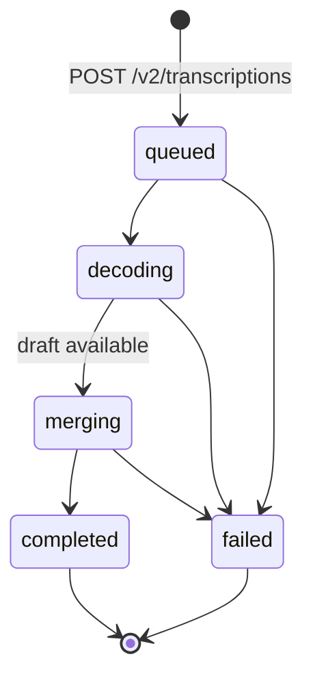

A **transcription** is one job that turns a recording into a transcript with
speakers and timestamps. Creating one is asynchronous: you get `202 Accepted`
with the job at once, then read it with
[`GET /v2/transcriptions/{id}`](#get-a-transcription) until its `status` is
`completed` or `failed`. For an introduction, see
[Transcribe recorded calls](/v2/transcribe-recorded-calls).

Base URL `https://sandbox.voice.miraiminds.co`. Every request carries
`Authorization: Bearer sk_live_…`, your workspace API key. A job belongs to the
workspace whose key created it.

## The transcription object

A finished job, as `GET /v2/transcriptions/{id}` returns it:

```json
{
  "id": "trn_01M3XRSFXW77RHEQ85979AJXAF",
  "object": "transcription",
  "status": "completed",
  "created_at": "2026-10-02T07:38:20Z",
  "finished_at": "2026-10-02T07:38:26Z",
  "duration_s": 23.14,
  "degraded": false,
  "model": "mira-transcribe-offline-1",
  "source": "upload",
  "file_name": "synthetic_call.wav",
  "bytes": 370308,
  "language": null,
  "diarize": true,
  "words": false,
  "text": "नमस्ते मैं Mira University के admissions desk से बात कर रही हूँ क्या आपके पास दो मिनट हैं yes tell me I wanted to ask about the BBA course fees जी ज़रूर BBA की fees एक लाख बीस हज़ार रुपये प्रति वर्ष है आप Aadhaar के साथ online apply कर सकते हैं okay thank you I will apply this week",
  "segments": [
    {
      "speaker": "Agent",
      "speaker_id": "spk0",
      "start": 0,
      "end": 6.57,
      "text": "नमस्ते मैं Mira University के admissions desk से बात कर रही हूँ क्या आपके पास दो मिनट हैं"
    },
    {
      "speaker": "Customer",
      "speaker_id": "spk1",
      "start": 7.21,
      "end": 11.32,
      "text": "yes tell me I wanted to ask about the BBA course fees"
    },
    {
      "speaker": "Agent",
      "speaker_id": "spk0",
      "start": 11.98,
      "end": 19.56,
      "text": "जी ज़रूर BBA की fees एक लाख बीस हज़ार रुपये प्रति वर्ष है आप Aadhaar के साथ online apply कर सकते हैं"
    },
    {
      "speaker": "Customer",
      "speaker_id": "spk1",
      "start": 20.21,
      "end": 23.05,
      "text": "okay thank you I will apply this week"
    }
  ],
  "diarization": {
    "enabled": true,
    "applied": true,
    "speakers": [
      { "id": "spk0", "role": "Agent", "talk_s": 14.1 },
      { "id": "spk1", "role": "Customer", "talk_s": 7 }
    ]
  },
  "error": null,
  "cost": { "status": "charged", "amount_inr": 0.12, "rate_inr_per_hour": 18 }
}
```

| Field | Type | Description |
| :--- | :--- | :--- |
| `id` | string | `trn_` and 26 characters. It is also the `reference` of the job's [wallet transaction](#billing). |
| `object` | string | Always `transcription`. |
| `status` | enum | `queued`, `decoding`, `merging`, `completed` or `failed`. See [statuses](#statuses). |
| `created_at` | string | RFC 3339, UTC. When the job was accepted. |
| `finished_at` | string \| null | When the job completed or failed. `null` before that. |
| `duration_s` | number \| null | Length of the recording in seconds. `null` until the recording has been decoded. |
| `degraded` | boolean \| null | `true` when the language model step was unavailable, so the transcript is a single recognition pass without roles. A degraded job is free. `null` until the job completes. See [degraded jobs](/v2/transcribe-recorded-calls#degraded-jobs). |
| `model` | string \| null | The model that wrote the transcript, once the job completes: `mira-transcribe-offline-1`. |
| `source` | enum | `upload` for a multipart file, `url` for a link we fetched. |
| `file_name` | string | The uploaded file's name, or the last part of the link's path. |
| `bytes` | integer | Size of the recording. |
| `language` | string \| null | The language you set, or `null` when it was detected. |
| `diarize` | boolean | Whether speaker separation was requested. |
| `words` | boolean | Whether word timings were requested. |
| `text` | string | The whole transcript as one string. Completed jobs only. |
| `segments` | array | One entry per turn. See [segments](#segments). Completed jobs only. |
| `draft` | array | While the job is `merging`: the stronger single recognition pass, in the same shape as `segments`, with an empty `speaker` and no `speaker_id`. Gone once the job completes. |
| `diarization` | object | Who spoke and for how long. See [diarization](#diarization). Completed jobs only. |
| `error` | object \| null | For a failed job, `code` and `message`. See [why a job failed](#why-a-job-failed). `null` otherwise. |
| `cost` | object | `status` is `pending` until the job finishes, then `charged` or `free`. `amount_inr` is `null` while pending, then what the job was charged (`0` when free). `rate_inr_per_hour` is the rate fixed on the job when it was accepted. |

`text`, `segments`, `draft` and `diarization` appear only on
`GET /v2/transcriptions/{id}`. The create response and
[the list](#list-transcriptions) carry every other field.

### Segments

| Field | Description |
| :--- | :--- |
| `speaker` | The role: `Agent`, `Customer` or `Other`. A best guess from what each voice says; it can be wrong, and it is empty when it could not be told. |
| `speaker_id` | The voice: `spk0`, `spk1` and so on, in the order the voices first speak. Present when speaker separation was applied. Group lines by this field. |
| `start`, `end` | Seconds from the start of the recording. |
| `text` | What was said, as it was spoken: Hindi in Devanagari and English in Latin script, though common English loanwords can stay in Devanagari. Nothing is translated. |
| `words` | Word timings, present when you sent `words: true` and the words lined up with the audio. |

With `words: true`, each segment also carries its words:

```json
{
  "speaker": "Customer",
  "speaker_id": "spk1",
  "start": 7.21,
  "end": 11.32,
  "text": "yes tell me I wanted to ask about the BBA course fees",
  "words": [
    { "w": "yes", "start": 7.26, "end": 7.5 },
    { "w": "tell", "start": 7.74, "end": 7.98 },
    { "w": "me", "start": 8.06, "end": 8.14 },
    { "w": "I", "start": 8.38, "end": 8.46 },
    { "w": "wanted", "start": 8.62, "end": 9.02 },
    { "w": "to", "start": 9.1, "end": 9.18 },
    { "w": "ask", "start": 9.26, "end": 9.58 },
    { "w": "about", "start": 9.66, "end": 9.9 },
    { "w": "the", "start": 9.98, "end": 10.06 },
    { "w": "BBA", "start": 10.06, "end": 10.46 },
    { "w": "course", "start": 10.62, "end": 10.86 },
    { "w": "fees", "start": 11.02, "end": 11.18 }
  ]
}
```

### Diarization

| Field | Description |
| :--- | :--- |
| `enabled` | Whether speaker separation ran for this job. `false` when you sent `diarize: false`. |
| `applied` | Whether its result was used. When it is `false`, segments keep the roles the language model gave them and have no `speaker_id`. |
| `speakers` | One entry per voice: `id` (the `speaker_id`), `role` and `talk_s`, the seconds that voice spoke. |
| `words.applied` | Present when you sent `words: true` and speaker separation was applied. `true` when word timings were added. Today they are added for Hindi recordings; Gujarati and English recordings get none. |

## Statuses

| Status | Final | Meaning |
| :--- | :---: | :--- |
| `queued` | | Accepted and waiting for its turn. |
| `decoding` | | The recognition passes are listening to the recording. |
| `merging` | | The language model is writing the transcript and the speakers. `duration_s` is set, and `draft` holds the stronger single pass. |
| `completed` | Yes | `text`, `segments` and `diarization` are ready. Charged, unless `degraded` is `true`. |
| `failed` | Yes | Not transcribed and not charged. `error` says why. |



Statuses only move forward. There is no progress percentage. A job usually
completes in about 10 seconds plus 15% of the recording's length, and speaker
separation adds about a second. A draft is readable a few seconds after
decoding ends. A job that has not finished 24 hours after it was accepted fails
with `timed_out`.

### Why a job failed

| `error.code` | `error.message` | What to do |
| :--- | :--- | :--- |
| `transcription_failed` | the recording could not be transcribed; check that it is an audio file with speech (WAV or MP3 work everywhere) | Check that the file plays and has speech in it. |
| `audio_too_long` | the recording is longer than 120 minutes, the most one job takes | Split the recording. |
| `engine_restarted` | transcription restarted while working on this recording; submit it again | Send it again. |
| `job_lost` | this job is no longer available on the transcription service; submit the recording again | Send it again. |
| `timed_out` | this job did not finish in time; submit the recording again | Send it again. |
| `submit_interrupted` | the recording was not handed to transcription; submit it again | Send it again. |

A failed job is never charged. Branch on `error.code`, allow for codes not
listed here, and show `error.message` if you need a sentence for a person.

```json title="A failed job"
{
  "id": "trn_01M3XS0Q2B7K9D4F6H8J1M3N5P",
  "object": "transcription",
  "status": "failed",
  "error": {
    "code": "audio_too_long",
    "message": "the recording is longer than 120 minutes, the most one job takes"
  },
  "cost": { "status": "free", "amount_inr": 0, "rate_inr_per_hour": 18 }
}
```

The example shows only the fields that change; a real answer carries every
field of [the object](#the-transcription-object).

---

## Create a transcription

```http
POST /v2/transcriptions
```

Send the recording in one of two ways:

- As `multipart/form-data` with the file in `file`. Up to 45 MB.
- As `application/json` with an `https` `url` that we fetch. Up to 200 MB.

Recordings can be up to two hours long, in any common audio format (WAV, MP3,
M4A, OGG, FLAC, WebM, AMR and others).

### Upload a file

| Field | Required | Description |
| :--- | :--- | :--- |
| `file` | yes | The recording. One file per request. |
| `context` | no | What the call is about: who is calling whom and why. Up to 2,000 characters. Helps the transcript spell names and terms. |
| `vocabulary` | no | Names, brands and terms to spell right, separated by commas or new lines. Up to 200 terms of up to 100 characters each. Repeats are dropped. |
| `language` | no | `auto` (default) detects the main language. Or `hi`, `gu`, `en`, `mr`, `pa`, `bn`, `ur`. |
| `diarize` | no | `true` (default) or `false`. Speaker separation: a `speaker_id` per voice. |
| `words` | no | `false` (default) or `true`. Word timings on each segment. |

Any other form field is refused with `400 invalid_request`.

<Tabs>
  <Tab title="cURL">
    ```bash
    curl -X POST https://sandbox.voice.miraiminds.co/v2/transcriptions \
      -H "Authorization: Bearer $MIRAI_API_KEY" \
      -H "Idempotency-Key: call-2026-10-02-0412" \
      -F file=@call.wav \
      -F context="A call to a university admissions desk about a course and its fees" \
      -F vocabulary="Mira University, BBA, Aadhaar"
    ```
  </Tab>
  <Tab title="Python">
    ```python
    import os

    import httpx

    API = "https://sandbox.voice.miraiminds.co"
    auth = {"Authorization": f"Bearer {os.environ['MIRAI_API_KEY']}"}

    with open("call.wav", "rb") as f:
        r = httpx.post(
            f"{API}/v2/transcriptions",
            headers={**auth, "Idempotency-Key": "call-2026-10-02-0412"},
            files={"file": ("call.wav", f, "audio/wav")},
            data={
                "context": "A call to a university admissions desk about a course and its fees",
                "vocabulary": "Mira University, BBA, Aadhaar",
            },
            timeout=600,  # the answer comes after the whole file is uploaded
        )
    job = r.json()
    if r.status_code != 202:
        raise RuntimeError(f"{job['error']['code']}: {job['error']['message']}")
    print(job["id"], job["status"])  # trn_01M3XRSFXW77RHEQ85979AJXAF queued
    ```
  </Tab>
  <Tab title="Node.js">
    ```javascript
    import { readFile } from "node:fs/promises";

    const API = "https://sandbox.voice.miraiminds.co";
    const auth = { Authorization: `Bearer ${process.env.MIRAI_API_KEY}` };

    const form = new FormData();
    form.append("file", new Blob([await readFile("call.wav")], { type: "audio/wav" }), "call.wav");
    form.append("context", "A call to a university admissions desk about a course and its fees");
    form.append("vocabulary", "Mira University, BBA, Aadhaar");

    const res = await fetch(`${API}/v2/transcriptions`, {
      method: "POST",
      headers: { ...auth, "Idempotency-Key": "call-2026-10-02-0412" },
      body: form,
    });
    const job = await res.json();
    if (res.status !== 202) throw new Error(`${job.error.code}: ${job.error.message}`);
    console.log(job.id, job.status); // trn_01M3XRSFXW77RHEQ85979AJXAF queued
    ```
  </Tab>
</Tabs>

### Send a link

The same options as JSON, with `url` in place of the file. `diarize` and
`words` are JSON booleans, and `vocabulary` can also be an array of strings.

| Field | Required | Description |
| :--- | :--- | :--- |
| `url` | yes | An `https` link to the recording, up to 2,048 characters, such as a pre-signed link to your storage. |
| `context`, `vocabulary`, `language`, `diarize`, `words` | no | As for an upload. |

We fetch the link once, before we answer, and do not store it. It must point
to a public address on the default `https` port, with no user name or password
in it, and answer `200`. Redirects are followed only to `https` addresses, and
only a few of them. The download has to finish within 5 minutes, so give a
pre-signed link at least that long to live.

<Tabs>
  <Tab title="cURL">
    ```bash
    curl -X POST https://sandbox.voice.miraiminds.co/v2/transcriptions \
      -H "Authorization: Bearer $MIRAI_API_KEY" \
      -H "Content-Type: application/json" \
      -H "Idempotency-Key: call-2026-10-02-0413" \
      -d '{
        "url": "https://storage.example.com/calls/0413.mp3?X-Amz-Expires=900&X-Amz-Signature=…",
        "context": "A call to a university admissions desk about a course and its fees",
        "vocabulary": ["Mira University", "BBA", "Aadhaar"],
        "language": "hi",
        "words": true
      }'
    ```
  </Tab>
  <Tab title="Python">
    ```python
    r = httpx.post(
        f"{API}/v2/transcriptions",
        headers={**auth, "Idempotency-Key": "call-2026-10-02-0413"},
        json={
            "url": presigned_url,  # from your storage, valid for a few minutes
            "context": "A call to a university admissions desk about a course and its fees",
            "vocabulary": ["Mira University", "BBA", "Aadhaar"],
            "language": "hi",
            "words": True,
        },
        timeout=600,  # we download the recording before answering
    )
    job = r.json()
    if r.status_code != 202:
        raise RuntimeError(f"{job['error']['code']}: {job['error']['message']}")
    ```
  </Tab>
  <Tab title="Node.js">
    ```javascript
    const res = await fetch(`${API}/v2/transcriptions`, {
      method: "POST",
      headers: { ...auth, "Content-Type": "application/json", "Idempotency-Key": "call-2026-10-02-0413" },
      body: JSON.stringify({
        url: presignedUrl, // from your storage, valid for a few minutes
        context: "A call to a university admissions desk about a course and its fees",
        vocabulary: ["Mira University", "BBA", "Aadhaar"],
        language: "hi",
        words: true,
      }),
    });
    const job = await res.json();
    if (res.status !== 202) throw new Error(`${job.error.code}: ${job.error.message}`);
    ```
  </Tab>
</Tabs>

### Response

`202 Accepted`, with a `Location` header and the job:

```http
Location: /v2/transcriptions/trn_01M3XRSFXW77RHEQ85979AJXAF
```

```json title="202 Accepted"
{
  "id": "trn_01M3XRSFXW77RHEQ85979AJXAF",
  "object": "transcription",
  "status": "queued",
  "created_at": "2026-10-02T07:38:20Z",
  "finished_at": null,
  "duration_s": null,
  "degraded": null,
  "model": null,
  "source": "upload",
  "file_name": "synthetic_call.wav",
  "bytes": 370308,
  "language": null,
  "diarize": true,
  "words": false,
  "error": null,
  "cost": { "status": "pending", "amount_inr": null, "rate_inr_per_hour": 18 }
}
```

### Idempotency

Send an `Idempotency-Key` header (up to 255 characters) with a value from your
own records, such as your call ID. A request with a key your workspace has
already used returns the job that key created, with `202` and the job's current
status, and makes no second job and no second charge. That makes a request that
timed out safe to retry.

Keys don't expire, and a reused key returns the original job even if you send
a different file. If the transcription service refused the recording, the job
is not created and the key can be used again.

### Errors

Capacity and the wallet are checked before the recording is read.

| Status | `error.code` | Cause |
| :--- | :--- | :--- |
| `400` | `invalid_request` | The body is neither multipart nor JSON, has no `file` or `url`, has more than one file or an unknown field, or a field is out of range. Also a `url` that is not `https`, not public, or that could not be fetched (the message gives the reason, such as "the recording url answered HTTP 403"), and a recording the transcription service could not accept. `error.message` names the problem. |
| `401` | `unauthorized` | Missing or unknown API key. |
| `402` | `insufficient_balance` | The wallet balance is zero or below. Nothing was read or charged. [Top up](/v2/wallet#top-up) and retry with the same `Idempotency-Key`. |
| `403` | `forbidden` | The key was revoked. |
| `413` | `request_too_large` | The upload is over 45 MB, or the file at `url` is over 200 MB. |
| `429` | `at_capacity` | Your workspace already has 20 unfinished jobs. `Retry-After: 30`. |
| `429` | `rate_limited` | Your workspace has started 120 jobs in the past hour, or uploads are busy for a moment, or the [request rate](/v2/limits#request-rate) for your key was exceeded. `Retry-After` says when to try again. |
| `500` | `internal` | Our fault. No job was made that will be charged. Retry with a new `Idempotency-Key`. |
| `503` | `upstream_unavailable` | The transcription service is unavailable right now. Nothing was charged. `Retry-After: 30`. |
| `503` | `transcription_unavailable` | Offline transcription is not available on this deployment. |

No refusal is charged, and a refused request does not count towards the
hourly limit.

---

## Get a transcription

```http
GET /v2/transcriptions/{id}
```

Read a job until its `status` is `completed` or `failed`. Start quickly, since
short recordings often finish in seconds, then slow down to every few seconds.

<Tabs>
  <Tab title="cURL">
    ```bash
    curl https://sandbox.voice.miraiminds.co/v2/transcriptions/trn_01M3XRSFXW77RHEQ85979AJXAF \
      -H "Authorization: Bearer $MIRAI_API_KEY"
    ```
  </Tab>
  <Tab title="Python">
    ```python
    import time

    def wait_for_transcript(transcription_id: str, timeout_secs: int = 3600) -> dict:
        deadline = time.monotonic() + timeout_secs
        delay = 1.0
        while time.monotonic() < deadline:
            r = httpx.get(f"{API}/v2/transcriptions/{transcription_id}", headers=auth, timeout=30)
            if r.status_code in (429, 503):
                time.sleep(float(r.headers.get("Retry-After", "5")))
                continue
            job = r.raise_for_status().json()
            if job["status"] in ("completed", "failed"):
                return job
            time.sleep(delay)
            delay = min(delay * 1.5, 5)  # quick at first, then every 5 seconds
        raise TimeoutError(transcription_id)

    job = wait_for_transcript("trn_01M3XRSFXW77RHEQ85979AJXAF")
    if job["status"] == "failed":
        print(job["error"]["code"], job["error"]["message"])
    else:
        for seg in job.get("segments", []):
            print(f"{seg['start']:7.2f}  {seg.get('speaker_id', '-')}  {seg['speaker']}: {seg['text']}")
    ```
  </Tab>
  <Tab title="Node.js">
    ```javascript
    const sleep = (ms) => new Promise((resolve) => setTimeout(resolve, ms));

    async function waitForTranscript(id, timeoutMs = 3_600_000) {
      const deadline = Date.now() + timeoutMs;
      let delay = 1000;
      while (Date.now() < deadline) {
        const res = await fetch(`${API}/v2/transcriptions/${id}`, { headers: auth });
        if (res.status === 429 || res.status === 503) {
          await sleep(Number(res.headers.get("retry-after") ?? 5) * 1000);
          continue;
        }
        const job = await res.json();
        if (!res.ok) throw new Error(`${job.error.code}: ${job.error.message}`);
        if (job.status === "completed" || job.status === "failed") return job;
        await sleep(delay);
        delay = Math.min(delay * 1.5, 5000); // quick at first, then every 5 seconds
      }
      throw new Error(`timed out waiting for ${id}`);
    }

    const job = await waitForTranscript("trn_01M3XRSFXW77RHEQ85979AJXAF");
    if (job.status === "failed") console.log(job.error.code, job.error.message);
    else for (const seg of job.segments ?? []) console.log(seg.start, seg.speaker_id, seg.speaker, seg.text);
    ```
  </Tab>
</Tabs>

**`200 OK`**: [the transcription object](#the-transcription-object). While the
job is `merging`, it carries `draft`:

```json title="200 OK (merging)"
{
  "id": "trn_01M3XRSFXW77RHEQ85979AJXAF",
  "object": "transcription",
  "status": "merging",
  "created_at": "2026-10-02T07:38:20Z",
  "finished_at": null,
  "duration_s": 23.14,
  "degraded": null,
  "model": null,
  "source": "upload",
  "file_name": "synthetic_call.wav",
  "bytes": 370308,
  "language": null,
  "diarize": true,
  "words": false,
  "draft": [
    {
      "speaker": "",
      "start": 0,
      "end": 23.14,
      "text": "नमस्ते मैं मीरा यूनिवर्सिटी के एडमिशंस डेस्क से बात कर रही हूँ क्या आपके पास दो मिनट हैं यस टेल मी आई वॉन्टेड टू आस्क अबाउट द बी बी ए कॉर्स फ़ीस जी ज़रूर बी बी ए की फ़ीस एक लाख बीस हज़ार रुपये प्रति वर्ष है आप आधार के साथ ऑनलाइन अप्लाई कर सकते हैं ओके थैंक यू आई विल अप्लाई दिस वीक"
    }
  ],
  "error": null,
  "cost": { "status": "pending", "amount_inr": null, "rate_inr_per_hour": 18 }
}
```

The draft can be one long segment, as here, or several. Show it as provisional
and replace it with `segments` when the job completes.

A completed job is charged whether or not anyone reads it, so you can stop
polling at any time. If a finished transcript is no longer kept, the job still
answers `completed` with its `cost`, but without `text`, `segments` and
`diarization`. Copy transcripts into your own storage when they complete.

| Status | `error.code` | Cause |
| :--- | :--- | :--- |
| `404` | `not_found` | No such job in your workspace. A job that belongs to another workspace answers the same way. |
| `429` | `rate_limited` | The [request rate](/v2/limits#request-rate) for your key. Polling counts towards it. Honour `Retry-After`. |
| `503` | `upstream_unavailable` | The transcription service did not answer. `Retry-After: 10`. The job is unaffected. |

---

## List transcriptions

```http
GET /v2/transcriptions?limit=&cursor=&status=
```

Your workspace's jobs, newest first, from the console and the API. List items
carry every field except `text`, `segments`, `draft` and `diarization`; read a
job by its ID for those.

| Query param | Description |
| :--- | :--- |
| `limit` | 1 to 100, default 20. |
| `cursor` | `next_cursor` from the previous page. |
| `status` | Only jobs in this [status](#statuses): `queued`, `decoding`, `merging`, `completed` or `failed`. |

<Tabs>
  <Tab title="cURL">
    ```bash
    curl -G https://sandbox.voice.miraiminds.co/v2/transcriptions \
      -H "Authorization: Bearer $MIRAI_API_KEY" \
      --data-urlencode "status=completed" \
      --data-urlencode "limit=2"
    ```
  </Tab>
  <Tab title="Python">
    ```python
    def all_transcriptions(status: str | None = None):
        params = {"limit": 100, **({"status": status} if status else {})}
        while True:
            page = httpx.get(f"{API}/v2/transcriptions", headers=auth, params=params, timeout=30)
            page = page.raise_for_status().json()
            yield from page["data"]
            if not page["has_more"]:
                return
            params["cursor"] = page["next_cursor"]

    spent = sum(job["cost"]["amount_inr"] for job in all_transcriptions("completed"))
    ```
  </Tab>
  <Tab title="Node.js">
    ```javascript
    async function* allTranscriptions(status) {
      const params = new URLSearchParams({ limit: "100", ...(status ? { status } : {}) });
      while (true) {
        const res = await fetch(`${API}/v2/transcriptions?${params}`, { headers: auth });
        const page = await res.json();
        if (!res.ok) throw new Error(`${page.error.code}: ${page.error.message}`);
        yield* page.data;
        if (!page.has_more) return;
        params.set("cursor", page.next_cursor);
      }
    }

    let spent = 0;
    for await (const job of allTranscriptions("completed")) spent += job.cost.amount_inr;
    ```
  </Tab>
</Tabs>

```json title="200 OK"
{
  "data": [
    {
      "id": "trn_01M3XRSFXW77RHEQ85979AJXAF",
      "object": "transcription",
      "status": "completed",
      "created_at": "2026-10-02T07:38:20Z",
      "finished_at": "2026-10-02T07:38:26Z",
      "duration_s": 23.14,
      "degraded": false,
      "model": "mira-transcribe-offline-1",
      "source": "upload",
      "file_name": "synthetic_call.wav",
      "bytes": 370308,
      "language": null,
      "diarize": true,
      "words": false,
      "error": null,
      "cost": { "status": "charged", "amount_inr": 0.12, "rate_inr_per_hour": 18 }
    },
    {
      "id": "trn_01M3XRCR5F4BYY0SSEQCCT01BX",
      "object": "transcription",
      "status": "completed",
      "created_at": "2026-10-02T07:31:22Z",
      "finished_at": "2026-10-02T07:31:28Z",
      "duration_s": 23.14,
      "degraded": false,
      "model": "mira-transcribe-offline-1",
      "source": "upload",
      "file_name": "synthetic_call.wav",
      "bytes": 370308,
      "language": null,
      "diarize": true,
      "words": true,
      "error": null,
      "cost": { "status": "charged", "amount_inr": 0.12, "rate_inr_per_hour": 18 }
    }
  ],
  "has_more": true,
  "next_cursor": "trn_01M3XE3N8V7VRNTGESH40AMMM0"
}
```

`next_cursor` is `null` on the last page. A `limit` out of range, a `cursor`
that is not a transcription ID, or an unknown `status` returns
`400 invalid_request`. See [pagination](/v2/overview#pagination).

---

## Billing

Transcription costs ₹18 per hour of audio, charged once when a job completes.
A degraded or failed job is free. The charge is the length of the recording in
milliseconds times the rate, rounded up to the paisa:

```python
def cost_paise(duration_ms: int, rate_inr_per_hour: float = 18) -> int:
    paise_per_hour = round(rate_inr_per_hour * 100)
    return -(-duration_ms * paise_per_hour // 3_600_000)  # rounded up to the paisa

cost_paise(23_140)  # 12 paise, ₹0.12
```

Use the formula to forecast. `cost.amount_inr` on the job and the wallet
transaction are what was charged:

```json title="GET /v2/wallet/transactions"
{
  "id": "txn_01M3XRSP44KR3116AZ578NC2F1",
  "object": "wallet_transaction",
  "type": "debit",
  "amount_inr": 0.12,
  "balance_after_inr": 8762.06,
  "call_id": null,
  "description": "Transcription · 23s of audio · mira-transcribe-offline-1",
  "created_at": "2026-10-02T07:38:26Z",
  "kind": "transcription",
  "reference": "trn_01M3XRSFXW77RHEQ85979AJXAF",
  "quantity": 24
}
```

| Field | Meaning |
| :--- | :--- |
| `kind` | `transcription`. Classify rows by `kind`, never by `description`. |
| `reference` | The job's `id`. |
| `quantity` | The billed length in whole seconds, rounded up. |

Starting a job needs a wallet balance above zero. Nothing is held while it
runs. See [pricing](/v2/transcribe-recorded-calls#pricing) for the rest of the
rules.

## Limits

| Limit | Value | Over the limit |
| :--- | :--- | :--- |
| Uploaded file | 45 MB | `413 request_too_large` |
| Recording sent by link | 200 MB | `413 request_too_large` |
| Length of a recording | 2 hours | The job fails with `audio_too_long`, free. |
| `context` | 2,000 characters | `400 invalid_request` |
| `vocabulary` | 200 terms of up to 100 characters, no commas inside a term | `400 invalid_request` |
| `Idempotency-Key` | 255 characters | `400 invalid_request` |
| Unfinished jobs | 20 per workspace | `429 at_capacity`, `Retry-After: 30` |
| New jobs | 120 an hour per workspace | `429 rate_limited` with `Retry-After` |
| Requests | Your key's [request rate](/v2/limits#request-rate), shared with every `/v2` call | `429 rate_limited` with `Retry-After` |
| Time to finish | 24 hours after the job was accepted | The job fails with `timed_out`, free. |
