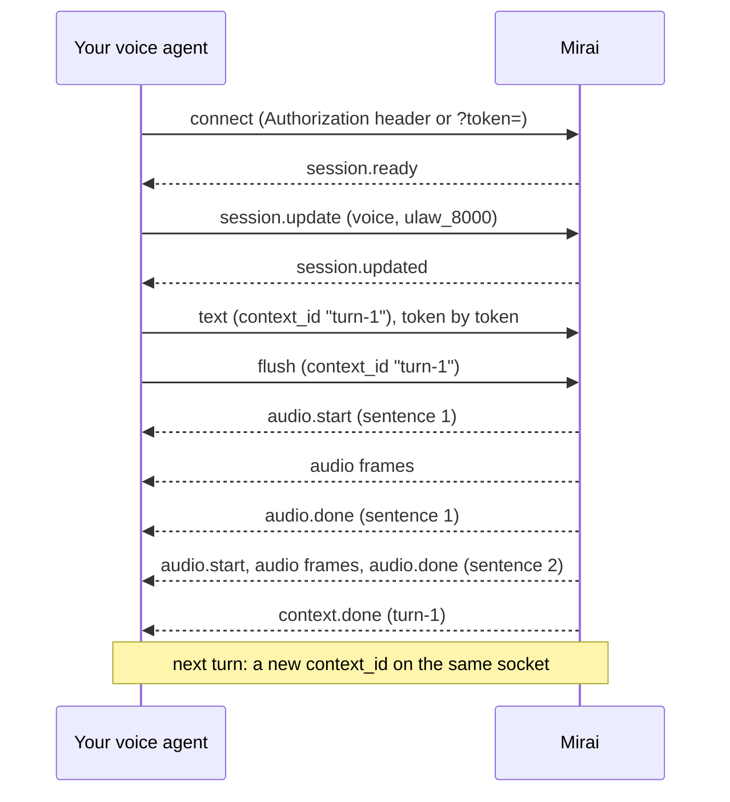

The streaming endpoint carries a whole conversation on one connection. You
send text as your language model writes it, a token or a sentence at a time.
We cut it into sentences, synthesise them in order and send the audio back on
the same socket. Voices, output formats and the price are the same as on
[`POST /v1/audio/speech`](/v2/tts-quickstart).

## When to use it

Use the WebSocket for live conversations: voice agents on the phone or in a
browser, anything where a model writes the reply while someone waits for it.
Compared with one HTTP request per sentence, it changes four things:

- You pay for the connection once per call. A new HTTPS connection needs a TCP
  and TLS handshake, which takes 0.4 to 1 second from India and sometimes
  longer when a connection attempt has to be retried.
- You can send tokens as they arrive. We find the sentence ends.
- The next sentence is synthesised while the current one plays, so there is no
  pause between sentences.
- Barge-in is one message. The sentence that was playing stops at once and is
  not charged.

When your workspace is at its concurrency limit, a sentence on a socket waits
up to 3 seconds for a free slot. An HTTP request gets a `429` straight away.

For one-off audio, such as a file, a voicemail or a notification, the
[HTTP endpoint](/v2/tts-quickstart) is simpler.

<Tip>
If your voice agent runs on Pipecat, `MiraiTTSService` from our
[Pipecat package](/v2/pipecat) speaks this protocol for you, including
barge-in, capacity retries and reconnects.
</Tip>

## Connect

```text
wss://sandbox.voice.miraiminds.co/v1/audio/speech/stream
```

`wss://sandbox.voice.miraiminds.co/v2/tts/stream` is the same endpoint, if you
keep every URL under `/v2`. Open one socket per call and keep it until the
call ends.

### From your server

Send your API key in the `Authorization` header, as on every other request:

```text
Authorization: Bearer sk_live_…
```

We refuse an API key in the URL (`?api_key=` returns `401`), because URLs end
up in proxy and server logs.

### From a browser

A browser cannot set headers on a WebSocket, and your API key must never reach
a web page. Your backend mints a short-lived stream token with its key and
hands the page only the token.

<Tabs>
  <Tab title="cURL">
    ```bash
    curl -X POST https://sandbox.voice.miraiminds.co/v2/tts/stream/tokens \
      -H "Authorization: Bearer $MIRA_API_KEY"
    ```
  </Tab>
  <Tab title="Python">
    ```python
    import os

    import httpx

    r = httpx.post(
        "https://sandbox.voice.miraiminds.co/v2/tts/stream/tokens",
        headers={"Authorization": f"Bearer {os.environ['MIRA_API_KEY']}"},
    )
    r.raise_for_status()
    stream_url = "wss://sandbox.voice.miraiminds.co" + r.json()["url"]
    ```
  </Tab>
  <Tab title="Node.js">
    ```js
    const r = await fetch("https://sandbox.voice.miraiminds.co/v2/tts/stream/tokens", {
      method: "POST",
      headers: { Authorization: `Bearer ${process.env.MIRA_API_KEY}` },
    });
    if (!r.ok) throw new Error(`token mint failed: ${r.status}`);
    const streamUrl = "wss://sandbox.voice.miraiminds.co" + (await r.json()).url;
    ```
  </Tab>
</Tabs>

```json title="201 Created"
{
  "object": "tts_stream_token",
  "token": "Hq3x9Zt0bL7wKc2Vn5RdQe8yUf1aJm4sPo6iTg0hBkE",
  "expires_at": "2026-10-07T05:31:00Z",
  "url": "/v1/audio/speech/stream?token=Hq3x9Zt0bL7wKc2Vn5RdQe8yUf1aJm4sPo6iTg0hBkE"
}
```

`url` is a path. The page connects to your API host followed by that path, as
in the [browser example](#browser-example). A token:

- lasts 60 seconds and opens one socket;
- bills the workspace of the key that minted it, under that key's rate limit;
- stops working if that key is revoked.

<Warning>
A socket opened with a token can synthesise speech on your wallet until it
closes, for up to an hour. Mint tokens only for users you have signed in, one
per connection, right before the page connects, and rate-limit the route that
mints them.
</Warning>

### When the connection is refused

We check everything we can before the WebSocket upgrade. A refused connection
gets an ordinary HTTP response with the usual [error envelope](/v2/errors):

| Status | `code` | Why | What to do |
| :--- | :--- | :--- | :--- |
| 401 | `unauthorized` | No credentials, an unknown key, or an API key in the URL. | Send the key in the `Authorization` header, or use a stream token. |
| 401 | `invalid_token` | The stream token is unknown, expired or already used. | Mint a new token. Each one opens one socket. |
| 402 | `insufficient_balance` | Your wallet is empty. | [Top up](/v2/wallet#top-up). |
| 403 | `forbidden` | The key, or the key that minted the token, was revoked. | Use a current key. |
| 426 | `upgrade_required` | A plain HTTP request reached the endpoint. | Connect with a WebSocket client (`wss://`). |
| 429 | `at_capacity` | Your workspace already has 20 sockets open, or the service is at its own ceiling. `Retry-After: 5`. | Reuse one socket per call and close the ones you are done with. |
| 429 | `rate_limited` | Your key's request rate. | Honour `Retry-After`. |
| 503 | `unavailable` | The server is restarting. `Retry-After: 2`. | Reconnect in a moment. |

A successful upgrade carries `X-Session-Id: ttsws_…`. Quote it when you ask us
about a socket.

## How a call flows



1. Connect. The first message you receive is `session.ready`, with the
   settings in force and your limits.
2. Send `session.update` to pick a voice and an output format. You can skip it
   if the defaults suit you.
3. For each turn of the conversation, pick a new `context_id` and send the
   reply's text in `text` messages as your model produces it.
4. When the reply is complete, send `flush`.
5. Each sentence arrives as `audio.start`, then its audio, then `audio.done`.
   After the last sentence of the turn you get `context.done`.
6. If the caller interrupts, send `cancel` for that context. See
   [Barge-in](#barge-in).
7. Keep the socket for the next turn, and close it when the call ends.

## Messages you send

Every message is a JSON text frame with a `type`. A message we cannot accept is
answered with an [`error` event](#errors-on-an-open-socket) and changes
nothing. The socket stays open.

| `type` | Fields | What it does |
| :--- | :--- | :--- |
| `session.update` | `voice`, `response_format`, `sample_rate`, `audio_transport`, `model`, all optional | Changes the settings for sentences cut after it. Answered with `session.updated`. |
| `text` | `context_id`, `text`, optional `flush` | Adds text to a context. Every sentence it completes is queued for synthesis. `"flush": true` also flushes. |
| `flush` | `context_id` | Sends whatever text the context still holds, however short. You get `context.done` once everything sent so far for that context has been spoken. |
| `cancel` | `context_id` | Stops the context now. See [Barge-in](#barge-in). Answered with `context.cancelled`. |
| `close` | none | Flushes every context, finishes speaking, then closes the socket. To stop at once, send `cancel` first or just close the socket. |

### `session.update`

| Field | Values | Default |
| :--- | :--- | :--- |
| `voice` | `ashu`, `neha`, `shruti` or `sameer`. See [Voices](/v2/voices). | `neha` |
| `response_format` | `pcm`, `mulaw` (also `ulaw`, `pcm_mulaw`), `alaw` (also `pcm_alaw`), or a value with the rate built in: `pcm_8000`, `pcm_16000`, `pcm_22050`, `pcm_24000`, `pcm_44100`, `pcm_48000`, `ulaw_8000`, `ulaw_16000`, `alaw_8000`, `alaw_16000`. `wav` is not available on a stream. | `pcm` |
| `sample_rate` | `8000`, `16000`, `22050`, `24000`, `44100` or `48000`. μ-law and A-law come at `8000` or `16000` only. | `48000` for `pcm`, `8000` for μ-law and A-law |
| `audio_transport` | `binary` sends audio as binary frames. `base64` sends it inside `audio.chunk` events. | `binary` |
| `model` | `mira-tts` | `mira-tts` |

```json
{ "type": "session.update", "voice": "shruti", "response_format": "ulaw_8000" }
```

We check every field before applying any of them, so a bad value leaves all
your settings as they were. If you change `response_format` without
`sample_rate`, you get that format's default rate. If `response_format`
includes a rate, leave `sample_rate` out or send the same value. Audio for
sentences already cut keeps the settings it was cut with, and every
`audio.start` tells you what its audio is.

`wav` is refused because a WAV header has to state the length of audio that
does not exist yet. Ask for `pcm` at the rate you need.

### `text`

```json
{ "type": "text", "context_id": "turn-3", "text": "आपका order कल " }
```

A context is one reply, usually one turn of the conversation. `context_id` is
any string of 1 to 128 characters that you choose. Send the text exactly as
your model streams it, spaces included: we join the pieces, so a token without
its leading space runs into the word before it.

## Events you receive

| `type` | Fields | When |
| :--- | :--- | :--- |
| `session.ready` | `session_id`, `model`, `voice`, `response_format`, `sample_rate`, `encoding`, `audio_transport`, `limits` | First message after you connect. |
| `session.updated` | Same as `session.ready` | After a valid `session.update`. |
| `audio.start` | `context_id`, `request_id`, `text`, `response_format`, `sample_rate`, `encoding` | Before a sentence's first audio. `text` is the sentence. |
| binary frame | Raw audio | Each piece of audio, with `audio_transport: binary`. |
| `audio.chunk` | `context_id`, `request_id`, `data` (base64) | Each piece of audio, with `audio_transport: base64`. |
| `audio.done` | `context_id`, `request_id`, `chars_billed`, `cost_paise`, `bytes`, `first_byte_ms` | The sentence was delivered in full. This is when it is charged. |
| `context.done` | `context_id` | A flush completed: everything sent for the context up to that flush has been spoken or has failed. |
| `context.cancelled` | `context_id` | Your `cancel` took effect. Nothing more for this context follows. |
| `error` | `code`, `message`, optional `context_id`, `request_id`, `retry_after_secs` | A sentence failed or a message was refused. See [Errors](#errors-on-an-open-socket). |
| `session.closed` | `reason` | We are about to close the socket. See [Closing](#closing). |

```json title="session.ready"
{
  "type": "session.ready",
  "session_id": "ttsws_01K6Z8M3Q4R7T9V2X5Y8A1B4C7",
  "model": "mira-tts",
  "voice": "neha",
  "response_format": "pcm",
  "sample_rate": 48000,
  "encoding": "pcm_s16le",
  "audio_transport": "binary",
  "limits": {
    "max_segment_chars": 250,
    "max_queued_chars": 10000,
    "max_contexts": 64,
    "idle_timeout_secs": 120,
    "max_session_secs": 3600
  }
}
```

```json title="audio.done"
{
  "type": "audio.done",
  "context_id": "turn-1",
  "request_id": "tts_01K6Z8N0B2D4F6H8K0M2P4R6T8",
  "chars_billed": 41,
  "cost_paise": 8,
  "bytes": 19840,
  "first_byte_ms": 212
}
```

### Audio

Binary frames carry raw audio with no header, always in whole samples:

- `pcm` is signed 16-bit little-endian mono (`encoding: pcm_s16le`), 2 bytes
  per sample.
- μ-law and A-law are G.711, 1 byte per sample. At 8 kHz that is 8,000 bytes a
  second, so 160 bytes is 20 ms.

A binary frame always belongs to the most recent `audio.start`. Use
`audio_transport: base64` only if your client cannot handle binary frames: the
same audio then arrives in `audio.chunk` events and takes about a third more
bytes.

## How text becomes sentences

We hold each context's text until one of these happens:

- A sentence ends: `.`, `?`, `!`, `।`, `॥` or `…`, optionally followed by a
  closing quote or bracket, and then whitespace.
- A new line arrives.
- The text passes 250 characters (`limits.max_segment_chars`) with no sentence
  end. We cut at the last `,` `;` `:` `—` `–`, or else at the last space.
- You send `flush`.

The rule needs whitespace after the stop, so `3.5` and `example.com` are never
split, and a stop at the very end of what you have sent waits for your next
token or a flush. A full stop after an abbreviation such as `Rs.`, `Dr.`,
`Mr.` or `e.g.`, or after a single initial, does not end a sentence. A sentence
shorter than two words joins the next one, so "Okay." is not sent on its own.

Lengths are counted in Unicode code points, which is also how characters are
billed.

## Ordering

These hold on every socket:

- Sentences are spoken one at a time, in the order they were cut, across all
  contexts.
- Each `audio.start` is closed by exactly one `audio.done` or `error` with the
  same `request_id`, or by `context.cancelled` for its context. The next
  `audio.start` comes after that.
- So every binary frame belongs to the most recent `audio.start`.
- A context's `context.done` comes after its last sentence's `audio.done` or
  `error`.
- Nothing for a context is sent after its `context.cancelled`.

## Barge-in

When the caller starts talking over your voice agent:

1. Send `cancel` with the `context_id` that is speaking.
2. Drop any audio you still receive for that context. Some may already be on
   the wire. Track the speaking context from the latest `audio.start`, and
   start playing again at the next `audio.start` for a different context.
3. Clear the audio you have already handed to your player or phone provider.
   On Twilio, send a `clear` event; on Plivo, `clearAudio`; on Exotel, `clear`.
4. Use a new `context_id` for the next reply.

On our side, `cancel` discards the context's unsent text and its queued
sentences, and stops the sentence being synthesised straight away. None of it
is charged. You always get `context.cancelled`, even if the context had already
finished, so you never need to know whether you were too late.

## When your workspace is busy

Each sentence takes one synthesis slot from your workspace's
[concurrency limit](/v2/limits#text-to-speech), the same pool HTTP requests
use, while it is synthesised. An open socket that is not speaking holds no
slot.

When a sentence's turn comes and the workspace is full, it waits for a slot in
a queue shared by all your sockets, for up to 3 seconds. If no slot frees in
that time, you get an `error` with code `at_capacity` and `retry_after_secs`
for that sentence, and the socket moves on to the next one. Send that text
again if you still need it. pipecat-mirai does this once for you.

If you run many calls at once, ask your Mirai contact for a higher limit. Ask
for a little more than your peak number of simultaneous calls, because each
call starts its next sentence shortly before the current one finishes.

## Billing

The socket costs the same as the [HTTP endpoint](/v2/tts-quickstart#billing),
per character of text spoken:

- A sentence is charged when its `audio.done` is sent, and `cost_paise` in that
  event is exactly what was debited.
- A sentence that is cancelled, fails, or is still undelivered when the socket
  closes is not charged.
- Fractions of a paisa carry over from one sentence to the next, so the total
  for a socket is its characters times the rate, rounded up once. A streamed
  reply never costs more than sending the same text in one HTTP request, and
  the spaces between sentences are not billed.
- Because of that carry, some sentences cost 0 paise. They appear in your
  request log but get no wallet row.

Every sentence has its own row in your
[request log](/v2/tts-quickstart#your-request-log), with `transport` set to
`websocket`. Its `request_id` is the row's `id` and the `reference` on its
[wallet row](/v2/wallet#a-text-to-speech-row). Before each sentence we check
that your wallet can cover it. If it cannot, that sentence fails with
`insufficient_balance`.

## Limits

| Limit | Value | Over the limit |
| :--- | :--- | :--- |
| Open sockets | **200 per workspace** | `429 at_capacity` before the upgrade, with `Retry-After: 5`. |
| Sentences being synthesised | Your workspace's TTS limit, **10** unless it has been set otherwise, shared with HTTP requests | The sentence waits up to 3 seconds, then `error` `at_capacity`. |
| One message | 64 KB | The socket is closed. |
| Text waiting to be spoken | 10,000 characters per socket | `error` `queue_full`. |
| Open contexts | 64 per socket | `error` `too_many_contexts`. |
| `context_id` | 1 to 128 characters | `error` `invalid_request`. |
| One sentence | 250 characters | Cut, as described in [How text becomes sentences](#how-text-becomes-sentences). |
| Idle socket | 120 seconds with no message from you and nothing playing | `session.closed` with `idle_timeout`. |
| Socket lifetime | 1 hour | `session.closed` with `max_duration`. |
| Stream token | 60 seconds, one socket | `401 invalid_token`. |

We send a WebSocket ping every 20 seconds and drop a client that has not
answered for 60 seconds. Most WebSocket libraries, and every browser, answer
pings for you. Pings do not count as activity for the idle limit: to keep a
quiet socket open, send `{"type": "session.update"}` with no fields every 30
seconds or so. It changes nothing.

If your client stops reading, we stop reading your messages until it catches
up, and a client that stays stuck is disconnected. Read the socket all the
time, and do slow work such as pacing audio to a phone line on another task.

## Errors on an open socket

An `error` event affects one message or one sentence. The socket stays open and
the next sentence goes ahead.

| `code` | What happened | What to do |
| :--- | :--- | :--- |
| `invalid_request` | A message was malformed, or a field was invalid. `message` names it. Nothing changed. | Fix the message. |
| `model_not_found` | `session.update` named a model other than `mira-tts`. | Leave `model` out. |
| `queue_full` | The socket already holds 10,000 characters that have not been spoken. | Wait for `audio.done` events, or cancel a context. |
| `too_many_contexts` | 64 contexts are open. | Flush or cancel the ones you are done with. |
| `session_closing` | You sent text after `close`. | Open a new socket. |
| `at_capacity` | No synthesis slot freed within 3 seconds. Carries `retry_after_secs`. | Send the text again after that delay. |
| `insufficient_balance` | Your wallet cannot cover this sentence. | [Top up](/v2/wallet#top-up). |
| `upstream_error`, `first_byte_timeout`, `total_timeout` | The speech engine failed or stalled on this sentence. It was not charged. | Send the text again. |
| `fleet_offline` | No speech capacity is online. | Retry after `retry_after_secs`. |

## Closing

Close the socket yourself when the call ends. If you send `close` first, we
finish speaking what you have sent before closing. When we close a socket, we
send `session.closed` with a reason, then close it:

| `reason` | Close code | Meaning |
| :--- | :--- | :--- |
| `client_close` | 1000 | You sent `close` and everything has been spoken. |
| `idle_timeout` | 1000 | Nothing from you and nothing playing for 120 seconds. |
| `max_duration` | 1000 | The socket reached its 1-hour limit. |
| `server_shutdown` | 1001 | We are restarting. Reconnect, and send again any text whose `audio.done` you had not received. |

A sentence that was not delivered when a socket closed is not charged.

## Python example

This script streams a model's reply into the socket token by token and saves
8 kHz μ-law, the format a phone line takes. Replace `llm_tokens` with your
model's stream.

```python stream_tts.py
# pip install "websockets>=14"
"""Stream a reply into Mirai and save 8 kHz μ-law audio, sentence by sentence.

    export MIRA_API_KEY=sk_live_...
    python stream_tts.py
    ffplay -f mulaw -ar 8000 reply.ulaw     # listen to the result
"""
import asyncio
import json
import os

import websockets

URL = "wss://sandbox.voice.miraiminds.co/v1/audio/speech/stream"


async def llm_tokens():
    """Stand-in for your LLM's streamed reply."""
    reply = "नमस्ते! आपका order कल शाम तक पहुँच जाएगा। Delivery से पहले हमारा agent आपको call करेगा।"
    for word in reply.split(" "):
        yield word + " "
        await asyncio.sleep(0.03)


async def main():
    headers = {"Authorization": f"Bearer {os.environ['MIRA_API_KEY']}"}
    async with websockets.connect(URL, additional_headers=headers) as ws:
        await ws.send(json.dumps(
            {"type": "session.update", "voice": "neha", "response_format": "ulaw_8000"}))

        async def send_reply(context_id):
            async for token in llm_tokens():
                await ws.send(json.dumps({"type": "text", "context_id": context_id, "text": token}))
            await ws.send(json.dumps({"type": "flush", "context_id": context_id}))

        sender = asyncio.create_task(send_reply("turn-1"))
        with open("reply.ulaw", "wb") as out:
            async for message in ws:
                if isinstance(message, bytes):
                    out.write(message)  # raw 8 kHz μ-law, ready for a phone line
                    continue
                event = json.loads(message)
                if event["type"] == "audio.start":
                    print("speaking:", event["text"])
                elif event["type"] == "audio.done":
                    print(f"  delivered: {event['chars_billed']} characters, {event['cost_paise']} paise")
                elif event["type"] == "error":
                    print("error:", event["code"], event["message"])
                elif event["type"] == "context.done" and event["context_id"] == "turn-1":
                    break
        await sender


asyncio.run(main())
```

With `websockets` older than 14, pass `extra_headers=` instead of
`additional_headers=`.

### Bridge to a phone call

To play the audio on a Twilio call, forward each binary frame to the Media
Stream instead of writing it to a file. The class below does that for one call.
It keeps Twilio at most 0.4 seconds ahead of what the caller hears, which
absorbs short stalls on your server without making barge-in slow, and it
handles barge-in. Plivo and Exotel work the same way with their own message
names, and Exotel takes `pcm_8000` instead of μ-law (see
[For phone calls](/v2/tts-quickstart#for-phone-calls)).

```python phone_leg.py
import asyncio
import base64
import json
import time

LEAD_SECS = 0.4   # how far ahead of the caller the provider may be
CHUNK = 160       # 20 ms of 8 kHz μ-law


class PhoneLeg:
    """Plays Mirai's ulaw_8000 audio on one Twilio Media Stream."""

    def __init__(self, twilio_ws, stream_sid):
        self.twilio_ws = twilio_ws      # the Media Stream WebSocket in your FastAPI app
        self.stream_sid = stream_sid
        self.until = 0.0                # when the audio sent so far finishes playing
        self.speaking = None            # context_id of the latest audio.start
        self.cancelled = set()

    async def on_mirai_message(self, message):
        """Call this for every message you read from the Mirai socket."""
        if isinstance(message, str):
            event = json.loads(message)
            if event["type"] == "audio.start":
                self.speaking = event["context_id"]
            return
        for i in range(0, len(message), CHUNK):
            chunk = message[i:i + CHUNK]
            await self._pace(len(chunk) / 8000)     # μ-law: 8,000 bytes per second
            if self.speaking in self.cancelled:
                return                              # the caller interrupted: drop the rest
            await self.twilio_ws.send_text(json.dumps({
                "event": "media",
                "streamSid": self.stream_sid,
                "media": {"payload": base64.b64encode(chunk).decode()},
            }))

    async def barge_in(self, mirai_ws, context_id):
        """Call this when your speech detection hears the caller talk over the bot."""
        self.cancelled.add(context_id)
        await mirai_ws.send(json.dumps({"type": "cancel", "context_id": context_id}))
        await self.twilio_ws.send_text(json.dumps({"event": "clear", "streamSid": self.stream_sid}))
        self.until = 0.0

    async def _pace(self, secs):
        now = time.monotonic()
        self.until = max(self.until, now)
        await asyncio.sleep(max(0.0, self.until - LEAD_SECS - now))
        self.until += secs
```

Read the Mirai socket in its own task and pass each message to
`on_mirai_message`. The pacing then waits in that task while the rest of your
voice agent keeps running. The same pacing is what `apply_output_lead` does in
[Pipecat](/v2/pipecat#recommended-phone-setup).

## Browser example

A page that speaks typed text, with a **Stop** button for barge-in. Your
backend mints the token, so the API key stays on your server. `requireSignedIn`
stands in for your own sign-in check.

```js server.js
// Your backend (Express). The API key never leaves it.
app.post("/api/tts-token", requireSignedIn, async (req, res) => {
  const r = await fetch("https://sandbox.voice.miraiminds.co/v2/tts/stream/tokens", {
    method: "POST",
    headers: { Authorization: `Bearer ${process.env.MIRA_API_KEY}` },
  });
  if (!r.ok) return res.status(502).json({ error: "could not mint a stream token" });
  const { url } = await r.json();
  res.json({ url: "wss://sandbox.voice.miraiminds.co" + url });
});
```

The page plays 24 kHz PCM through an `AudioWorklet` and holds 150 ms of audio
before each sentence starts, so a short first chunk cannot start playback and
then stall.

```html index.html
<textarea id="text">नमस्ते! आपका order कल शाम तक पहुँच जाएगा।</textarea>
<button id="speak">Speak</button>
<button id="stop">Stop</button>

<script type="module">
  const RATE = 24000;                  // pcm_s16le mono at 24 kHz
  const PREBUFFER = RATE * 0.15;       // samples held before a sentence starts

  const PLAYER = `
    class Player extends AudioWorkletProcessor {
      constructor() {
        super();
        this.queue = []; this.queued = 0; this.playing = false;
        this.port.onmessage = ({ data }) => {
          if (data === "clear") { this.queue = []; this.queued = 0; this.playing = false; return; }
          const pcm = new Int16Array(data);
          this.queue.push({ pcm, pos: 0 });
          this.queued += pcm.length;
        };
      }
      process(_inputs, [output]) {
        const out = output[0];
        out.fill(0);
        if (!this.playing && this.queued < ${PREBUFFER}) return true;
        this.playing = true;
        for (let i = 0; i < out.length; i++) {
          const head = this.queue[0];
          if (!head) { this.playing = false; break; }   // ran dry: buffer again first
          out[i] = head.pcm[head.pos++] / 0x8000;
          this.queued--;
          if (head.pos === head.pcm.length) this.queue.shift();
        }
        return true;
      }
    }
    registerProcessor("player", Player);
  `;

  const $ = (id) => document.getElementById(id);
  const ctx = new AudioContext({ sampleRate: RATE });
  await ctx.audioWorklet.addModule(
    URL.createObjectURL(new Blob([PLAYER], { type: "text/javascript" })));
  const player = new AudioWorkletNode(ctx, "player", { numberOfInputs: 0, outputChannelCount: [1] });
  player.connect(ctx.destination);

  let ws, turn = 0, speaking = null;
  const cancelled = new Set();

  async function connect() {
    const { url } = await fetch("/api/tts-token", { method: "POST" }).then((r) => r.json());
    ws = new WebSocket(url);
    ws.binaryType = "arraybuffer";
    ws.onmessage = ({ data }) => {
      if (typeof data !== "string") {
        if (!cancelled.has(speaking)) player.port.postMessage(data, [data]);
        return;
      }
      const event = JSON.parse(data);
      if (event.type === "audio.start") speaking = event.context_id;
      if (event.type === "error") console.warn(event.code, event.message);
    };
    await new Promise((resolve, reject) => {
      ws.addEventListener("open", resolve, { once: true });
      ws.addEventListener("error", reject, { once: true });
    });
    ws.send(JSON.stringify({ type: "session.update", voice: "neha", response_format: "pcm", sample_rate: RATE }));
  }

  $("speak").onclick = async () => {
    await ctx.resume();   // browsers start audio only after a click
    if (!ws || ws.readyState !== WebSocket.OPEN) await connect();
    turn += 1;
    ws.send(JSON.stringify({ type: "text", context_id: `turn-${turn}`, text: $("text").value, flush: true }));
  };

  $("stop").onclick = () => {
    const id = `turn-${turn}`;
    cancelled.add(id);
    ws?.send(JSON.stringify({ type: "cancel", context_id: id }));
    player.port.postMessage("clear");
  };
</script>
```

A token opens one socket, so `connect` mints a new one each time it needs to
reconnect, for example after the socket has been idle for two minutes.

## Related

<CardGroup cols={2}>
  <Card title="TTS quickstart" icon="bolt" href="/v2/tts-quickstart">
    The HTTP endpoint, output formats, billing and the request log.
  </Card>
  <Card title="Pipecat" icon="python" href="/v2/pipecat">
    `MiraiTTSService` and the recommended phone setup.
  </Card>
  <Card title="Fixing choppy audio" icon="wave-square" href="/v2/tts-quickstart#fixing-choppy-or-broken-audio">
    Symptoms, causes and fixes for gaps and breaks.
  </Card>
  <Card title="Limits" icon="gauge" href="/v2/limits#text-to-speech">
    Concurrency, sockets and rate limits.
  </Card>
</CardGroup>
