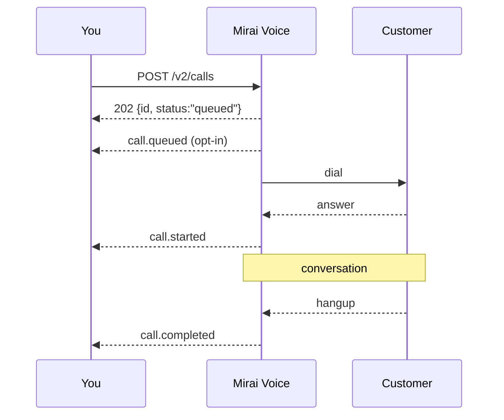

Pass `webhook_url` when you [create a call](/v2/calls#create-a-call) and we POST
a signed JSON event at each lifecycle transition. Webhooks are how you learn a
call's outcome — polling is the fallback, not the design.

Your endpoint must be **public HTTPS** and must return a **2xx** quickly. Any
other status, or a connection failure, triggers [retries](#retries).

## Event envelope

Every event has the same shape.

```json
{
  "id": "evt_01JZQ9C5N9P4R7S3T6V8W2X4YB",
  "type": "call.completed",
  "created_at": "2026-07-26T09:16:38Z",
  "data": {
    "call": {
      "id": "call_01JZQ9B4M8N3P6R2S5T7V9W1YA",
      "object": "call",
      "agent_id": "agt_01JZQ8F3K7M2N5P9R4T6V8W0XZ",
      "to": "+919876543210",
      "status": "completed",
      "ended_reason": "assistant-ended-call",
      "started_at": "2026-07-26T09:15:02Z",
      "ended_at": "2026-07-26T09:16:38Z",
      "duration_secs": 96,
      "cost": { "amount_inr": 2, "per_min_inr": 1 }
    }
  }
}
```

| Field | Description |
| :--- | :--- |
| `id` | `evt_<ulid>`. Unique per **delivery attempt group** — retries of the same event reuse it. [Dedupe on this](#idempotency). |
| `type` | See [event types](#event-types). |
| `created_at` | When the event was generated, not when it was delivered. |
| `data.call` | The [call object](/v2/calls#the-call-object), exactly as `GET /v2/calls/{id}` would return it at that moment. |

Treat the envelope as **additive**: new fields appear without a version bump.
Ignore what you do not recognise.

## Event types

| Type | Fires when | `data.call.status` |
| :--- | :--- | :--- |
| `call.queued` | The call is admitted to the queue. **Opt-in** — ask your Mirai contact to enable it. | `queued` |
| `call.started` | Media is live; the conversation has begun. | `in_progress` |
| `call.completed` | The call connected and finished normally. | `completed` |
| `call.voicemail` | An answering machine answered. | `voicemail` |
| `call.failed` | The call did not connect, or the pipeline errored. | `no_answer`, `busy`, `failed`, `timeout` |
| `call.aborted` | You cancelled it with [`POST /abort`](/v2/calls#abort-a-call) — queued, ringing or mid-conversation. | `aborted` |

Exactly one terminal event fires per call: `call.completed`, `call.voicemail`,
`call.failed` or `call.aborted`.



### `call.failed`

Read `data.call.status` to tell the failure modes apart — `no_answer` is a
retry-tomorrow, `failed` is a page-someone.

```json
{
  "id": "evt_01JZQ9E7Q3S6T9V5W8X1Y4Z6AC",
  "type": "call.failed",
  "created_at": "2026-07-26T09:15:44Z",
  "data": {
    "call": {
      "id": "call_01JZQ9B4M8N3P6R2S5T7V9W1YB",
      "object": "call",
      "agent_id": "agt_01JZQ8F3K7M2N5P9R4T6V8W0XZ",
      "to": "+919876543211",
      "status": "no_answer",
      "ended_reason": "customer-did-not-answer",
      "started_at": null,
      "ended_at": "2026-07-26T09:15:44Z",
      "duration_secs": 0,
      "cost": { "amount_inr": 0, "per_min_inr": 1 }
    }
  }
}
```

### `call.voicemail`

```json
{
  "id": "evt_01JZQ9F8R4T7V2W5X8Y1Z4A6BD",
  "type": "call.voicemail",
  "created_at": "2026-07-26T09:18:20Z",
  "data": {
    "call": {
      "id": "call_01JZQ9B4M8N3P6R2S5T7V9W1YC",
      "object": "call",
      "agent_id": "agt_01JZQ8F3K7M2N5P9R4T6V8W0XZ",
      "to": "+919876543212",
      "status": "voicemail",
      "ended_reason": "voicemail",
      "started_at": "2026-07-26T09:18:02Z",
      "ended_at": "2026-07-26T09:18:20Z",
      "duration_secs": 18,
      "cost": { "amount_inr": 1, "per_min_inr": 1 }
    }
  }
}
```

`status: voicemail` always carries `ended_reason: "voicemail"` — that reason is
what identifies the answering machine in the first place, so the pair is the
only combination you will see.

Voicemail calls **are billed** — media was live. 18 seconds bills as
18 seconds: ₹0.30 at `t1`. See [metering](/general/tiers#metering).

### `call.aborted`

```json
{
  "id": "evt_01JZQ9G9S5V8W3X6Y9Z2A5B7CE",
  "type": "call.aborted",
  "created_at": "2026-07-26T09:14:51Z",
  "data": {
    "call": {
      "id": "call_01JZQ9B4M8N3P6R2S5T7V9W1YD",
      "object": "call",
      "agent_id": "agt_01JZQ8F3K7M2N5P9R4T6V8W0XZ",
      "to": "+919876543213",
      "status": "aborted",
      "ended_reason": "aborted-by-api",
      "started_at": null,
      "ended_at": "2026-07-26T09:14:51Z",
      "duration_secs": 0,
      "cost": { "amount_inr": 0, "per_min_inr": 1 }
    }
  }
}
```

`aborted-by-api` is the only `ended_reason` an abort produces, whether you
cancelled the call in the queue, mid-ring or mid-conversation. Aborted calls are
never billed.

---

## Signature verification

Every delivery carries a timestamped HMAC-SHA256 signature.

```http
X-Mirai-Signature: t=1785057398,v1=771bca27e1647dfbe59ff5d8f32d9de69be246f6e604c05bddcbaefd8604ccb3
```

| Element | Meaning |
| :--- | :--- |
| `t` | Unix seconds when we signed the delivery. |
| `v1` | Lowercase hex `HMAC-SHA256(secret, "<t>.<raw_body>")`. |

The signed string is the timestamp, a literal `.`, then the **raw request body
bytes**. The secret is your per-workspace `whsec_…`, shown once when your key is
issued.

Verification is four steps:

1. Parse `t` and `v1` out of the header.
2. Reject if `|now − t| > 300` seconds — this is the [replay window](#replay-protection).
3. Recompute the HMAC over `t + "." + raw_body`.
4. Compare with `v1` in **constant time**.

<Tabs>
  <Tab title="Python">
    ```python
    # verify.py — framework-independent core
    import hashlib
    import hmac
    import time

    TOLERANCE_SECS = 300


    def verify_signature(raw_body: bytes, signature_header: str, secret: str) -> bool:
        """Return True iff the delivery is authentic and inside the replay window.

        raw_body must be the exact bytes we sent. A parsed-and-re-serialised dict
        will not match: key order and whitespace both change the digest.
        """
        if not signature_header:
            return False

        parts = dict(
            p.split("=", 1) for p in signature_header.split(",") if "=" in p
        )
        t, v1 = parts.get("t"), parts.get("v1")
        if not t or not v1:
            return False

        try:
            sent_at = int(t)
        except ValueError:
            return False
        if abs(time.time() - sent_at) > TOLERANCE_SECS:
            return False

        expected = hmac.new(
            secret.encode("utf-8"),
            t.encode("utf-8") + b"." + raw_body,
            hashlib.sha256,
        ).hexdigest()
        return hmac.compare_digest(expected, v1)
    ```

    Flask:

    ```python
    import os
    from flask import Flask, request
    from verify import verify_signature

    app = Flask(__name__)
    WEBHOOK_SECRET = os.environ["MIRAI_WEBHOOK_SECRET"]


    @app.post("/mirai/webhook")
    def mirai_webhook():
        if not verify_signature(
            request.get_data(),  # raw bytes, before any JSON parsing
            request.headers.get("X-Mirai-Signature", ""),
            WEBHOOK_SECRET,
        ):
            return {"error": "invalid signature"}, 401

        event = request.get_json()
        if already_processed(event["id"]):
            return "", 200  # duplicate delivery, already handled

        enqueue(event)          # do the slow work off the request
        mark_processed(event["id"])
        return "", 200          # any 2xx stops our retries
    ```

    FastAPI:

    ```python
    import json
    import os
    from fastapi import FastAPI, Request, Response

    app = FastAPI()
    WEBHOOK_SECRET = os.environ["MIRAI_WEBHOOK_SECRET"]


    @app.post("/mirai/webhook")
    async def mirai_webhook(request: Request):
        raw = await request.body()
        if not verify_signature(
            raw, request.headers.get("x-mirai-signature", ""), WEBHOOK_SECRET
        ):
            return Response(status_code=401)

        event = json.loads(raw)
        enqueue(event)
        return Response(status_code=200)
    ```
  </Tab>
  <Tab title="Node.js">
    ```javascript
    // verify.js — framework-independent core
    import crypto from "node:crypto";

    const TOLERANCE_SECS = 300;

    /**
     * @param {Buffer} rawBody exact bytes as received, before JSON.parse
     * @param {string} signatureHeader value of X-Mirai-Signature
     * @param {string} secret your whsec_… webhook secret
     */
    export function verifySignature(rawBody, signatureHeader, secret) {
      if (!signatureHeader) return false;

      const parts = Object.fromEntries(
        signatureHeader.split(",").map((p) => {
          const i = p.indexOf("=");
          return i === -1 ? ["", ""] : [p.slice(0, i).trim(), p.slice(i + 1).trim()];
        })
      );
      const { t, v1 } = parts;
      if (!t || !v1) return false;

      const sentAt = Number(t);
      if (!Number.isFinite(sentAt)) return false;
      if (Math.abs(Date.now() / 1000 - sentAt) > TOLERANCE_SECS) return false;

      const expected = crypto
        .createHmac("sha256", secret)
        .update(`${t}.`)
        .update(rawBody)
        .digest("hex");

      const a = Buffer.from(expected, "utf8");
      const b = Buffer.from(v1, "utf8");
      return a.length === b.length && crypto.timingSafeEqual(a, b);
    }
    ```

    Express — note `express.raw`, not `express.json`:

    ```javascript
    import express from "express";
    import { verifySignature } from "./verify.js";

    const app = express();
    const WEBHOOK_SECRET = process.env.MIRAI_WEBHOOK_SECRET;

    app.post(
      "/mirai/webhook",
      express.raw({ type: "application/json" }),
      async (req, res) => {
        if (!verifySignature(req.body, req.get("X-Mirai-Signature") ?? "", WEBHOOK_SECRET)) {
          return res.status(401).json({ error: "invalid signature" });
        }

        const event = JSON.parse(req.body.toString("utf8"));
        if (await alreadyProcessed(event.id)) return res.sendStatus(200);

        await enqueue(event);       // do the slow work off the request
        await markProcessed(event.id);
        res.sendStatus(200);        // any 2xx stops our retries
      }
    );

    app.listen(3000);
    ```

    Next.js App Router:

    ```javascript
    // app/api/mirai/webhook/route.js
    import { verifySignature } from "@/lib/verify";

    export async function POST(request) {
      const raw = Buffer.from(await request.arrayBuffer());
      const ok = verifySignature(
        raw,
        request.headers.get("x-mirai-signature") ?? "",
        process.env.MIRAI_WEBHOOK_SECRET
      );
      if (!ok) return new Response(null, { status: 401 });

      const event = JSON.parse(raw.toString("utf8"));
      await enqueue(event);
      return new Response(null, { status: 200 });
    }
    ```
  </Tab>
</Tabs>

### Test vector

Check your implementation against this before you go anywhere near a real call.

```text title="secret"
whsec_7d4f1a09c2e58b36a1f0d7c93b2e64a8
```

```text title="raw body (177 bytes, exactly as shown — no trailing newline)"
{"id":"evt_01JZQ9C5N9P4R7S3T6V8W2X4YB","type":"call.completed","created_at":"2026-07-26T09:16:38Z","data":{"call":{"id":"call_01JZQ9B4M8N3P6R2S5T7V9W1YA","status":"completed"}}}
```

```text title="header"
X-Mirai-Signature: t=1785057398,v1=771bca27e1647dfbe59ff5d8f32d9de69be246f6e604c05bddcbaefd8604ccb3
```

Your HMAC must equal that `v1`. (The timestamp is in the past, so skip the
window check while testing this vector.)

```bash
printf '%s' '1785057398.{"id":"evt_01JZQ9C5N9P4R7S3T6V8W2X4YB","type":"call.completed","created_at":"2026-07-26T09:16:38Z","data":{"call":{"id":"call_01JZQ9B4M8N3P6R2S5T7V9W1YA","status":"completed"}}}' \
  | openssl dgst -sha256 -hmac 'whsec_7d4f1a09c2e58b36a1f0d7c93b2e64a8' -hex
```

### Raw body

The single most common integration bug: signing a re-serialised body.

```js
// ✗ wrong — key order, spacing and unicode escaping all differ from what we sent
hmac(JSON.stringify(req.body));

// ✓ right — the bytes we sent
hmac(rawBodyBuffer);
```

Capture the raw bytes **before** any body parser touches them. In Express that
means `express.raw({ type: "application/json" })` on this route (mount it before
any global `express.json()`); in Django, `request.body`; in Rails,
`request.raw_post`; behind API Gateway, make sure the payload is not
base64-transformed on the way in.

### Replay protection

We reject nothing on your behalf — the timestamp is there so **you** can. Drop
deliveries where `|now − t| > 300` seconds. Without that check, anyone who
captures one valid delivery can replay it forever.

If legitimate deliveries fail the window check, your server clock is wrong.
Run NTP.

### Rotating the secret

Ask ops. During rotation both the old and the new secret are considered valid
for a short overlap, so verify against a list:

```python
def verify_any(raw_body, header, secrets):
    return any(verify_signature(raw_body, header, s) for s in secrets)
```

---

## Retries

A delivery succeeds on any `2xx`. Anything else — `4xx`, `5xx`, timeout, TLS
error, DNS failure — is retried: **six attempts with exponential backoff over
roughly 36 minutes**, the first fired immediately and the gaps widening up to a
half-hour cap.

Design against the window, not against the individual gaps — the exact delays
are an implementation detail and we tune them. What is contractual is that a
brief outage on your side is survivable without losing the event, and that an
endpoint down for the whole 36 minutes will lose it.

After the sixth attempt the event goes to a dead-letter queue. We can replay
from the DLQ — a replayed event is byte-identical to the original, including its
`id`, and carries a **fresh** `t` and `v1` so it passes your window check.

Consequences worth planning for:

- **Order is not guaranteed.** A retried `call.started` can arrive after
  `call.completed`. Order your own state machine by `data.call.status`, not by
  arrival.
- **Slow endpoints get retried.** If your handler takes longer than our client
  timeout we treat it as a failure and send again. Acknowledge first, work
  later.
- **A `401` from your signature check is a retryable failure to us.** That is
  intentional — a transient secret-loading bug on your side should not lose the
  event.

## Linking an event to your own records

An event carries the call, not your database. The join key is `call_id`, and
you have it **before** any event can arrive — `POST /v2/calls` returns it
synchronously in the `202`:

```python
call = mirai.calls.create(agent_id=agent.id, to=customer.phone)
Order.objects.filter(pk=order.id).update(mirai_call_id=call.id)   # store it here
```

Do that write before you return from the request that placed the call. A
webhook can land while the placing request is still in flight, and a handler
that cannot find the call yet has to either drop the event or retry blindly.

`variables` are substituted into the prompt; they are **not** echoed back on
the event. Anything you need at webhook time belongs in your own row, keyed by
`call_id`.

## Idempotency

Assume at-least-once delivery. Dedupe on `id`:

<Tabs>
  <Tab title="Python">
    ```python
    # Redis SETNX with a TTL longer than the full retry schedule (~36 min).
    def already_processed(event_id: str) -> bool:
        return not redis.set(f"mirai:evt:{event_id}", "1", nx=True, ex=86_400)
    ```
  </Tab>
  <Tab title="Node.js">
    ```javascript
    // Redis SETNX with a TTL longer than the full retry schedule (~36 min).
    async function alreadyProcessed(eventId) {
      const set = await redis.set(`mirai:evt:${eventId}`, "1", "NX", "EX", 86_400);
      return set === null;
    }
    ```
  </Tab>
</Tabs>

Or make the handler naturally idempotent — `UPDATE orders SET call_status = ?
WHERE id = ?` needs no dedupe table at all.

## Local development

Webhooks need a public URL. Tunnel to your laptop:

```bash
ngrok http 3000
# → https://a1b2c3d4.ngrok-free.app
```

Then pass `"webhook_url": "https://a1b2c3d4.ngrok-free.app/mirai/webhook"` when
creating a call. Replay a captured delivery against your handler with `curl` to
iterate without burning wallet balance:

```bash
curl -X POST http://localhost:3000/mirai/webhook \
  -H "Content-Type: application/json" \
  -H "X-Mirai-Signature: t=$(date +%s),v1=$(printf '%s' "$(date +%s).$(cat event.json)" \
      | openssl dgst -sha256 -hmac "$MIRAI_WEBHOOK_SECRET" -hex | cut -d' ' -f2)" \
  --data-binary @event.json
```

## Checklist

- [ ] Endpoint is public HTTPS and returns 2xx in well under a second.
- [ ] Signature verified against the **raw** body, in constant time.
- [ ] Timestamp window enforced at 300 seconds.
- [ ] Events deduped on `id`.
- [ ] Unknown `type` values ignored, not crashed on.
- [ ] Handler does no slow work inline — enqueue and return.
